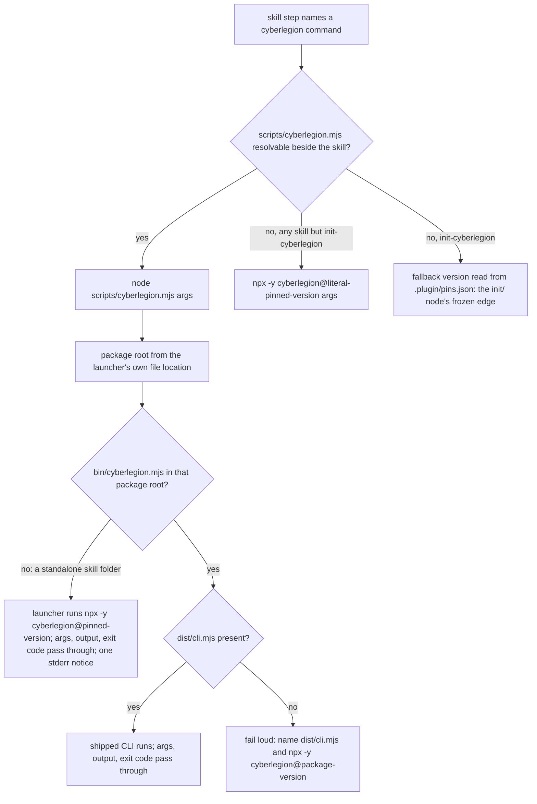
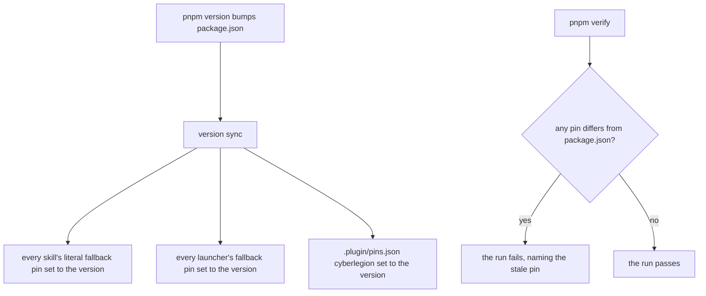

# cli-launcher — skills run the CLI they ship with

## What

Every plugin skill that runs a `cyberlegion` command runs the CLI **its own plugin ships**, not a
copy npx fetches. Each such skill carries a launcher, `scripts/cyberlegion.mjs`, that finds the
package root from its own file location and hands every argument to the package's
`bin/cyberlegion.mjs`. Skill bodies call it as `node scripts/cyberlegion.mjs <command>`.

A launcher found outside a plugin package (the skill folder was copied on its own) runs that same
pinned published CLI itself, so a skill works standalone and reaching outside its folder is only a
fast path. The agentskills specification asks a script to "be self-contained or clearly document
dependencies"; the launcher does both. A skill also names one pinned `npx -y cyberlegion@<version>` fallback for a host where the launcher
path cannot be resolved. Those pins, and the plugin's `.plugin/pins.json` map, are rewritten by the
release version flow (`pnpm version`) from `packages/cyberlegion/package.json`, and the test suite
fails when either disagrees with that version. The pin can no longer lag the package.

**Why.** The skills called `npx cyberlegion@0.3.1 …` while the package was at 0.4.0, because nothing
moved the pin at release: a skill ran a CLI older than the one its own text describes. Each npx call
also paid npx's resolve-and-spawn cost and, with several agents running at once, risked the
`~/.npm/_npx` `ENOTEMPTY` race. The launcher removes npx from the common path entirely.

**What makes it possible.** `dist/cli.mjs` is a committed, self-contained bundle, so
`bin/cyberlegion.mjs` runs at a git-source plugin install with no build and no `node_modules`.

**Non-goals** — which command a skill runs and when (each skill's own node); the CLI's commands
themselves (the sibling `packages/cyberlegion` CLI project); the `mail hook` command `init` writes into
a harness's hook settings, and bare `cyberlegion` calls in other plugins (both install-time
decisions, outside this plugin's skills); `npx cyberlegion@<version>` examples in the readmes and docs
site (documentation, not a skill's invocation); a spawned unit's PATH shim (a CLI concern, and absent in
the user's own session, so no skill relies on it).

**Key terms** — **launcher**: `skills/<skill>/scripts/cyberlegion.mjs`. **Installed shape**: the
package directory as a plugin install copies it — no `node_modules`, only what the checkout or tarball
carries. **Fallback pin**: the one `npx -y cyberlegion@<version>` line a skill names for when the
launcher cannot be resolved. **Version flow**: the repo's `pnpm version` script, run at release.

## Use Cases

**Subject** — how a plugin skill reaches the `cyberlegion` CLI, and how the version a skill falls
back to is kept equal to the version that shipped it.

| Use case | Trigger | Inputs | Outcome |
|---|---|---|---|
| **run a CLI command from a skill** | a skill step names a `cyberlegion` command | the command's arguments; the working directory of the repo the agent works on | the command runs on the CLI shipped beside the skill, with its output and exit code unchanged |
| **fall back when the launcher cannot be resolved** | the agent cannot resolve `scripts/cyberlegion.mjs` beside the skill | the same arguments | the command runs on the published CLI of the version that shipped the skill |
| **cut a release** | the maintainer runs `pnpm version` | the new `package.json` version | every skill's fallback pin and the pins map name the new version |
| **catch a stale pin** | `pnpm verify` / CI | the tracked skills and the pins map | any pin that disagrees with `package.json` fails the run |

**Actors** — the **agent** running a skill reaches the first two use cases; the **maintainer** cuts
the release; **CI** runs the check. The **user** whose session hosts the skill is affected without
invoking anything: they get the CLI version the skill's text describes, and no npx cache race.

**Extensions**

- *run a CLI command* — the skill folder was installed on its own, with no plugin package around it
  (so no `bin/cyberlegion.mjs` three levels up): the launcher runs the pinned
  `npx -y cyberlegion@<version>` itself, passing arguments, output, and exit code through, and says
  so in one stderr line. The skill still works standalone, only slower; the package is a fast path,
  not a dependency. The checkout carries no `dist/cli.mjs` (a source install that was never
  built): the launcher fails loud, naming the missing file and the pinned published version to run
  instead, rather than a raw module-not-found. The working directory is never used to find the CLI.
- *fall back* — `init-cyberlegion` takes its fallback version from the plugin's `.plugin/pins.json`
  map (its own frozen suite, `init/`), which the version flow regenerates like the literal pins; every
  other skill names the version literally.
- *cut a release* — extensions: none that this node decides; a failed `changeset version` stops the
  script chain before the sync runs.
- *catch a stale pin* — extensions: none; the check has one failure outcome.

## Control Flow

### 0 — A skill runs a CLI command

*Entered by:* run a CLI command from a skill · fall back when the launcher cannot be resolved

`FIND` is agent behavior (resolving a path relative to the skill), not a guarantee, which is why the
fallback exists. `INITFB` belongs to the `init/` node, whose frozen suite already makes
`init-cyberlegion` read its version from `.plugin/pins.json`; this node owns only that the map is kept
current (`SYNC → MAP`), so it carries no scenario for `INITFB`. `ROOT` never consults the working directory: that is the user's repo, the command's
input, not where the CLI lives.

### 1 — Release keeps every pin current

*Entered by:* cut a release · catch a stale pin

## Scenario map

Every row is one edge from `## Control Flow`, bound to exactly one scenario in `cli-launcher.feature`;
every scenario in that suite has exactly one row.

### run a CLI command from a skill

| Edge | Path (Given) | Scenario |
|---|---|---|
| `STEP → FIND` | the plugin's skills | `every skill that runs the CLI ships a launcher` |
| `FIND → LAUNCH` | a skill body that names a CLI command | `a skill body runs every CLI command through its launcher` |
| `LAUNCH → ROOT` | a launcher run from an unrelated working directory | `the launcher finds the CLI from its own location, not the working directory` |
| `PKG → SELFFB` | a skill folder copied alone, with no package around it | `a launcher in a standalone skill folder runs the pinned published CLI` |
| `DIST → RUN` | an installed-shape plugin directory with no node_modules | `a skill's launcher runs the shipped CLI from an installed-shape plugin directory` |
| `RUN` (pass-through) | a command with arguments that exits non-zero | `arguments, output, and the exit code pass through the launcher unchanged` |
| `DIST → MISSING` | an installed-shape directory without dist/cli.mjs | `a launcher at a checkout without the built CLI names it and the pinned fallback` |

### fall back when the launcher cannot be resolved

| Edge | Path (Given) | Scenario |
|---|---|---|
| `FIND → FALLBACK` | a skill that runs the CLI | `each skill names one pinned npx fallback of the shipped version` |

### cut a release

| Edge | Path (Given) | Scenario |
|---|---|---|
| `SYNC → SKILLPINS` | skills pinned to an older version | `the version flow rewrites every skill's fallback pin` |
| `SYNC → LAUNCHPINS` | launchers pinned to an older version | `the version flow rewrites every launcher's fallback pin` |
| `SYNC → MAP` | a pins map naming an older version | `the version flow rewrites the plugin's pins map` |

### catch a stale pin

| Edge | Path (Given) | Scenario |
|---|---|---|
| `STALE → FAIL` | a pin that differs from package.json | `a pin that disagrees with the package version fails the test suite` |
| `STALE → PASS` | every pin equal to package.json | `pins that match the package version pass the test suite` |
