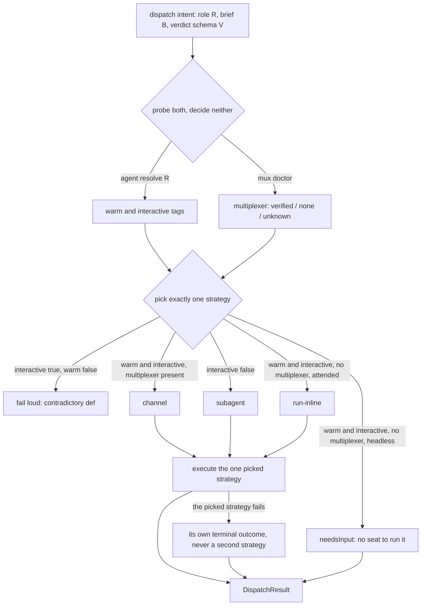
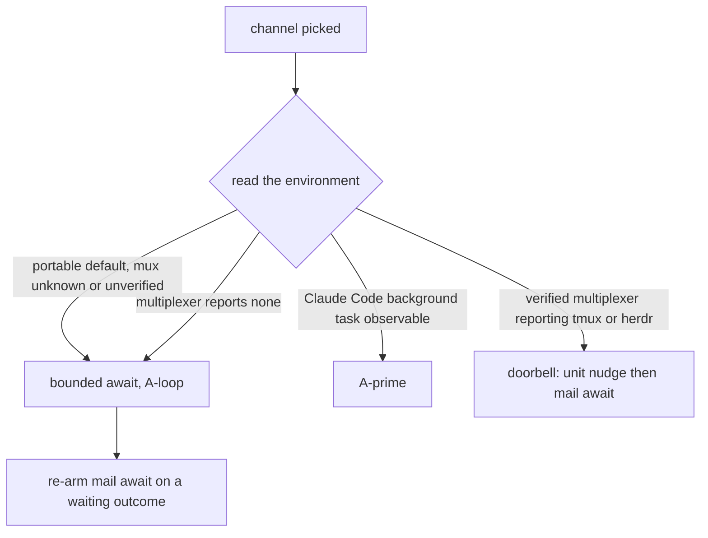
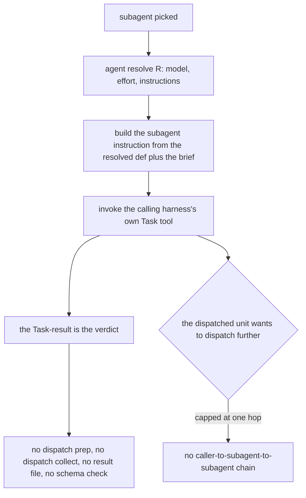
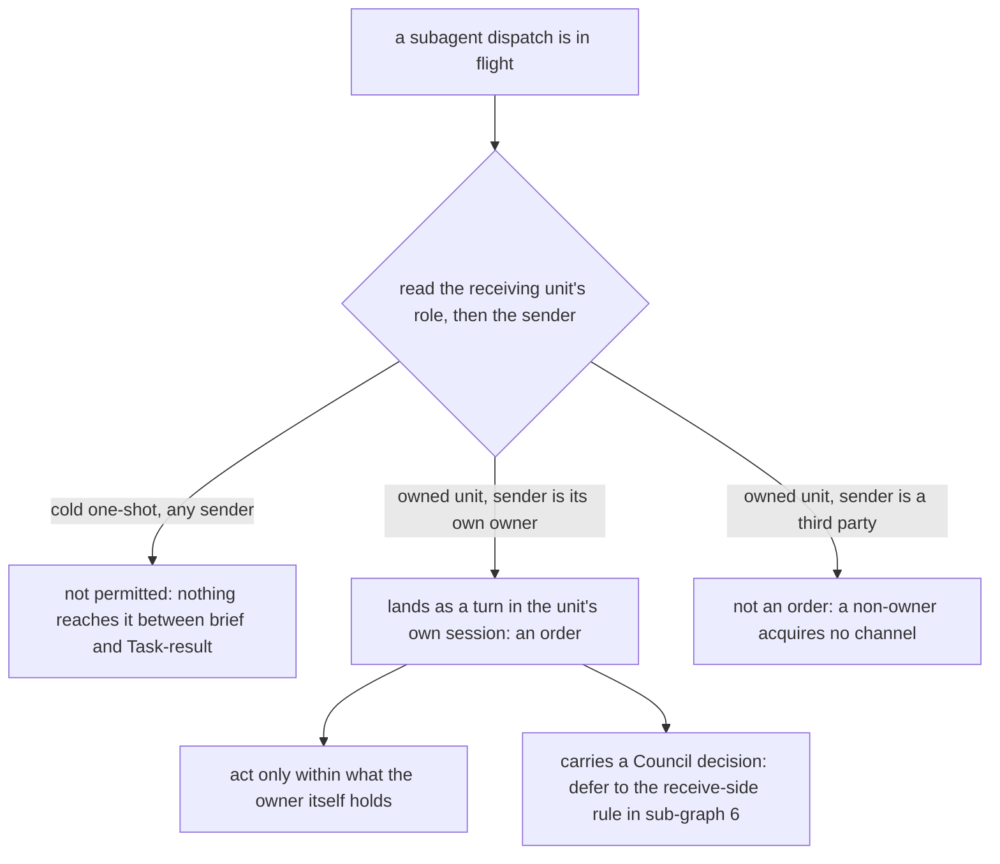
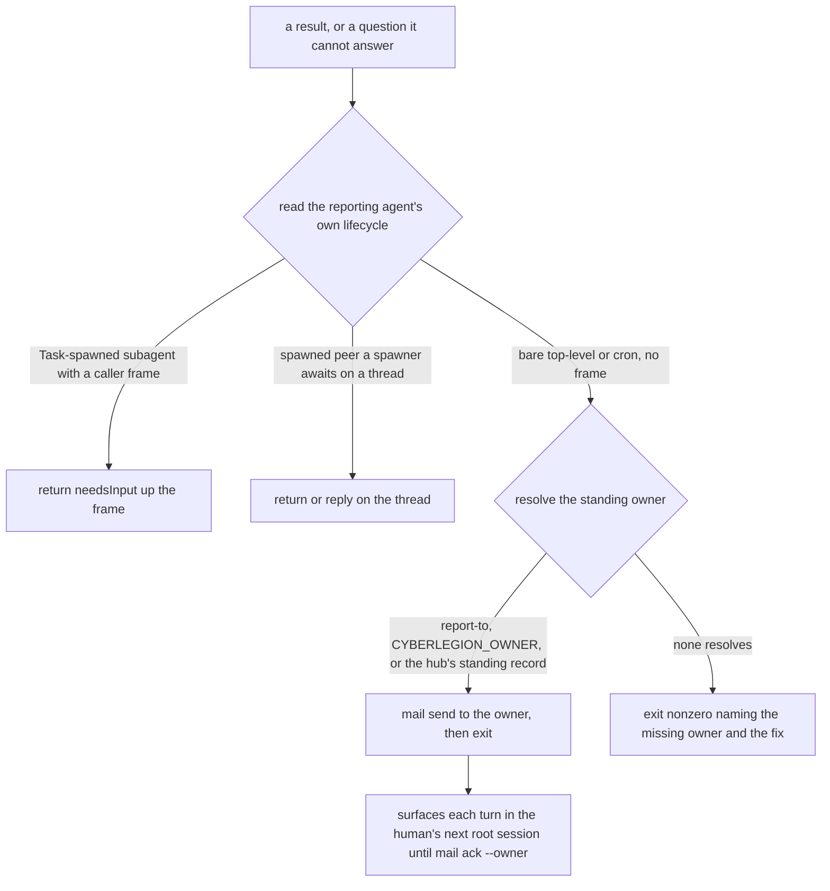
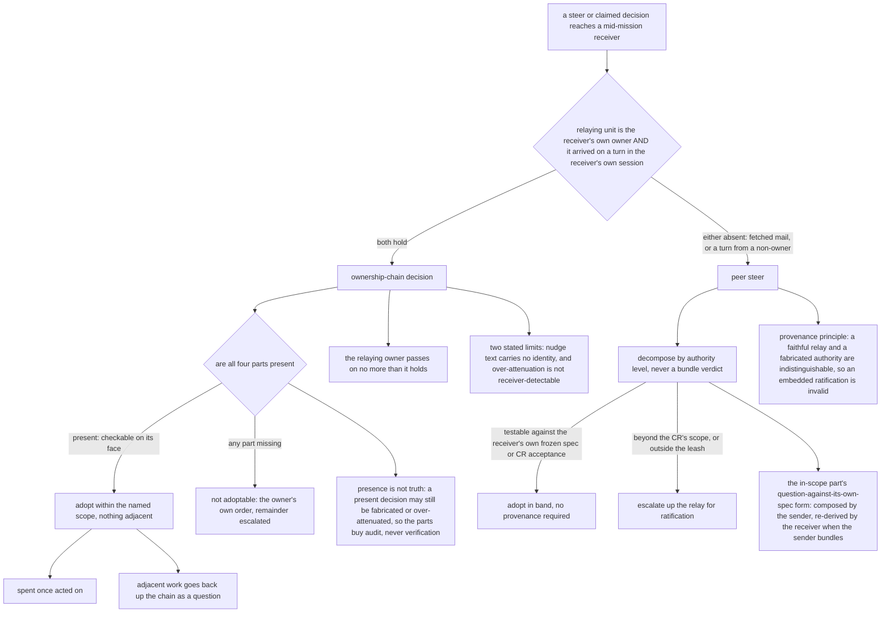
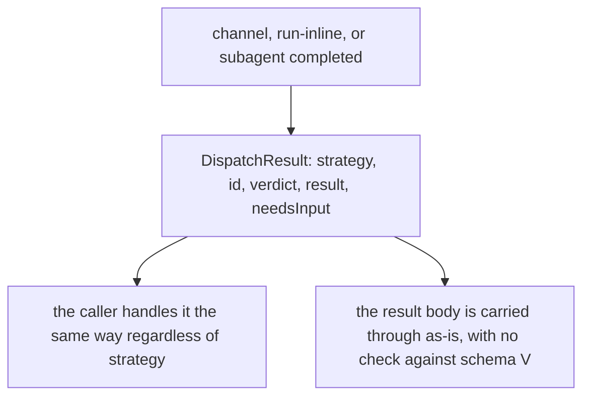
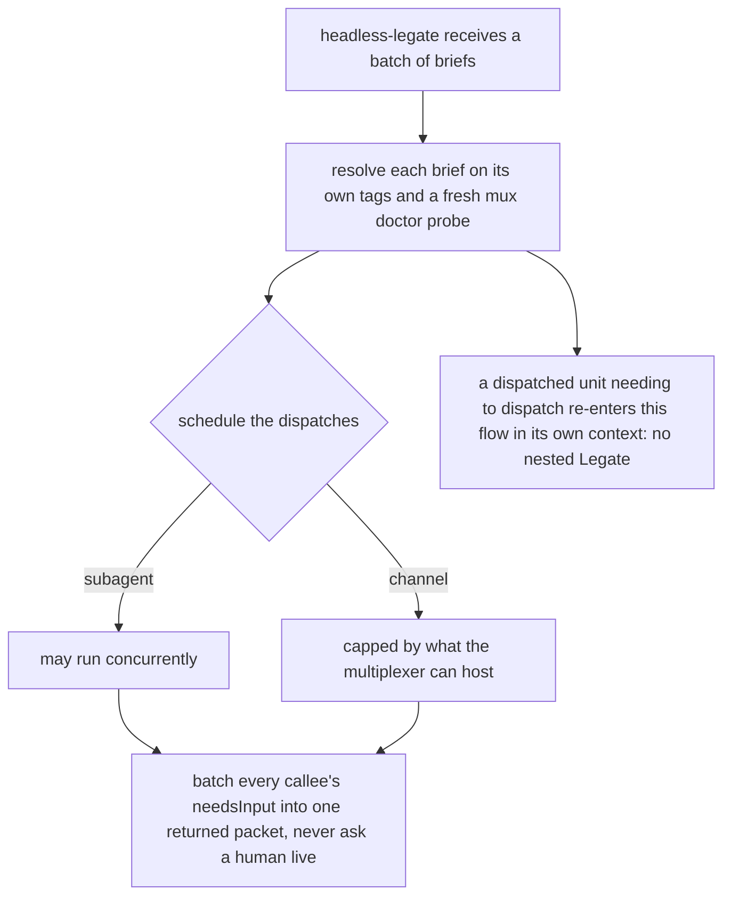

# dispatch — the Legate's routing brain

## What

`dispatch` is the Legate's routing brain: the judgment that turns one **dispatch intent** —
fulfill role `R` with brief `B`, expecting a verdict matching schema `V` — into exactly one of
three ways of getting that role fulfilled, and then relays the answer home. The three are
**channel** (spawn a warm peer that can converse and mail back over rounds), **subagent** (a
cold one-shot the caller's own harness runs, whose returned message is the verdict), and
**run-inline** (the caller does the work in its own session). The problem it solves is that the
`cyberlegion` CLI deliberately carries no routing judgment at all, so without this node a
dispatch intent has nobody to decide what shape it should take.

**Non-goals** — the CLI primitives themselves (`agent resolve`, `mux doctor`, `unit spawn`,
`mail await`, `unit nudge`, which belong to the sibling `cyberlegion` CLI project); auto-routing
inside the CLI (there is no `--backend auto`); switching strategy mid-flight once one is picked;
and structured validation of the returned result against schema `V`, which no shipped capability
performs today.

**Key terms** — **seat**: whether the Legate holds a live caller channel (*attended*) or not
(*headless*). **Multiplexer**: the terminal pane host `mux doctor` probes; with none, there is no
pane for a warm peer to live in. **Frame**: a caller waiting on a callee's return — a *framed*
callee reports by returning, a *bare* one by mail. **Four parts**: the Council's verbatim words,
where they were said, the relaying unit, and the scope, which together make a relayed decision
well-formed. **Ownership chain**: the owner-to-unit relationship, as against a *peer*
relationship between two units neither of which dispatched the other.

The **one realization** of the Legate role — resolving a dispatch intent (fulfill role `R` with
brief `B`, expect a verdict matching schema `V`) into exactly one of three strategies, whichever
surface it runs on. By default it is the **attended session** (loads `dispatch-governance`
in-session, holds the caller's channel); in the **headless fallback** it is the spawned `headless-legate`
agent, batching `needsInput` instead of asking live. Both loads run the identical procedure; this
node covers both, the same way SDD's `mission/conductor` node covers its in-session and automaton
realizations in one spec.

The `cyberlegion` CLI is deliberately dumb hands: it never auto-routes, never picks a backend, never
invokes a Task tool. All routing judgment lives in this node. When a strategy runs, it is **composed
from surviving CLI primitives** — `agent resolve` (read the def's tags), `mux doctor` (probe the
multiplexer), `unit spawn` + `mail await` (the channel path), `unit nudge` (the doorbell wake), and
the caller's **own** harness Task tool (the subagent path). There is no `dispatch` command group:
`dispatch prep`, `dispatch channel`, `dispatch collect`, the result file, and `Store.result` were all
dropped — the node composes the primitives directly.

This node also covers `subagent-backend-governance` — the concrete three-step procedure the
**subagent** strategy runs once picked: resolve the agent def → invoke the caller's own Task tool →
take the subagent's **Task-result** (its own final returned message) as the verdict. There is no
`prep`/`collect`, no result file, and no schema-validation step; it is a sub-procedure of this
behavior, not a separate capability.

It further covers `relay-governance` — the **report/ask contract** orthogonal to strategy choice:
once a result (or an unanswerable question) exists, how it gets home is keyed on the *reporting
agent's own lifecycle*, not on which strategy dispatched it. A framed callee (Task-spawned subagent,
or a peer a spawner awaits) returns `needsInput` up its frame; a **bare top-level / cron** session
with no frame pushes `mail send` to the standing owner and exits, and the report surfaces into the
human's next root session (the CLI's `surfacing` node). This is where the headless "batch needs-input
and relay" behavior lives now — `dispatch-governance` and `headless-legate` load it rather than
restating it. `relay-governance` states transport only; the standing owner identity, owner mail, and
surfacing are the sibling `cyberlegion` CLI's mechanism.

The subagent path's **mid-turn messaging rule is scoped by role, not by backend**. A **cold
one-shot dispatch** (a judge, a grader) takes no mid-run message — nothing reaches it between its
brief and its Task-result, which is what makes its verdict its own. An **owned unit realized as a
subagent** — a unit an owner is running, which happens to have no pane of its own — may be messaged
mid-turn by **its owner**, and those messages land as turns in the unit's own session, so they are
**orders**. That is this path's own rule: which role has an order channel at all. What such a
message may *carry* is **not restated here**. An owner's mid-turn message into a unit it is running
**is** the ownership-chain case — the relaying unit is the receiver's own owner, and the decision
arrives on a turn in the receiver's own session — so the four parts, the attenuation clause, and the
two limits are the **receive-side** rule stated once below, and this path **defers** to it. This is
the owner's **positional** order channel down into a unit it is running, not the **lateral** peer
mail whose embedded ratification `relay-governance` holds invalid. Depth-1 is unchanged: the
existing depth-1 scenario already binds every unit realized via the subagent path, owned or cold.

`relay-governance` also carries the **receive side**: how a mid-mission receiver triages a relayed
steer whose parts sit at different authority levels. The receiver **decomposes by authority level**
— an in-scope refinement (testable against the receiver's **own** frozen spec / CR acceptance /
leash) adopts **in-band** with no provenance required, while cross-cutting doctrine escalates up the
relay for ratification, never adopted on a peer's say-so. Bundle-adopt and bundle-reject are both
anti-patterns. The root is the **provenance principle**: authority over peer mail cannot be
established (a faithful relay and a fabricated authority are indistinguishable), so a receiver acts
only on what it can verify against its own loaded contract — which is also why a ratification
embedded in relayed mail is invalid (the relayed-ratification seam).

That seam is keyed on the **relationship**, not on the transport alone. A **peer steer** — anything
relayed by a unit holding no authority over the receiver — is unchanged: its ratification claim is
invalid and the bundle-adopt / bundle-reject decomposition governs it. A decision relayed down the
**ownership chain** is adoptable **within its named scope and nothing adjacent**, and it is that
case only when **both** hold: the relaying unit is the receiver's own owner, **and** the decision
arrived on a **turn** in the receiver's own session. Either one alone leaves it a peer steer — mail
the receiver **fetched** stays content whatever it claims, and a turn placed by a non-owner supplies
no authority. It must carry **four parts**: the Council's verbatim words, where they were said, the
relaying unit, and its scope (one action on one target). It is **spent once acted on**, and
authority **attenuates at every hop** (no link passes on more than it holds).

**What the four parts do, and what they do not — both halves hold.** They are a **well-formedness**
requirement, and well-formedness is **checkable on its face in the moment**: a receiver can see
whether all four are present without being able to verify that any one of them is true. So they
**gate adoption** — a decision missing any part is not adoptable and drops back to
escalate-for-ratification; the message is then the relaying owner's **own order**, bounded by what
that owner holds, with the remainder escalated rather than acted on. They are **not a verification
of truth**: a present, well-formed decision can still be fabricated or over-attenuated, and the
receiver cannot tell the difference from the decision alone. Their after-the-fact value is
**audit** — the record a later reader can check the claim against — never verification in the
moment; and they **widen nothing**, the scope staying capped by what the relaying unit itself
holds.

Two limits are stated, not worked around. The rule is **not forgery-proof**: `unit nudge --message`
writes caller-controlled text into any addressable pane and records no caller identity, so position
is a structural fact about the Legion's shape rather than a proof. And a receiver **cannot detect**
a relay that passed on more than the relayer held — attenuation is sender-side discipline, not a
receiver-side check. Scope here is **one action on one target** — the two-part form.

**The revision part is an open cross-repo seam, not a settled drop.** Both amendments dropped the
third scope part (*one revision*) on the ground that `dispatch` has no revision concept of its own,
which is true of this node's vocabulary. It is **not** settled across the corpus: the dependent that
filed both amendments landed its own authority contract keeping the three-part form, where the
revision does real work (a decision naming a revision does not survive that target moving on). A unit
loading both contracts therefore meets a **more permissive** scope rule here than there. This node
states the two-part form and **names the gap** rather than asserting the drop; restoring the part
would widen a contract a sibling corpus has already ratified, so it is escalated, not decided here.

## Use Cases

**Fit:** partial

**Subject** — given an intent to fulfill a role with a brief, deciding whether that role runs as a
warm interactive peer (**channel**), a cold one-shot subagent (**subagent**), or inline in the
caller's own session (**run-inline**) — and executing that choice by composing the surviving
`cyberlegion` CLI primitives.

**Non-goals** — the CLI primitives themselves (`agent resolve`, `mux doctor`, `unit spawn`,
`mail await`, `unit nudge` — those are the sibling `cyberlegion` CLI project); auto-routing inside
the CLI (there is no `--backend auto` — the CLI never chooses on its own); a mid-flight strategy
switch once one is picked; structured verdict-schema validation of the result (deferred to a future
`mail --verdict-schema` capability, absent today).

| Behavior | Trigger | Outcome |
|---|---|---|
| **resolve tags + environment** | any dispatch intent reaches this node | `agent resolve <R>` reads `warm`/`interactive`; `mux doctor` reads multiplexer presence |
| **pick channel** | `warm` + `interactive` + a multiplexer is present | compose `unit spawn --agent R --brief-file B --at <placement>` then `mail await --thread <t>` — a warm peer that can converse and mail back over rounds |
| **pick run-inline (attended)** | `warm` + `interactive` + no multiplexer, in-session | returns a `run-inline` verdict; the caller does the work itself — no cold subagent substitute |
| **run-inline has no seat (headless)** | `warm` + `interactive` + no multiplexer, under `headless-legate` | the Legate cannot run the work itself; returns `needsInput` naming the role + brief for its own relay to resolve |
| **pick subagent** | `interactive` unset (`false`) — a cold, one-shot role (either `warm` value) | realized via `subagent-backend-governance`: resolve the def → caller's **own** Task tool → the Task-result is the verdict (no result file) |
| **reject an unroutable def** | `interactive` set but `warm` unset (`false`) | **fail loud** naming the def + the contradictory tags — an `interactive` role must be `warm`, a cold one-shot must not be `interactive`; never swept into **subagent**, never a `needsInput` (a malformed def is an author bug) |
| **choose the channel wake sub-mode** | channel was picked | bounded await (A-loop) by default; A-prime when a Claude-Code background task is observable; doorbell (B, `unit nudge` + `mail await`) only behind a **verified** mux; never a doorbell when mux is `none` |
| **fan out N briefs (headless only)** | `headless-legate` receives a batch of briefs | resolves and runs each independently; subagent dispatches may run concurrently, channel dispatches are capped by the environment's multiplexer |
| **report the result uniformly** | any strategy completes | returns a `DispatchResult` (`strategy`, `id`, `verdict`, `result`, `needsInput`) the caller handles the same way regardless of strategy |
| **cold one-shot takes no mid-run message** | a judge or grader is realized via the subagent path | nothing reaches it between brief and Task-result — its independence is the reason the ban holds here |
| **an owner may message its own unit mid-turn** | an owned unit is realized as a subagent and its owner needs to change its course | the owner's mid-turn message lands as a turn in the unit's session and is an **order**; a non-owner acquires no such channel |
| **authority attenuates across the hop** | a mid-turn message from the owner carries a Council decision | the mid-turn path adds no rule of its own here — it is the ownership-chain case, so `relay-governance`'s four parts, attenuation, and limits govern it; the owner passes on no more than it holds |
| **the `subagent \| channel` seam** | a dependent (e.g. SDD) needs a role fulfilled | the dependent states intent only (role, brief, verdict schema) — never pins a literal command name — and this node decides the mechanism |
| **relay by lifecycle** (`relay-governance`) | a headless agent has a result or an unanswerable question | framed callee → return `needsInput`; bare top-level/cron → `mail send` to the standing owner + exit; owner report surfaces to the human, read is a deliberate `mail ack --owner` |
| **decompose a received steer** (`relay-governance`) | a relayed steer reaches a mid-mission receiver | split by authority level: in-scope refinement (verifiable against the receiver's own frozen spec/leash) adopts in-band; cross-cutting doctrine escalates for ratification; never bundle-adopt or bundle-reject |
| **adopt an ownership-chain decision** (`relay-governance`) | a decision relayed by the receiver's **own owner** **on a turn** in its own session, carrying the Council's verbatim words, where they were said, the relaying unit, and its scope | adoptable within the named scope and nothing adjacent; spent once acted on; attenuates at every hop; a missing part, fetched mail, or a turn from a non-owner each drop it back to escalate-for-ratification / peer-steer triage |
| **the four parts gate, and audit — they do not verify** (`relay-governance`) | a receiver weighs a relayed decision's four parts | presence is checkable on its face, so a missing part gates adoption (escalate-for-ratification, the message staying the owner's own order); truth is not checkable, so a present decision may still be fabricated or over-attenuated and the parts buy **audit** after the fact, never verification in the moment |
| **one home for the four-part rule** | a reader loads either skill covering this node | `relay-governance` states the four parts, attenuation, spent-once, and both limits **once**; `subagent-backend-governance` references that statement instead of restating it |

## Control Flow

One dispatch intent makes one pass through the graph below. It is drawn as eight sub-graphs
because the decision logic genuinely differs between them; every `## Use Cases` row names the
sub-graph it enters, and several rows share one (many-to-one). Sub-graphs 4 and 6 are the two
contracts this node also covers — `subagent-backend-governance`'s mid-turn rule and
`relay-governance`'s receive side — and 4 hands off to 6 rather than deciding for itself.

### 1 — Strategy resolution

*Entered by:* resolve tags + environment · pick channel · pick run-inline (attended) ·
run-inline has no seat (headless) · pick subagent · reject an unroutable def ·
the `subagent | channel` seam

The five `PICK` branch edges are exhausted **as a set** by one `@trigger` Scenario Outline, which
is why the map binds them as one row; each branch's own downstream behavior then carries its own
scenario. The `subagent | channel` seam is not a separate edge — it is the claim that `PICK` is
where the mechanism is chosen at all, which the same outline and the `CLI never auto-routes`
scenario hold between them.

### 2 — Channel wake sub-mode

*Entered by:* pick channel · choose the channel wake sub-mode

### 3 — Subagent realization

*Entered by:* pick subagent

### 4 — Mid-turn messaging into a unit realized as a subagent

*Entered by:* cold one-shot takes no mid-run message · an owner may message its own unit mid-turn ·
authority attenuates across the hop

### 5 — Relay by lifecycle

*Entered by:* relay by lifecycle

### 6 — Receive side: triaging a relayed steer or decision

*Entered by:* decompose a received steer · adopt an ownership-chain decision ·
the four parts gate, and audit — they do not verify

`relay-governance` states the four parts, attenuation, spent-once, and both limits **once**;
`subagent-backend-governance` references that statement rather than restating it, which is why
sub-graph 4's `DEFER` edge points here.

### 7 — Uniform result

*Entered by:* report the result uniformly

### 8 — Headless fan-out

*Entered by:* fan out N briefs (headless only)

## Scenario map

Every row is one **(path class, edge)** pair from `## Control Flow`, bound to exactly one
scenario in `dispatch.feature`; every scenario in that suite has exactly one row. A repeated
edge carries a different path class, and a `Path` reading *any* is a convergence claim — the
outcome does not depend on how the edge was reached.

### resolve tags + environment

| Edge | Path (Given) | Scenario |
|---|---|---|
| `INTENT → PROBE` | any dispatch intent | `the Legate probes both the agent def and the environment before deciding` |
| `PICK → {channel, run-inline, subagent, needsInput}` | each warm / interactive / mux / seat combination in turn | `the resolved tags, multiplexer, and seat select exactly one strategy` |
| `PICK` (who owns the choice) | the routing choice is attributed | `the CLI never auto-routes` |

### reject an unroutable def

| Edge | Path (Given) | Scenario |
|---|---|---|
| `PICK → FAILLOUD` | warm false with interactive true | `a non-warm interactive def is unroutable and fails loud` |

### pick run-inline (attended)

| Edge | Path (Given) | Scenario |
|---|---|---|
| `PICK → INLINE` | warm and interactive, no multiplexer, attended seat | `run-inline delegates nothing — the caller does the work in-session` |

### pick channel, and choose the wake sub-mode

| Edge | Path (Given) | Scenario |
|---|---|---|
| `CHAN → WAKE` | each environment in turn | `once channel is picked, the environment selects the wake sub-mode` |
| `WAKE → DOOR` | mux doctor reports a verified multiplexer that is not none | `the doorbell path rings the peer's pane then awaits, only behind a verified mux` |
| `WAKE → BOUND` | mux doctor reports the multiplexer is none | `never ring a doorbell when there is no pane to ring` |

### pick subagent

| Edge | Path (Given) | Scenario |
|---|---|---|
| `SUB → RESOLVE → INSTR → TASK` | subagent picked for a named role | `the subagent path is realized by the caller's own Task tool` |
| `TASK → VERDICT → NOFILE` | the dispatch is collecting its verdict | `the retired prep/collect/result-file path is gone` |
| `TASK → DEPTH → NODEEPER` | a unit that is itself realized via the subagent path | `a cold subagent does not itself dispatch another cold subagent` |

### exactly one strategy, start to finish

| Edge | Path (Given) | Scenario |
|---|---|---|
| `SUB → EXEC` | subagent was the picked strategy | `exactly one strategy's primitives run, never a second` |
| `EXEC → TERMINAL` | the picked strategy failed | `no mid-flight strategy switch` |

### cold one-shot takes no mid-run message

| Edge | Path (Given) | Scenario |
|---|---|---|
| `WHO → BANNED` | a judge realized via the subagent path, whose worth is its independence | `a cold one-shot dispatch takes no mid-run message` |

### an owner may message its own unit mid-turn

| Edge | Path (Given) | Scenario |
|---|---|---|
| `INFLIGHT → WHO` | each role and sender pair in turn | `the role and the sender decide whether a mid-turn message is an order` |
| `WHO → ORDER` | an owned unit with no pane of its own, messaged by its owner | `an owner may message mid-turn the unit it is running as a subagent` |

### authority attenuates across the hop

| Edge | Path (Given) | Scenario |
|---|---|---|
| `ORDER → ATTEN` | the owner asserts an authority it does not itself hold | `authority attenuates across the mid-turn hop` |
| `ORDER → DEFER` | the owner's message carries a decision with all four parts | `a relayed Council decision is actionable only with all four scope parts` |
| `ORDER → DEFER` | the owner's message carries a decision missing a part | `a relayed Council decision missing any scope part is not acted on as one` |
| `ORDER → DEFER` | an owned unit weighing a decision inside its owner's mid-turn message | `an owner's mid-turn message into a unit it is running is the ownership-chain case` |

### relay by lifecycle

| Edge | Path (Given) | Scenario |
|---|---|---|
| `HAVE → LIFE` | each reporting lifecycle in turn | `report/ask transport is forced by the reporting agent's lifecycle` |
| `LIFE → UPFRAME` | a Task-spawned callee whose spawner awaits its return | `a framed callee returns needsInput and never opens a human mailbox` |
| `OWNER → SEND` | a bare cron session whose standing owner resolves | `a bare cron session pushes mail to the standing owner and exits` |
| `OWNER → LOUD` | a bare cron session with no resolvable owner | `a frameless report with no resolvable owner fails loud` |
| `SEND → SURFACE` | a report already in the standing owner's durable inbox | `surfacing owner mail is not a receipt` |

### decompose a received steer

| Edge | Path (Given) | Scenario |
|---|---|---|
| `ARRIVES → REL` | a receiver weighing a relayed claim of ratification | `an ownership-chain decision needs both the relationship and the position` |
| `REL → PEER` | mail the receiver fetched from its own mailbox | `mail the receiver fetched is content, whatever it claims` |
| `REL → PEER` | a turn placed by a unit that did not dispatch the receiver | `a turn placed by a unit that is not the receiver's owner is still a peer steer` |
| `REL → PEER` | a steer from a unit holding no authority over the receiver | `a peer steer is unchanged by the ownership-chain rule` |
| `PEER → DECOMP` | a steer bundling an in-scope refinement with a cross-cutting rule | `a receiver decomposes a relayed steer by authority level before acting` |
| `DECOMP → {INBAND, ESC2}` | each part's authority level in turn | `each decomposed part's authority level selects its verdict` |
| `DECOMP → INBAND` | a part testable against the receiver's own frozen spec or CR acceptance | `an in-scope refinement adopts in-band with no provenance required` |
| `DECOMP → ESC2` | a part changing shape beyond the current CR's scope or leash | `cross-cutting doctrine is never adopted on a peer's say-so` |
| `PEER → DECOMP` (no bundle verdict) | a bundle whose parts sit at different authority levels | `no bundle verdicts — neither bundle-adopt nor bundle-reject` |
| `PEER → PROV` | a steer arriving over peer mail | `the provenance principle — act only on what you can verify against your own loaded contract` |
| `PEER → PROV` | relayed mail carrying a claim that the user approved | `a ratification embedded in relayed mail is invalid` |
| `DECOMP → QFORM` | a sender composing a steer that contains an in-scope part | `senders phrase the in-scope part as a question against the receiver's own spec` |
| `DECOMP → QFORM` | a receiver handed a bundle phrased as an imported rule | `receivers re-derive the question form when a sender bundles` |

### adopt an ownership-chain decision

| Edge | Path (Given) | Scenario |
|---|---|---|
| `REL → CHAIN` | the owner relayed it on a turn in the receiver's own session | `a decision relayed by the receiver's own owner is adoptable within its named scope` |
| `CHAIN → FOUR` | each of the four parts present, then each one missing in turn | `a decision missing any of the four parts is not adoptable` |
| `ADOPT → SPENT` | the receiver has already acted within the named scope | `a relayed decision is spent once acted on` |
| `ADOPT → ADJACENT` | the receiver finds work inside the scope that the decision does not name | `adjacent work found while acting on a scoped decision goes back up as a question` |
| `CHAIN → HOP` | an owner composing a relay down to a unit it dispatched | `authority attenuates at every hop` |

### the four parts gate, and audit — they do not verify

| Edge | Path (Given) | Scenario |
|---|---|---|
| `FOUR → ADOPT` / `FOUR → ESC1` | the receiver weighs whether the decision is well-formed | `the four parts are checkable on their face, and that is what gates adoption` |
| `FOUR → AUDIT` | the receiver weighs whether a fully-formed decision is true | `the four parts are not a verification of the decision's truth` |

### the two stated limits

| Edge | Path (Given) | Scenario |
|---|---|---|
| `CHAIN → LIMITS` | unit nudge --message writes caller-controlled text and records no identity | `the ownership chain is a structural fact, not a proof of identity` |
| `CHAIN → LIMITS` | a relay that passed on more authority than the relaying unit held | `over-attenuation is not receiver-detectable` |

### one home for the four-part rule

| Edge | Path (Given) | Scenario |
|---|---|---|
| `DEFER → sub-graph 6` | a reader loads either skill covering this node | `the four-part rule has one home and is referenced, not restated` |

### report the result uniformly

| Edge | Path (Given) | Scenario |
|---|---|---|
| `DONE → SHAPE → SAME` | any of channel, run-inline, or subagent completed | `every strategy returns the same DispatchResult shape` |
| `SHAPE → RAW` | the caller supplied a verdict schema V | `the result is carried through unvalidated today` |

### fan out N briefs (headless only)

| Edge | Path (Given) | Scenario |
|---|---|---|
| `BATCH → EACH` | the headless Legate receives a batch of three briefs | `the headless Legate resolves each brief's strategy independently` |
| `EACH → SCHED → {CONC, CAP}` | a batch mixing channel and subagent dispatches | `fan-out concurrency respects the multiplexer's pane capacity` |
| `{CONC, CAP} → COLLECT` | N briefs already fanned out | `the headless Legate batches every callee's needsInput into one return` |
| `EACH → NONEST` | a dispatched unit that itself needs to dispatch further | `the Legate does not spawn another Legate` |
