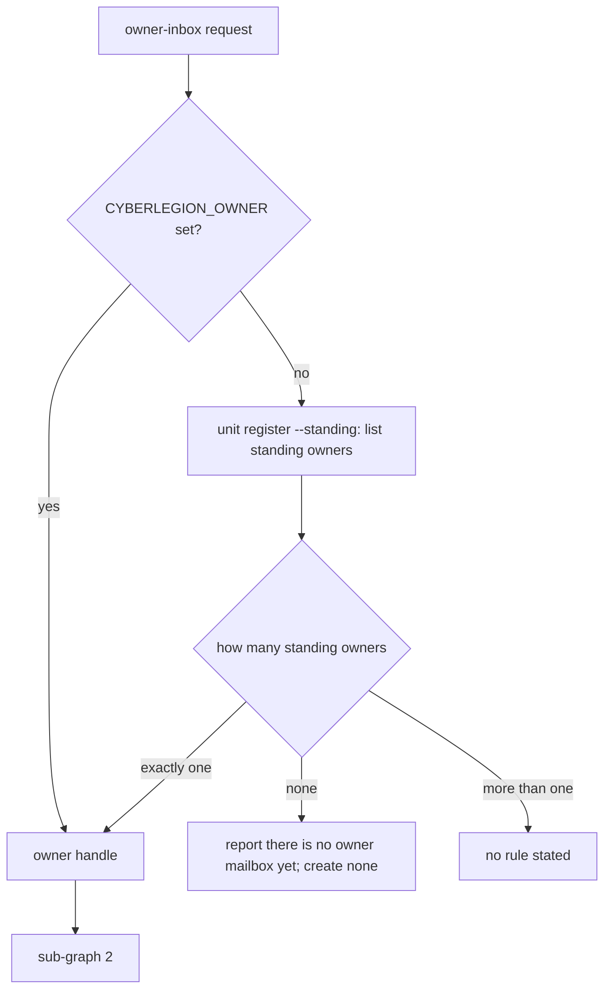
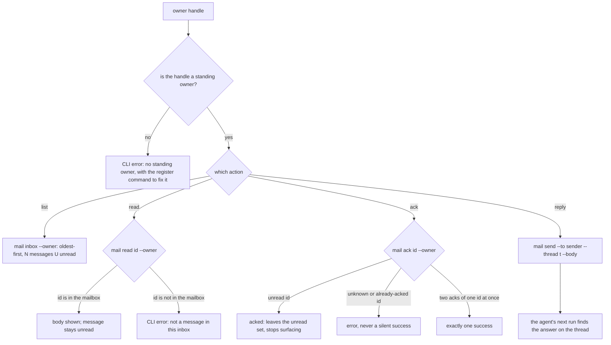

# inbox — the `manage-inbox` owner-mailbox skill

## What

`inbox` is the human's way into the **owner mailbox**. Agents that run with nobody waiting on them
(a cron job, a scheduled run) cannot hand a report back to a caller, so they mail it to one
durable inbox that belongs to the human instead. The `manage-inbox` skill lets the human work that
inbox from any session: see what is waiting, read a report, mark it handled, and answer a question
an agent left there. Without this node, that mail only reaches the human when it happens to
surface on its own at the start of a session.

**Non-goals** — deciding where work goes (`gateway/`, `dispatch/`); creating or binding the owner
identity (`init/`); a session's own inbox; and the CLI commands themselves, which belong to the
sibling `packages/cyberlegion` project. `## Use Cases` states each in full.

**Key terms** — **owner mailbox**: the inbox of a *standing* identity, which outlives any one
session, as against a session's own inbox, which ends with it. **Owner handle**: the name of that
standing identity; every command in this skill is scoped to it (`--owner <handle>`). **Frameless
agent**: an agent with no caller waiting on its return, so it reports by mail. **Doorbell**: the
automatic surfacing of unread owner mail into a new root session. **Ack**: marking a message
handled; it moves the message out of the unread set, and nothing else does in this skill.

The human's surface for the **owner mailbox**: the hub-level, session-independent inbox a standing
`legate` owner identity holds, where frameless agents (cron-started, no parent frame) push their
reports (`dispatch/`'s `relay-governance` lifecycle). `manage-inbox` wraps the `cyberlegion` CLI's
owner-scoped mail commands so a human roaming across sessions manages the one owner mailbox from
wherever they are. It is a **thin wrapper**: every mechanic is a `cyberlegion` CLI call; it decides
nothing about routing or dispatch and writes no state beyond the ack/reply the human directs.

## Placement note (backfilled by the formation pass)

This node was added by a post-mission formation pass following CR `cyberlegion-plugin-init-skill`:
the `manage-inbox` skill already shipped under `packages/cyberlegion/skills/manage-inbox/` and is
already named by both `gateway/README.md`'s non-goals and `init/README.md`'s trigger-disambiguation
(and its own `.feature`'s routing-defer scenario), but carried no owning node in this project's
capability map — an untagged orphan. The split from `gateway/`/`init/`/`dispatch/` is purely
placement (which existing skill's behavior this node covers); no new design decision, no scenario
authored here, coverage-preserving by construction (there is no scenario to narrow — the skill and
its own `.feature` already exist unchanged in the plugin). Self-cleared under the Warden's
reversible/derivable/low-blast class; provisional until the user-channel holder ratifies the trail.

## Use Cases

**Subject** — the human's own on-demand review of the standing owner mailbox: resolving the owner
handle, listing what is waiting, reading a report without consuming it, acking it once handled, and
replying on a report's thread to answer a frameless agent's question.

**Non-goals** — routing or dispatch judgment (that is `gateway/` / `dispatch/`); onboarding /
binding the owner identity in the first place (that is `init/`); a session's own (non-owner) inbox
(the plain `mail inbox`/`read`/`ack`, out of scope for this skill and this node); the CLI mechanics
themselves (`unit register --standing`, `mail inbox`/`read`/`ack`/`send` — the sibling `packages/cyberlegion`
project).

| Use case | Trigger | Inputs | Outcome |
|---|---|---|---|
| **resolve the owner handle** | any owner-inbox request | `$CYBERLEGION_OWNER` or the standing owner list | the one standing handle to scope every other call to |
| **list what is waiting** | "check my inbox", "any reports for me" | `--unread` optional | aggregate `<N> messages (<U> unread)`, oldest-first |
| **read without consuming** | "what did the agent send", "read that report" | a message id | the report body; message stays unread until acked |
| **ack — the only read-state change** | "mark it read", "clear my owner inbox" | a message id | exactly one success even under two concurrent acks; acking an unknown/already-acked id errors |
| **reply on a report's thread** | acting on a surfaced owner-mail doorbell that is a question | a thread id + answer body | the frameless agent's next tick picks up the answer |

## Control Flow

Every request makes one pass through two sub-graphs: first find the owner handle, then run the one
mailbox action the human asked for. They are drawn apart because the first is shared by every use
case and decides *whose* mailbox, while the second decides *what* to do in it. The graph is drawn
from the shipped `manage-inbox` skill and the CLI commands it calls.

### 1 — Resolve the owner handle

*Entered by:* resolve the owner handle — and, through it, every other use case

With no standing owner, the skill does not create one while the human is only checking mail.
Creating it is a deliberate act that belongs to `init/`. With more than one standing owner and no
`CYBERLEGION_OWNER`, the skill states no rule, so `MANY` has no outcome yet (see `## Scenario
map`).

### 2 — Act on the owner mailbox

*Entered by:* list what is waiting · read without consuming · ack — the only read-state change ·
reply on a report's thread

`KNOWN → NOTOWNER` is reached only when `CYBERLEGION_OWNER` names a handle that is not a standing
owner; a handle found by listing is one by construction. The `list` edge carries two path classes:
with `--unread` it shows only unacked mail, without it every message. A request about a session's
own inbox never enters this graph; it is the plain `mail` commands, out of this node's scope.

## Scenario map

The node has **no suite yet** (`## Owed`), so no row binds a scenario. Each row below is one
**(path class, edge)** pair from `## Control Flow` that `inbox/inbox.feature` must bind when it is
authored. The `Scenario` cell reads *owed* rather than a backtick-wrapped title, on purpose: when a
suite lands beside this file, `check-suite` reports every such row as unparseable until it names a
real scenario, so the map cannot read complete while it binds nothing.

### resolve the owner handle

| Edge | Path (Given) | Scenario |
|---|---|---|
| `ENVSET → HANDLE` | `CYBERLEGION_OWNER` is set | owed |
| `COUNT → HANDLE` | no `CYBERLEGION_OWNER`, exactly one standing owner | owed |
| `COUNT → NOOWNER` | no `CYBERLEGION_OWNER`, no standing owner | owed |
| `COUNT → MANY` | no `CYBERLEGION_OWNER`, more than one standing owner | owed — no outcome stated |
| `KNOWN → NOTOWNER` | `CYBERLEGION_OWNER` names a handle that is not a standing owner | owed |

### list what is waiting

| Edge | Path (Given) | Scenario |
|---|---|---|
| `WHICH → INBOX` | without `--unread` | owed |
| `WHICH → INBOX` | with `--unread` | owed |

### read without consuming

| Edge | Path (Given) | Scenario |
|---|---|---|
| `READ → BODY` | an id in the owner mailbox | owed |
| `READ → READERR` | an id not in the owner mailbox | owed |

### ack — the only read-state change

| Edge | Path (Given) | Scenario |
|---|---|---|
| `ACK → ACKED` | an unread id | owed |
| `ACK → ACKERR` | an unknown or already-acked id | owed |
| `ACK → ONE` | two concurrent acks of one unread id | owed |

### reply on a report's thread

| Edge | Path (Given) | Scenario |
|---|---|---|
| `SEND → PICKUP` | a report that asks a question, carrying a thread id | owed |

## Owed

Specced alongside this placement backfill without a `.feature` — same owed state as `gateway/` and
`dispatch/` (CR `legion-gateway-legate`). A future CR authors `inbox/inbox.feature` from the use
cases above; root `status: draft` is unaffected either way (project rollup, independent of any
single node's freeze).
