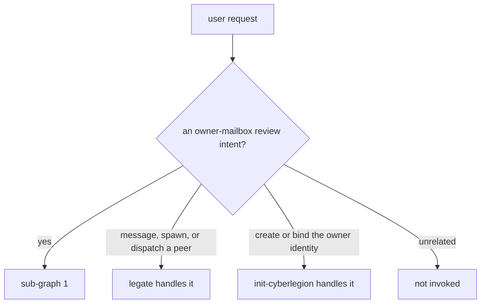
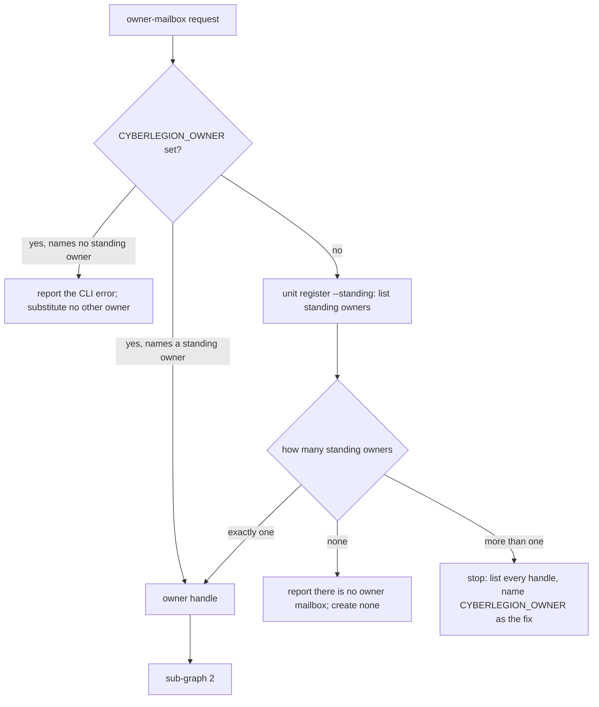
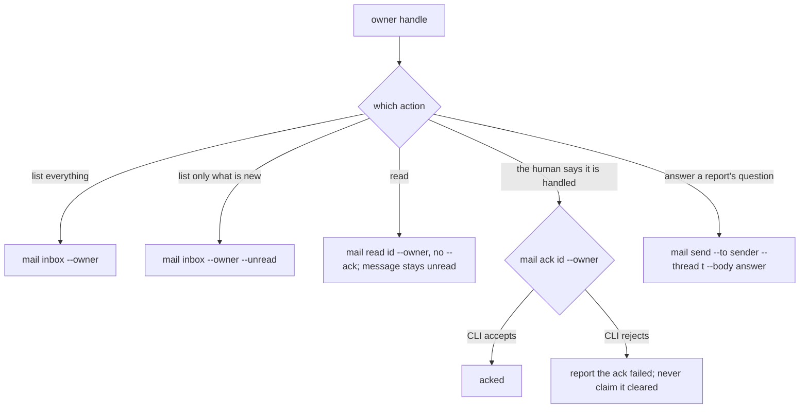

# inbox — the `manage-inbox` owner-mailbox skill

## What

`inbox` is the human's way into the **owner mailbox**. Agents that run with nobody waiting on them
(a cron job, a scheduled run) cannot hand a report back to a caller, so they mail it to one
durable inbox that belongs to the human instead. The `manage-inbox` skill lets the human work that
inbox from any session: see what is waiting, read a report, mark it handled, and answer a question
an agent left there. Without this node, that mail only reaches the human when it happens to
surface on its own at the start of a session.

**Non-goals** — deciding where work goes (`gateway/`, `dispatch/`); creating or binding the owner
identity (`init/`); a session's own inbox; and the CLI commands themselves, which belong to the
sibling `packages/cyberlegion` project. `## Use Cases` states each in full.

**Key terms** — **owner mailbox**: the inbox of a *standing* identity, which outlives any one
session, as against a session's own inbox, which ends with it. **Owner handle**: the name of that
standing identity; every command in this skill is scoped to it (`--owner <handle>`). **Frameless
agent**: an agent with no caller waiting on its return, so it reports by mail. **Doorbell**: the
automatic surfacing of unread owner mail into a new root session. **Ack**: marking a message
handled; it moves the message out of the unread set, and nothing else does in this skill.

The human's surface for the **owner mailbox**: the hub-level, session-independent inbox a standing
`legate` owner identity holds, where frameless agents (cron-started, no parent frame) push their
reports (`dispatch/`'s `relay-governance` lifecycle). `manage-inbox` wraps the `cyberlegion` CLI's
owner-scoped mail commands so a human roaming across sessions manages the one owner mailbox from
wherever they are. It is a **thin wrapper**: every mechanic is a `cyberlegion` CLI call; it decides
nothing about routing or dispatch and writes no state beyond the ack/reply the human directs.

**Fit:** strong — `manage-inbox` makes a genuine activation decision (it shares the words "inbox",
"read" and "ack" with `legate`, which handles a session's own mail, and "owner inbox" with
`init-cyberlegion`, which creates one) **and** carries judgment branches (which owner's mailbox,
whether a request consumes a message), so all four ACED layers carry signal.

## Placement note (backfilled by the formation pass)

This node was added by a post-mission formation pass following CR `cyberlegion-plugin-init-skill`:
the `manage-inbox` skill already shipped under `packages/cyberlegion/skills/manage-inbox/` and is
already named by both `gateway/README.md`'s non-goals and `init/README.md`'s trigger-disambiguation
(and `init/init-cyberlegion.feature`'s routing-defer scenario), but carried no owning node in this project's
capability map — an untagged orphan. The split from `gateway/`/`init/`/`dispatch/` is purely
placement (which existing skill's behavior this node covers); no new design decision, no scenario
authored here, coverage-preserving by construction (there was no scenario to narrow; the node's own
suite, `inbox.feature`, was authored later by CR `github-53-inbox-multi-owner`). Self-cleared under the Warden's
reversible/derivable/low-blast class; provisional until the user-channel holder ratifies the trail.

## Use Cases

**Subject** — the human's own on-demand review of the standing owner mailbox: resolving the owner
handle, listing what is waiting, reading a report without consuming it, acking it once handled, and
replying on a report's thread to answer a frameless agent's question.

**Non-goals** — routing or dispatch judgment (that is `gateway/` / `dispatch/`); onboarding /
binding the owner identity in the first place (that is `init/`); a session's own (non-owner) inbox
(the plain `mail inbox`/`read`/`ack`, out of scope for this skill and this node); the CLI mechanics
themselves (`unit register --standing`, `mail inbox`/`read`/`ack`/`send` — the sibling `packages/cyberlegion`
project).

| Use case | Trigger | Inputs | Outcome |
|---|---|---|---|
| **resolve the owner handle** | any owner-inbox request | `$CYBERLEGION_OWNER` or the standing owner list | the one standing handle to scope every other call to; with several standing owners and no `$CYBERLEGION_OWNER`, a stop that lists them |
| **list what is waiting** | "check my inbox", "any reports for me" | `--unread` optional | aggregate `<N> messages (<U> unread)`, oldest-first |
| **read without consuming** | "what did the agent send", "read that report" | a message id | the report body; message stays unread until acked |
| **ack — the only read-state change** | "mark it read", "clear my owner inbox" | a message id | the message leaves the unread set; an ack the CLI rejects is reported as a failure |
| **reply on a report's thread** | acting on a surfaced owner-mail doorbell that is a question | a thread id + answer body | the frameless agent's next tick picks up the answer |

**Actors** — the **human** who owns the mailbox invokes every use case. The **frameless agent** that
wrote a report is affected without invoking anything: it learns its report was handled only through
an ack, and gets its answer only through a reply on its thread.

**Extensions** — every path from a trigger that does not reach its outcome:

- *resolve the owner handle* — `$CYBERLEGION_OWNER` names a handle that is not a standing owner: the
  CLI's error is reported and no other owner is substituted. No standing owner exists: the skill says
  so and creates none, because creating one is `init/`'s deliberate act. Several standing owners and
  no `$CYBERLEGION_OWNER`: the skill picks none, lists every standing handle, and tells the human to
  set `$CYBERLEGION_OWNER`; guessing would show or ack another owner's mail.
  A handle the human names in conversation ("use this one") is not an input this node models;
  `$CYBERLEGION_OWNER` is the one way to choose among several owners.
- *list what is waiting* — extensions: none. An empty mailbox is a successful listing (the CLI's
  aggregate line reads `0 messages`), not a divergence.
- *read without consuming* — an id not in the mailbox: the CLI errors (its own suite's outcome). The
  skill's one decision is never to consume on read, so it passes no `--ack`.
- *ack* — the CLI rejects the ack (unknown or already-acked id): the skill reports the failure and
  never tells the human the report was cleared.
- *reply on a report's thread* — extensions: none that the skill decides. Delivery failures are the
  CLI's `mail send` outcomes.

**Surface trace** — the skill passes `--owner <handle>` on every mailbox command (resolve → all);
`--unread` only when the human asks for what is new (list); `--thread <t>` and `--to <sender>` on a
reply (reply). It never passes `--ack` to `mail read` (read), which would fold two use cases into
one.

## Control Flow

Every request makes one pass through three sub-graphs: decide whether the request is this skill's,
find the owner handle, then run the one mailbox action the human asked for. They are drawn apart
because the decisions differ. The first decides *whose skill*, the second *whose mailbox* (shared by
every use case), and the third *what to do in it*. The graph is drawn from the shipped
`manage-inbox` skill and holds only the skill's own decisions. What the CLI does with a command (a
read that leaves the message unread, an ack error, two concurrent acks yielding one success, `--owner`
on a handle that is not a standing owner) is the sibling CLI project's `mail/core` suite, and appears
here only where the skill decides what to do with the CLI's answer.

### 0 — Classify the request

*Entered by:* every trigger

The `CLASS` branches are exhausted **as a set** by one `@trigger` Scenario Outline, which is why the
map binds them as one row; the two sibling defers then carry their own scenarios.

### 1 — Resolve the owner handle

*Entered by:* resolve the owner handle — and, through it, every other use case

`MANY` and `NOTOWNER` are stops. The skill runs no mail command with `--owner` from either, because
any handle it chose there would be a guess, and a wrong guess shows or acks another owner's mail. The
skill learns that a set handle names no standing owner from the CLI's error on its first `--owner`
call. The skill does not check this ahead of time, but it must not answer the error by retrying with
a listed owner.

### 2 — Act on the owner mailbox

*Entered by:* list what is waiting · read without consuming · ack — the only read-state change ·
reply on a report's thread

A request about a session's own inbox never enters this graph. It is `legate`'s plain `mail`
commands, classified away in sub-graph 0.

## Scenario map

Every row is one **(path class, edge)** pair from `## Control Flow`, bound to exactly one scenario
in `inbox.feature`; every scenario in that suite has exactly one row.

### classify the request

| Edge | Path (Given) | Scenario |
|---|---|---|
| `CLASS → {RESOLVE, LEGATE, INIT, NONE}` | each owner-mailbox, sibling, and unrelated query in turn | `manage-inbox activates on an owner-mailbox review intent and defers its siblings` |
| `CLASS → LEGATE` | a peer message, spawn, or dispatch request | `a peer message, spawn, or dispatch request defers to legate` |
| `CLASS → INIT` | a request to create or bind the owner identity | `a request to create or bind the owner identity defers to init-cyberlegion` |

### resolve the owner handle

| Edge | Path (Given) | Scenario |
|---|---|---|
| `ENVSET → HANDLE` | `CYBERLEGION_OWNER` names a standing owner, other standing owners exist | `a set CYBERLEGION_OWNER names the mailbox without consulting the standing list` |
| `ENVSET → NOTOWNER` | `CYBERLEGION_OWNER` names no standing owner, one other standing owner exists | `a CYBERLEGION_OWNER naming no standing owner is reported, not replaced` |
| `COUNT → HANDLE` | no `CYBERLEGION_OWNER`, exactly one standing owner | `with CYBERLEGION_OWNER unset, the single standing owner is used without asking` |
| `COUNT → NOOWNER` | no `CYBERLEGION_OWNER`, no standing owner | `with no standing owner, the skill reports it and creates none` |
| `COUNT → MANY` | no `CYBERLEGION_OWNER`, more than one standing owner | `with several standing owners and CYBERLEGION_OWNER unset, the skill stops and lists them` |

### list what is waiting

| Edge | Path (Given) | Scenario |
|---|---|---|
| `WHICH → INBOX` | a resolved handle, the human asks for everything | `a request for everything lists the whole owner mailbox` |
| `WHICH → UNREAD` | a resolved handle, the human asks only for what is new | `a request for only what is new lists unread owner mail` |

### read without consuming

| Edge | Path (Given) | Scenario |
|---|---|---|
| `WHICH → READ` | a resolved handle and an unread message | `reading a report leaves it unread` |

### ack — the only read-state change

| Edge | Path (Given) | Scenario |
|---|---|---|
| `ACK → ACKED` | a resolved handle and an unread message | `a report the user says is handled is acked in the owner mailbox` |
| `ACK → ACKFAIL` | a resolved handle and an ack the CLI rejects | `an ack the CLI rejects is reported as a failure, not as handled` |

### reply on a report's thread

| Edge | Path (Given) | Scenario |
|---|---|---|
| `WHICH → SEND` | a resolved handle and a report asking a question on a thread | `an answer to a report's question goes back on that report's thread` |

## Owed

The node's suite, `inbox/inbox.feature`, was authored by CR `github-53-inbox-multi-owner`, which added
the several-standing-owners stop. Root `status: draft` is unaffected: it is the project rollup,
independent of any single node's freeze.
