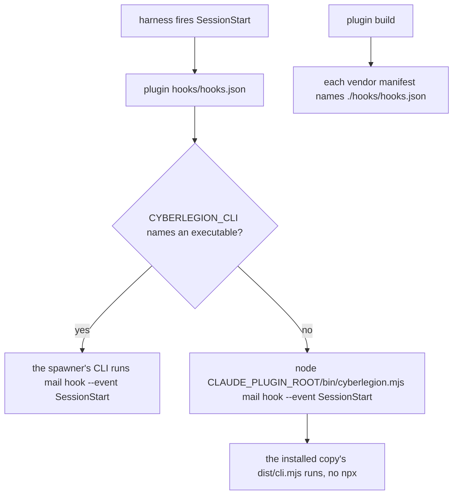

# mail-hook — the plugin ships the mail-surfacing hook

## What

The plugin carries the hook that surfaces Legion mail, so the hook runs **the CLI the session was
spawned or installed with**. `hooks/hooks.json` at the package root registers SessionStart only, running:

```
if [ -x "$CYBERLEGION_CLI" ]; then "$CYBERLEGION_CLI" mail hook --event SessionStart; else node "${CLAUDE_PLUGIN_ROOT}/bin/cyberlegion.mjs" mail hook --event SessionStart; fi
```

In a spawned unit, `unit spawn` set `CYBERLEGION_CLI` to the spawner's CLI shim (the CLI's
`unit/lifecycle` node), so the hook runs the CLI that spawned the unit. Anywhere else — a top-level
session, or a unit whose shim is gone — the variable names no executable and the hook runs the
installed plugin copy's own CLI.

The canonical `plugin.json` declares the file (`extensions["org.cyberuni.universal-plugin"].hooks`),
so `universal-plugin plugin build` names it in every vendor manifest the plugin ships to (Claude Code
and Codex).

**Why.** `init` used to write `npx cyberlegion[@<pin>] mail hook …` into the project. `npx` never
consults PATH: unpinned it ran whatever the registry resolved, pinned it ran a version that went stale
at the next release, and offline or under the `~/.npm/_npx` `ENOTEMPTY` race it failed. That broke the
invariant from #65: a session uses the CLI it was installed or spawned with (#69).

**What makes it possible.**

- Claude Code expands `${CLAUDE_PLUGIN_ROOT}` in a plugin hook's command to the installed plugin copy
  (code.claude.com/docs/en/plugins-reference). Codex runs plugin hook commands in a shell and sets
  `CLAUDE_PLUGIN_ROOT` "for compatibility with existing plugin hooks" (beside its own `PLUGIN_ROOT`),
  so one variable reaches the plugin root on both. universal-plugin passes a hooks *file* through
  untranslated, so the file uses `CLAUDE_PLUGIN_ROOT` rather than the canonical `${PLUGIN_ROOT}`, which
  Claude Code does not expand.
- `dist/cli.mjs` is committed, so `bin/cyberlegion.mjs` runs at an installed-shape copy with no
  `node_modules`, offline.

**Non-goals** — what `mail hook` emits (the CLI's `mail/surface` node); what `init` writes into a
project's own harness config, including the PATH-first cursor hook and removing an earlier project
hook (the CLI's `init` node); Cursor plugin packaging (the plugin is not built for Cursor).

**No PostToolUse.** The hook used to fire on PostToolUse for `Write|Edit` too, to surface mail a busy
unit received mid-turn. It re-injected **every** unread message on **every** edit until acked, and paid
a node cold start per edit; the `mail send` doorbell already types into the recipient's pane, and a
harness that takes typed input mid-turn hands it over during the running turn
(`.research/harness-hooks/conclusion.md`, follow-up 2). A project PostToolUse hook an older `init`
wrote is removed by `init` (the CLI's `init` node), and `mail hook` rejects the event.

**Why an env var, not PATH (#108).** A spawned unit has the spawner's shim first on PATH (#67), but a
PATH lookup cannot tell that shim from a stale global `cyberlegion`, and Claude Code also puts the
plugin's own `bin/` on the Bash PATH. `CYBERLEGION_CLI` is set only by spawn, so its presence is the
marker and its value is the CLI — nothing is resolved by name. The test is `-x`, not `-n`: a pruned
unit's data dir leaves the variable naming nothing, and the hook falls back rather than failing.
The variable is written `$CYBERLEGION_CLI`, never `${…}`, so a harness that substitutes `${VAR}`
tokens in plugin hook commands leaves it to the shell.

## Use Cases

| Use case | Trigger | Inputs | Outcome |
|---|---|---|---|
| **surface mail at session start** | the harness fires SessionStart | the installed plugin root | the plugin's own CLI runs `mail hook --event SessionStart` and its payload reaches the session |
| **surface mail in a spawned unit** | the harness fires SessionStart in a unit | `CYBERLEGION_CLI` naming the spawner's shim | the spawner's CLI runs `mail hook --event SessionStart`, not the plugin's copy |
| **ship the hook to each vendor** | `universal-plugin plugin build` | the canonical `plugin.json` | each vendor manifest names `./hooks/hooks.json` |

## Control Flow



## Scenario map

| Edge | Path (Given) | Scenario |
|---|---|---|
| `FIRE → FILE` | the plugin's hooks file | `the plugin's hook file registers SessionStart only` |
| `FILE → SEL` | the hook command | `the plugin hook command prefers CYBERLEGION_CLI, else the plugin's own CLI, never npx` |
| `SEL -- yes` | CYBERLEGION_CLI naming an executable | `the plugin hook runs the CLI named in CYBERLEGION_CLI` |
| `SEL -- no` (unset) | no CYBERLEGION_CLI, another cyberlegion on PATH | `the plugin hook ignores a cyberlegion on PATH when CYBERLEGION_CLI is unset` |
| `SEL -- no` (stale) | CYBERLEGION_CLI naming no file | `the plugin hook falls back when CYBERLEGION_CLI names no executable` |
| `CMD → RUN` | an installed-shape plugin directory with no node_modules, a caller with unread mail | `the plugin hook runs from an installed-shape plugin directory` |
| `BUILD → MANIFEST` | the canonical and vendor manifests | `every vendor manifest names the plugin's hook file` |
