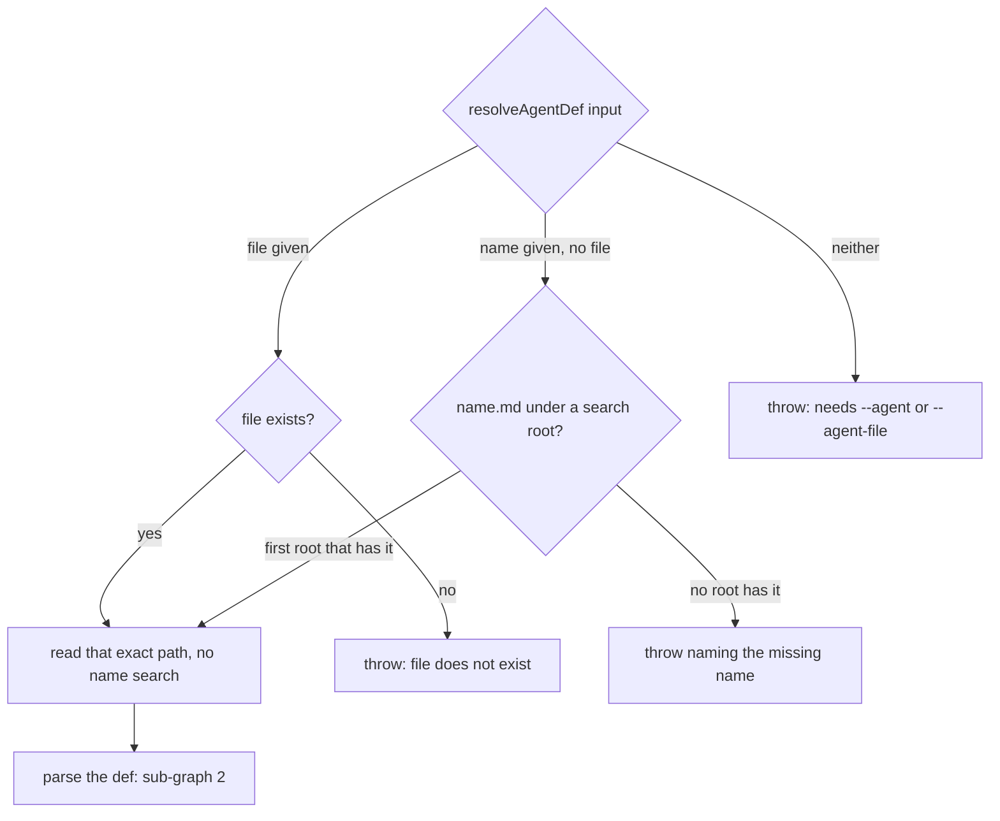
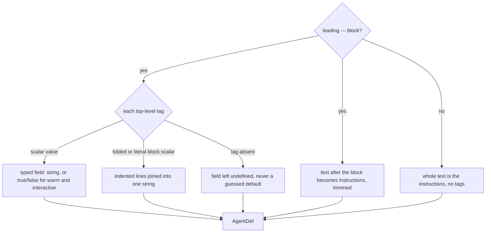
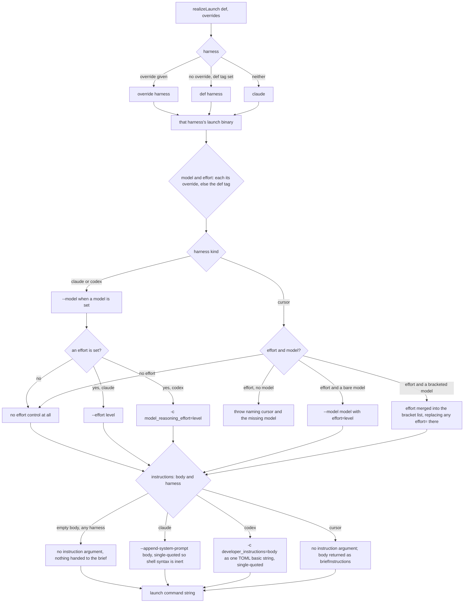
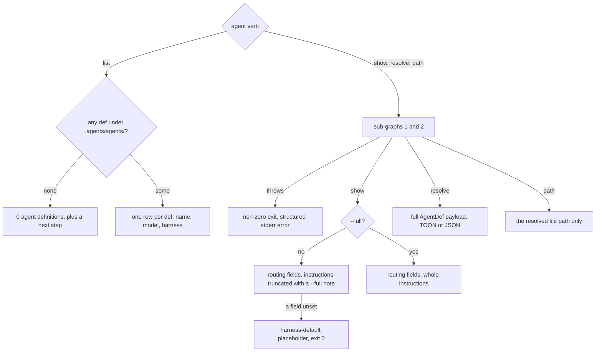

# agent — resolve reusable agent definitions

## What

`agent` reads one agent definition — a Markdown file with a frontmatter block on top — and turns
it into something a caller can act on: a typed record of its tags and instructions, or the shell
command that launches a harness session carrying them. Callers are routing layers and the
`unit spawn` verb; a person reaches it through `agent list`, `show`, `resolve`, and `path` to look at
a def before anything is launched. The problem it solves is that a def is plain text, while every
harness wants its model, effort, and system prompt spelled its own way on its own command line —
and one harness, cursor, has no command-line place for a system prompt at all, so its def's
instructions are handed back for the brief instead.

**Non-goals** — deciding *how* a def should run (warm peer, inline, or cold subagent); launching
anything (the launch command is a string, never executed here); building a cold subagent's
instruction; and finding defs by any plugin's directory convention.

**Key terms** — **def**: one agent-definition `.md` file. **Frontmatter**: the `---`-fenced block
of `key: value` tags at the top of a def; the text after it is the def's **instructions**.
**Routing tags**: `harness`, `warm`, and `interactive`, which only cyberlegion reads. **Harness**:
the agent CLI a session runs in (`claude`, `cursor`, `codex`). **Effort control**: the harness's
own way of setting reasoning effort, which differs per harness. **Instruction channel**: the
harness's own way of taking a def's instructions — a flag on claude, a config override on codex, and
none on cursor, whose instructions travel in the brief.

Resolve a universal agent-definition `.md` file (YAML frontmatter + Markdown body, as used under
`.agents/agents/*.md` and `plugins/*/agents/*.md`) into a machine payload or a channel launch command.
`model`/`description`/`effort` are the ordinary agent-def tags; `harness`/`warm`/`interactive` are
cyberlegion-only routing tags a future gateway (`legion-gateway-legate`, CR-5) reads to choose
between a warm peer, an inline run, and a cold subagent. Resolving a def reads a **file only** — no
knowledge of plugin namespacing, SDD, or the def's author; a plugin-scoped def is passed in by
explicit `--agent-file <path>`, never resolved by convention. Authored in `legion-agentdef` (CR-4b).

## Use Cases

**Subject** — turning one named `.md` def into the concrete thing a caller does with it, and the CLI
surface that inspects a def before that:

- **Resolve by name under the project convention** — `agent resolve <name>` (and the internal
  `resolveAgentDef`) searches `.agents/agents/<name>.md` under the project root, parses the leading
  `---`-delimited frontmatter block, and treats everything after it as the def's `instructions`
  body verbatim.
- **Resolve an exact file, bypassing name search entirely** — `--agent-file <path>` (or
  `resolveAgentDef({ file })`) reads that path directly. This is the only way a plugin-scoped def
  (`plugins/<plugin>/agents/*.md`) is ever resolved — cyberlegion never walks a plugin's own
  directory convention itself.
- **Frontmatter tags parse into typed fields** — `name`, `description`, `model`, `effort` (ordinary
  agent-def tags) and `harness` (`claude`|`cursor`|`codex`), `warm`, `interactive` (cyberlegion-only
  routing tags, booleans) are each read off the top-level frontmatter block. A folded `>`/`|` block
  scalar (as `article-writer.md`'s `description` uses) is supported. A tag the def omits resolves to
  `undefined` (or `false` for warm/interactive when unset — a def opts in explicitly) rather than
  raising an error; only a wholly unresolvable name/file raises.
- **A def missing `model` is not an error** — resolution still succeeds; the model field is absent
  and a launch/realize step applies its own harness default rather than the resolver inventing one.
- **realizeLaunch turns a def into a CHANNEL launch invocation** — applies the def's `model` +
  `instructions` (and any `harness`) into the harness's own launch command (`claude`/`cursor-agent`/
  `codex`), for the warm-peer / channel family. An explicit `model`/`effort`/`harness` override (passed
  by the caller) wins over the def's own tags, which win over the harness default (`claude`). A def's
  `effort` travels through each harness's own effort control, since no two spell it alike: `claude
  --effort <level>`; codex's config override `-c model_reasoning_effort="<level>"` (it has no
  dedicated flag); cursor's bracket parameter on the model, `--model '<model>[effort=<level>]'`,
  merged into any bracket list the model already carries and replacing an `effort=` already there.
  Cursor has no effort control apart from the model, so a cursor def with an `effort` but no `model`
  **throws** rather than launching — a warn-and-ignore would start a session that looks configured
  and runs at the harness default effort, the silent drop this rule exists to prevent. A def with no
  `effort` carries no effort control at all; the harness default applies. A def's `instructions`
  body likewise travels through each harness's own instruction channel, since only claude has an
  append-to-system-prompt flag: `claude --append-system-prompt '<body>'`; codex's config override
  `-c developer_instructions="<body>"` (no dedicated flag; the value is a TOML basic string, so a
  multi-line body or one carrying quotes and backslashes arrives intact, and it adds to codex's own
  base instructions rather than replacing them). Cursor's CLI has **no** instruction channel —
  no flag, no config override — so for cursor the realized launch carries no instruction argument
  and instead **hands the body to the brief** (a returned `briefInstructions` field), which
  `unit spawn` writes in front of the task under its own heading (`unit/lifecycle`). That demotes
  the instructions from a system prompt to the peer's first user turn; the heading makes the
  demotion visible rather than silent. Claude and codex never hand instructions to the brief, and a
  def whose body is empty carries no instruction argument and hands nothing to the brief on any
  harness. This realizes
  the **channel** (warm-peer) launch only; a caller composing a cold Task subagent builds that
  instruction itself from the `resolve` payload (there is no CLI subagent-instruction realizer — the
  result-slot and its instruction builder were dropped in CR-4).
- **agent list / show / resolve / path** — `list` enumerates every resolvable def under
  `.agents/agents/` (name/model/harness rows, a definitive empty state); `show` prints the resolved
  model/effort/harness/warm/interactive plus the instructions body, truncated unless `--full`;
  `resolve` emits the full machine `AgentDef` payload (TOON default, full JSON under
  `--format json`) for a routing caller to compose a launch/spawn from; `path` prints just the
  resolved file path. A bad name/file fails loud (nonzero exit, structured stderr error) rather than
  falling back to a default def.

**Non-goals** — the gateway/Legate routing brain that decides warm-peer vs run-inline vs subagent
from a def's `warm`/`interactive` tags and mux availability (`legion-gateway-legate`, CR-5); actually
spawning anything (`realizeLaunch` is a pure builder — it returns a launch command, plus a
`briefInstructions` string for cursor, and the CLI never invokes a Task tool or opens a session
itself); building the cold-subagent instruction (a caller composes that from the
`resolve` payload — the CLI has no subagent-instruction realizer since CR-4); plugin/SDD def
discovery conventions (an upward dependency cyberlegion never takes on).

Every scenario in [`agent.feature`](./agent.feature) maps to one of these behaviors:

| Behavior | What it covers |
|---|---|
| **resolve by name** | `.agents/agents/<name>.md` lookup; body becomes instructions |
| **resolve an exact file** | `--agent-file`/`file` bypasses name search; plugin-scoped defs |
| **frontmatter tags parse into typed fields** | model/effort/harness/warm/interactive; folded block scalar; missing tags stay undefined |
| **a def missing model is not an error** | resolution succeeds; harness default applies later |
| **realizeLaunch** | per-harness channel launch command; explicit override precedence; per-harness effort control, cursor's missing-model refusal, effort override; per-harness instruction channel, cursor's instructions handed to the brief |
| **agent list / show / resolve / path** | empty state; truncation + `--full`; JSON payload; bad-name fail-loud |

## Control Flow

A call makes one pass through one of four sub-graphs. Every `## Use Cases` row names the sub-graph
it enters, and several rows share one. Sub-graph 1 locates the file and hands it to 2, which parses
it; 3 consumes the parsed def; 4 is the CLI surface, which runs 1 and 2 and then prints.

### 1 — Locate the def file

*Entered by:* resolve by name · resolve an exact file

A given `file` wins over a given `name`: name search never runs once a file is named. Extra search
roots are checked ahead of `.agents/agents/`.

### 2 — Parse the frontmatter into typed fields

*Entered by:* frontmatter tags parse into typed fields · a def missing model is not an error

An absent tag is not an error for any field, `model` included: the def still resolves, and the
launch step (sub-graph 3) applies the harness default. A missing `name` falls back to the file
stem. Only sub-graph 1's three throws fail a resolve.

### 3 — Realize a channel launch command

*Entered by:* realizeLaunch turns a def into a CHANNEL launch invocation

The override precedence is one rule for `harness`, `model`, and `effort`: an explicit override
beats the def's tag, which beats the harness default. The command reports the model and effort it
launched with, whichever source won. Only a cursor launch returns `briefInstructions`; `unit spawn`
writes them in front of the brief (the `unit/lifecycle` node owns that brief file).

`unit spawn` enters this sub-graph through `resolveSpawnLaunch`, which passes its `--harness`,
`--model`, and `--effort` flags as the overrides. With no def, a `--model` or `--effort` on a bare
`--harness` realizes against an empty def; with neither, no command is built and the harness's own
default launch stands. Those `unit spawn` paths are bound in the `unit/lifecycle` node's suite.

### 4 — The agent CLI verbs

*Entered by:* agent list / show / resolve / path

`resolve` alone takes an exact-file option, so it can reach a plugin-scoped def; `show` and `path`
resolve by name only.

## Scenario map

Every row is one **(path class, edge)** pair from `## Control Flow`, bound to exactly one scenario
in `agent.feature`; every scenario in that suite has exactly one row. A repeated edge carries a
different path class.

### resolve by name

| Edge | Path (Given) | Scenario |
|---|---|---|
| `SEARCH → READ` | a name whose `.md` exists under `.agents/agents/` | `resolving by name finds <name>.md under .agents/agents/` |
| `PARSE → BODY` | a def with a frontmatter block and a Markdown body | `the Markdown body after the frontmatter block becomes instructions verbatim` |
| `SEARCH → NOTFOUND` | a name with no `.md` under any search root | `an unresolvable name errors with a clear message` |

### resolve an exact file

| Edge | Path (Given) | Scenario |
|---|---|---|
| `FILE → READ` | an existing file outside `.agents/agents/` | `--agent-file reads that exact path directly` |
| `FILE → NOFILE` | a file path that does not exist | `a nonexistent --agent-file errors with a clear message` |
| `INPUT → NEITHER` | neither a name nor a file | `neither name nor file given errors rather than guessing` |

### frontmatter tags parse into typed fields

| Edge | Path (Given) | Scenario |
|---|---|---|
| `TAG → SCALAR` | each scalar tag in turn: model, effort, harness, warm, interactive | `a scalar frontmatter tag parses into its typed field` |
| `TAG → BLOCK` | a folded `>` description over several indented lines | `a folded > block-scalar description spanning multiple lines parses into one string` |
| `TAG → ABSENT` | the routing tags harness, warm, and interactive absent | `a tag the def omits resolves to undefined rather than a guessed default` |

### a def missing model is not an error

| Edge | Path (Given) | Scenario |
|---|---|---|
| `TAG → ABSENT` | the `model` tag absent | `a def with no model tag still resolves successfully` |

### realizeLaunch turns a def into a CHANNEL launch invocation

| Edge | Path (Given) | Scenario |
|---|---|---|
| `DEFH → BINARY` | each harness tag in turn, no override | `realizeLaunch maps a harness tag to its own launch binary` |
| `HARNESS → DEFAULT` | no harness tag and no harness override | `realizeLaunch defaults to claude when neither the def nor an override sets a harness` |
| `MODEL → KIND` | the def's own model, no override | `realizeLaunch applies the def's own model and instructions` |
| `MODEL → KIND` | an effort override over the def's own effort | `an explicit effort override wins over the def's own effort` |
| `HARNESS → OVH` | a harness and model override over the def's own tags | `an explicit model/harness override wins over the def's own tags` |
| `INSTR → APPEND` | instructions carrying quotes and a `$()` sequence | `instructions containing shell-special characters are safely quoted` |
| `EFFORT → {CLAUDE, CODEX}`, `CURSOR → BRACKET` | each harness in turn, a model and an effort | `realizeLaunch carries the def's effort in the harness's own effort control` |
| `EFFORT → NOEFFORT`, `CURSOR → NOEFFORT` | each harness in turn, a model and no effort | `a def with no effort launches with no effort control on any harness` |
| `CURSOR → MERGE` | cursor, an effort, and a model already carrying a bracket list | `a cursor effort merges into a model that already carries bracket parameters` |
| `CURSOR → REFUSE` | cursor, an effort, and no model | `a cursor effort with no model refuses rather than launching at the default effort` |
| `INSTR → {APPEND, DEVINSTR}` | each of claude and codex, a one-line body | `realizeLaunch carries the def's instructions in the harness's own instruction channel` |
| `INSTR → DEVINSTR`, barred `INSTR → APPEND` | codex, a one-line body | `a codex def's instructions never reach codex as the claude-only flag` |
| `INSTR → DEVINSTR` | codex, a two-line body with a double quote and a backslash | `codex instructions spanning lines with quotes and backslashes arrive as one exact TOML string` |
| `INSTR → NOINSTR` | each of claude and codex, an empty body | `a def with an empty instructions body carries no instruction argument` |
| `INSTR → TOBRIEF` | cursor, a one-line body | `a cursor def's instructions are handed to the brief, not the launch command` |
| `INSTR → NOINSTR` | cursor, an empty body | `a cursor def with an empty instructions body hands nothing to the brief` |
| barred `{APPEND, DEVINSTR} → brief` | each of claude and codex, a one-line body, checked for a brief hand-off | `a claude or codex def's instructions stay in the launch command and never reach the brief` |
| `HARNESS → OVH` then `INSTR → TOBRIEF` | a claude def with a one-line body and a cursor harness override | `an override to cursor moves a claude def's instructions from the command to the brief` |

### agent list / show / resolve / path

| Edge | Path (Given) | Scenario |
|---|---|---|
| `LIST → EMPTY` | no `.agents/agents/` directory, or an empty one | `agent list reports a definitive empty state when no defs exist` |
| `LIST → ROWS` | two defs under `.agents/agents/` | `agent list rows show name, model, and harness for every resolvable def` |
| `SHOW → TRUNC` | a def with a long instructions body | `agent show prints the resolved routing fields and a truncated instructions body` |
| `SHOW → FULL` | a def with a long instructions body, `--full` | `agent show --full prints the entire instructions body` |
| `TRUNC → PLACEHOLDER` | a def with no model tag | `agent show reflects a missing model as the harness-default note, not an error` |
| `LOCATE → PAYLOAD` | a resolvable def, `--format json` | `agent resolve --format json emits the full AgentDef payload` |
| `FILE → READ` | through `agent resolve`, a file outside `.agents/agents/` | `agent resolve --file resolves an exact path, bypassing name search` |
| `LOCATE → PATH` | a resolvable def | `agent path prints only the resolved def file's path` |
| `LOCATE → FAIL` | a name with no matching def, through any verb | `a bad name/file fails loud rather than falling back to a default` |
