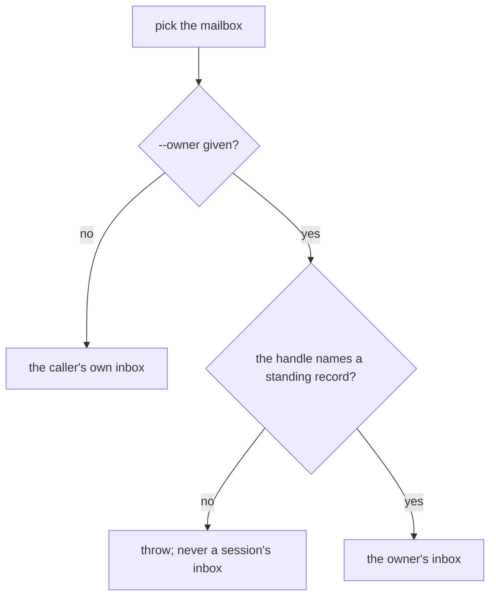
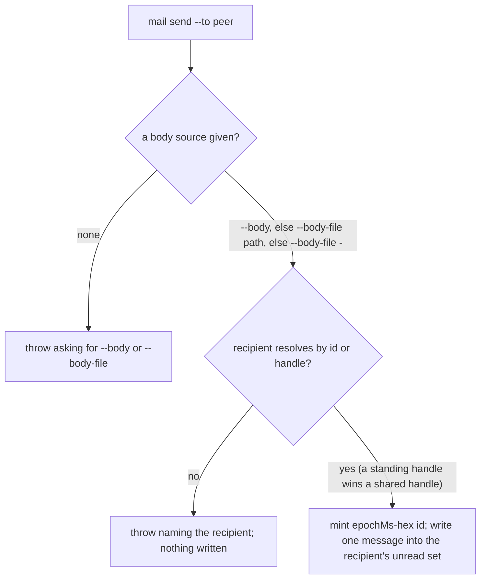
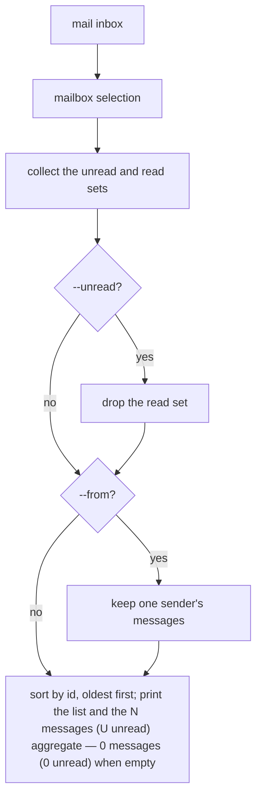
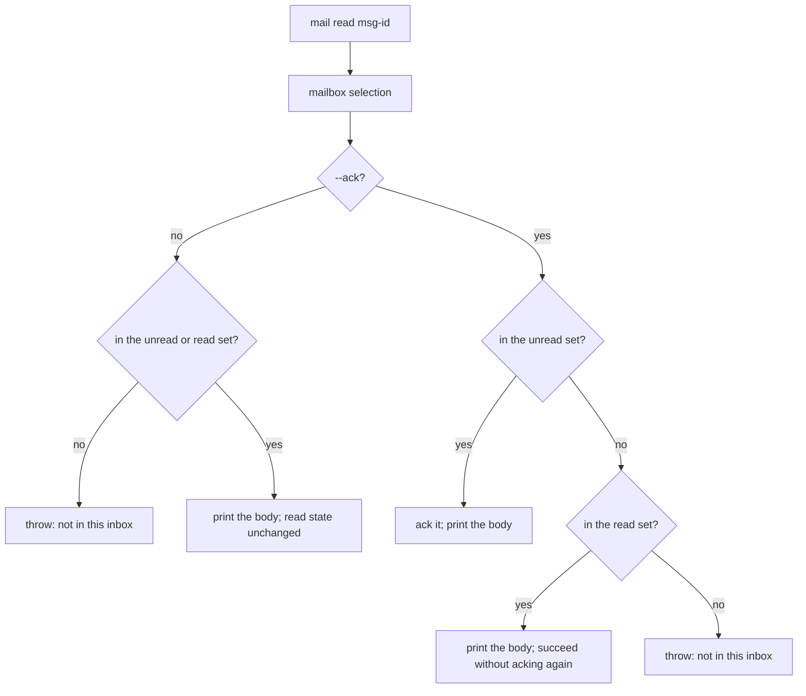
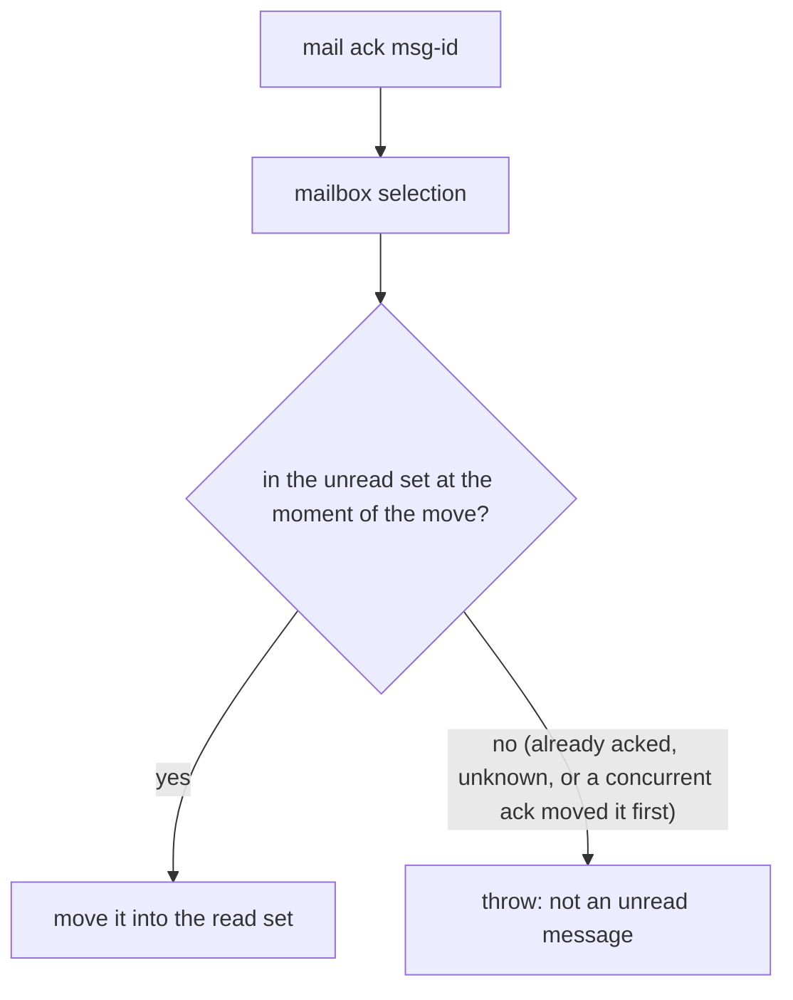
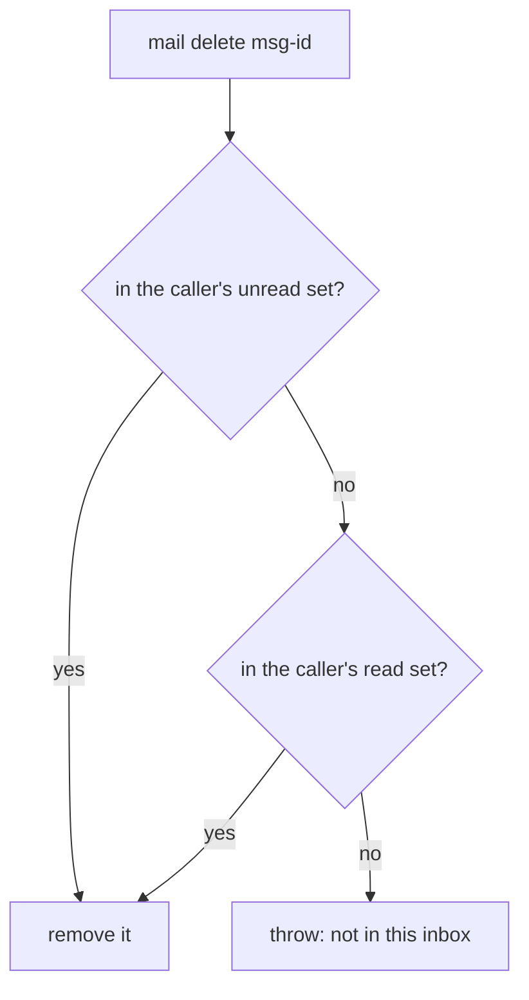

# mail core — durable inter-agent messaging

## What

Agents in a legion talk to each other by mail. A message is a file written into the recipient's
**inbox** under the global hub (the `Store`), so it survives the sender exiting, the recipient being
busy, and either session restarting. This node covers the plain mail verbs: `mail send` delivers a
message, `mail inbox` lists one, `mail read` shows one, `mail ack` marks one consumed, and
`mail delete` removes one. Nothing is lost and nothing is delivered twice: every send writes exactly
one message, and consuming a message is a deliberate, separate act.

The same verbs also reach the **standing owner mailbox** — the durable inbox a human reads — from
any session, so a person moving between sessions manages one hub-level inbox from wherever they are.

**Key terms**

- **inbox** — one recipient's mail, keyed by the recipient's id. It holds two sets: **unread** and
  **read** (acked).
- **message id** — `<epochMs>-<hex>`: the send time in milliseconds plus a random hex tail. Sorting
  ids as text sorts them by time, and the tail keeps two sends in the same millisecond distinct.
- **peek** — show a message without changing whether it is read.
- **ack** (acknowledge) — consume a message: move it from the unread set to the read set.
- **standing owner** — a durable, session-independent record for a human principal
  (`unit/registry`). Its inbox is the **owner mailbox**.
- **--owner** — a selector on `inbox`, `read`, and `ack` that targets a standing owner's inbox
  instead of the caller's own.

**Non-goals.**

- **Thread correlation and waiting** — `send --thread/--reply-to`, `inbox --thread`, `mail await`,
  and `mail watch` are spec'd in [`mail/wait`](../wait/README.md).
- **Injecting mail into a harness turn** — the hook payload and the owner-mail surfacing gate are
  spec'd in [`mail/surface`](../surface/README.md).
- **Waking the recipient on delivery** — the push-side doorbell is spec'd in
  [`mail/doorbell`](../doorbell/README.md).

This node is plain send / inbox / read / ack / delete only.

**Provenance.** Migrated CR-2 from `mail/mail.feature` (send/inbox/read/ack, unchanged) plus
`wake/wake.feature`'s `mail delete` scenarios (`cyberlegion-cli-realign`, ADR-0024): the oversized
`mail/` (62 scenarios) was sub-split into `core`/`wait`/`surface`, each a real mail sub-command group
rather than a `concept:` tag.

## Use Cases

**Actors**

- **A sending agent** — wants a message to reach a peer reliably, addressed by whatever name it
  knows the peer by.
- **A receiving agent** — wants to see what arrived, look at a message, and mark it handled or throw
  it away, without losing anything or handling anything twice.
- **A human owner, roaming across sessions** — wants to manage the one owner mailbox from whichever
  session they are in.
- **A frameless agent** (for example a cron-started session) — wants to leave a report for the owner
  and exit.
- **Stakeholder: `unit/lifecycle`** — decommissions a unit and needs its mailbox gone with it.

**Subject** — durably delivering a message to a peer's inbox and letting that peer list, peek at,
consume, or permanently remove it, without losing or duplicating anything.

### mail send — deliver exactly one message

| Trigger | Inputs | Outcome |
|---|---|---|
| `mail send --to <peer>` | the recipient by handle or id; the body from `--body <text>`, `--body-file <path>`, or `--body-file -` (stdin) | exactly one message file in the recipient's inbox, with a collision-free, time-ordered id |

- **The id is collision-free and time-ordered.** The id is `<epochMs>-<hex>`. The random hex tail
  keeps two sends in the same millisecond distinct, and lexical id order is time order, so a later
  send always sorts after an earlier one.
- **The recipient is resolved by handle or id.** A standing owner's handle resolves to the standing
  record (standing-precedence, see `unit/registry`), so a report addressed to the owner lands in the
  owner inbox.
- **The body comes from one source.** `resolveBody` takes the first source given, in the priority
  `--body`, then `--body-file <path>`, then `--body-file -` (stdin).

Extensions:

- **No body source** — neither `--body` nor `--body-file` given: it throws asking for one of them,
  rather than sending an empty message.
- **Unknown recipient** — it throws naming the recipient and writes nothing; no partial message ever
  lands in any inbox.

### mail inbox — list what arrived

| Trigger | Inputs | Outcome |
|---|---|---|
| `mail inbox` | optional `--unread`, `--from <handle-or-id>`, `--owner <handle>` | a TOON list (`messages[N]{id,from,subject,read}:`), oldest-first, plus a `<N> messages (<U> unread)` aggregate |

- `--unread` restricts the list to un-acked mail; `--from` restricts it to one sender. Both compose
  with the default oldest-first order.

Extensions:

- **Empty inbox** — reports `0 messages (0 unread)` rather than erroring.
- **`--owner` on a non-standing handle** — errors (see *the owner mailbox* below).

### mail read — peek at a message

| Trigger | Inputs | Outcome |
|---|---|---|
| `mail read <msg-id>` | a message id; optional `--owner <handle>` | the message's body, with from and subject, printed; its read state is unchanged |

- **read peeks — it does not consume.** The message stays unread and is still returned by a later
  `mail inbox --unread`.

Extensions:

- **Unknown message id** — errors that the message is not in this inbox.

### mail ack — consume a message

| Trigger | Inputs | Outcome |
|---|---|---|
| `mail ack <msg-id>` | a message id; optional `--owner <handle>` | the message moves from the unread set into the caller's read set |

- **ack is the consumer** — it is the only command that changes a message's read state.

Extensions:

- **Already acked, or unknown id** — errors rather than silently succeeding.
- **Two concurrent acks of the same message** — exactly one succeeds and the other errors (the loser
  finds the message already acked), so no report is double-consumed or lost.

### mail read --ack — peek and consume in one atomic step

| Trigger | Inputs | Outcome |
|---|---|---|
| `mail read <msg-id> --ack` | a message id; optional `--owner <handle>` | the body printed (as `read` does) and the message acked in the same call |

- "Receive and consume" is one round-trip instead of read-then-separately-ack.
- **Safe to repeat** (idempotent): it always prints the body and acks only when the message is still
  unread. On an already-acked message it prints the body and succeeds — unlike bare `ack`, which
  errors on a double-ack.
- It composes with `--owner`, consuming a standing owner-mailbox message in one step with the same
  idempotent behavior. Bare `mail read` (no `--ack`) stays the non-consuming peek.

Extensions:

- **Unknown message id** — still errors.

### mail delete — remove a message permanently

| Trigger | Inputs | Outcome |
|---|---|---|
| `mail delete <msg-id>` | a message id in the caller's own inbox | the message is gone, whether it was unread or already acked |

- Unlike `ack`, it does not require the message to still be unread.

Extensions:

- **Unknown message id** — errors rather than silently succeeding.

### The owner mailbox — readable and ackable from any session

`mail send --to <owner>` resolves the standing record and delivers into the owner inbox. `mail
inbox`, `mail read`, and `mail ack` take `--owner <handle>`, which targets a **standing** record's
inbox instead of the caller's own — so a human roaming across sessions manages the one hub-level
owner mailbox from wherever they are. `read --ack` also takes `--owner`; bare `read --owner` still
peeks without changing read state.

Extensions:

- **`--owner` on a handle that is not a standing record** — errors; it never reads a session's inbox
  as an owner mailbox.
- **Two concurrent `mail ack --owner` of the same message** — one success and one error, as for any
  ack.

### No verb: a mailbox lives as long as its address, not its runtime

Mail is keyed by the recipient's id, so stopping or restarting a unit's session (`unit/runtime`)
needs no mail-side act. The only whole-mailbox delete is the one `unit close` asks for when a unit is
decommissioned (`unit/lifecycle`); it removes read and unread mail together, through the mail store.

**Surface trace.** `--to` and `--body`/`--body-file` serve *send*; `--unread` and `--from` serve
*inbox*; `--ack` serves *read --ack*; `--owner` serves the owner mailbox on `inbox`, `read`, and
`ack` (and composes with `--ack`). `delete` takes no `--owner`: it acts on the caller's own inbox
only. `--body` and `--body-file` are not combined — the first given wins.

## Control Flow

`inbox`, `read`, and `ack` first pick a mailbox (the shared sub-graph below); `send` and `delete`
do not. Each verb then runs its own decisions.

### mailbox selection (inbox, read, ack)

### send

### inbox

### read and read --ack

### ack

The move is a single file rename, so of two concurrent acks exactly one finds the message unread.

### delete

## Scenario map

Grouped by use case, 1:1 with [`core.feature`](./core.feature). `any` in **Path** is a convergence
claim.

### mail send

| Edge | Path (Given) | Scenario |
|---|---|---|
| `SD4` | a registered sender and recipient | `send writes exactly one message into the recipient's inbox` |
| `SD4` ordering | two sends to one recipient, one after the other | `the message id is collision-free and time-ordered` |
| `SD4` same millisecond | two sends to one recipient at the same millisecond | `two sends in the same millisecond do not clobber each other` |
| `SD3 -- yes` by handle and by id | a recipient known by both a handle and an id | `a message is addressable to the recipient by handle or by id` |
| `SD3X` | no agent addressable as the recipient | `an unknown recipient errors with no partial write` |
| `SD1 -- source` | a body from each of the three sources | `the body comes from --body, --body-file <path>, or --body-file - (stdin)` |
| `SD1X` | no `--body` and no `--body-file` | `neither --body nor --body-file given errors rather than sending an empty message` |

### mail inbox

| Edge | Path (Given) | Scenario |
|---|---|---|
| `IN4` | a caller with two unread messages sent in order | `inbox lists the caller's mail oldest-first with a message/unread aggregate` |
| `IN4` empty | a caller with no mail at all | `inbox reports a definitive empty state` |
| `IN2U` | a caller with one acked and one unread message | `--unread restricts the listing to un-acked mail` |
| `IN3F` | a caller with messages from two senders | `--from restricts the listing to one sender` |

### mail read

| Edge | Path (Given) | Scenario |
|---|---|---|
| `RD3` | a caller with one unread message | `read prints the message body without acking it` |
| `RD2X` | a message id not in the caller's inbox | `read on an unknown message id errors` |

### mail ack

| Edge | Path (Given) | Scenario |
|---|---|---|
| `AK2` | a caller with one unread message | `ack moves the message out of the unread set` |
| `AK1X` already acked | a message the caller has already acked | `acking an already-acked message errors` |
| `AK1X` unknown | a message id not in the caller's inbox | `acking an unknown message id errors` |

### mail read --ack

| Edge | Path (Given) | Scenario |
|---|---|---|
| `RA2` own inbox | a caller with one unread message | `read --ack prints the body and acks in one step` |
| `RA3Y` own inbox | a message the caller has already acked | `read --ack on an already-acked message prints the body without erroring` |
| `RA3X` | a message id not in the caller's inbox | `read --ack on an unknown message id errors` |
| `MB4` → `RA2` | a standing owner with one unread message | `read --ack --owner consumes an owner-mailbox message in one step` |
| `MB4` → `RA3Y` | a standing owner with an already-acked message | `read --ack --owner on an already-acked owner message prints the body without erroring` |

### mail delete

| Edge | Path (Given) | Scenario |
|---|---|---|
| `DL1 -- yes` | the caller has an unread message | `delete removes an unread message` |
| `DL3 -- yes` | the caller has an already-acked message | `delete removes an already-acked message` |
| `DL3X` | a message id not in the caller's inbox at all | `delete on an unknown message id errors rather than silently succeeding` |

### The owner mailbox

| Edge | Path (Given) | Scenario |
|---|---|---|
| `SD3 -- yes` standing handle | a standing owner | `mail send to a standing owner delivers to the owner inbox` |
| `MB4` → `IN4` | a standing owner holding two messages, a caller with its own inbox | `mail inbox --owner lists the owner mailbox from any session` |
| `MB4` → `RD3` | a standing owner with one unread message | `mail read --owner peeks the owner mailbox without consuming` |
| `MB4` → `AK2` | a standing owner with one unread message | `mail ack --owner is the only thing that flips an owner message to read` |
| `AK1X` concurrent | two sessions acking the same owner message | `two concurrent acks of the same owner message — one wins` |
| `MB3X` | a handle that is a live session, not a standing owner | `mail --owner on a non-standing handle errors` |
