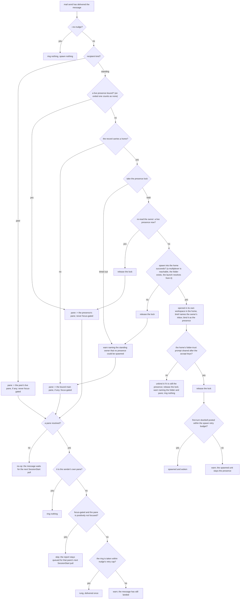

# mail doorbell — wake the recipient on delivery

## What

The **push** counterpart to [`mail/surface`](../surface/README.md)'s **pull**. `mail send` durably
delivers a message; the doorbell rings the recipient on arrival so a working recipient checks its
inbox without the sender separately running `unit nudge`. One primitive, four recipient shapes: a
peer agent's live session pane; a **standing owner** with a **presence** bound (`unit claim`), rung at
that live unit's pane; a standing owner with none but a **home** (`unit register --standing --home`),
where a presence is spawned and woken; or a standing owner with neither, rung at the hub's **bound
main pane** (`attach`), the human's live presence. Added by CR github-159 —
both gaps it closes (a peer never woken; the human never notified on live arrival) are the same
missing primitive, differing only in recipient.

## Use Cases

**Subject** — waking the recipient of a just-delivered message so it checks its inbox, without
turning the durable send into something that can fail because no one was awake:

- **A peer recipient with a live pane is rung on delivery** — after `mail send --to <peer>` writes the
  message, the recipient's live session pane is rung with a check-your-inbox doorbell so a working
  ship reads the mail with no separate manual `unit nudge`. The ring goes through the same
  `unit/lifecycle` **submit-verify** path the standalone nudge uses (issue #150): it is delivered as a
  **taken turn** — read the pane back, flush the staged buffer if a booting harness swallowed the
  first submit, never re-typing so the doorbell lands exactly once — not fire-and-forget. The sender's
  own pane is never rung (a send whose recipient resolves to the sender's own session delivers no
  doorbell to itself).
- **The wake never fails the send** — durable delivery is the guaranteed effect; the doorbell is
  best-effort on top. A recipient with **no live pane** (headless/absent) is a legitimate no-op: the
  message still lands, the send succeeds, and it surfaces on the recipient's next SessionStart via the
  existing pull path (`mail/surface`). A ring that **never completes** (a live pane that keeps the
  doorbell staged past the retry cap) is reported as a best-effort warning, never a send error — the
  message still lands. Mail stays store-and-forward; the nudge is the opportunistic wake on top.
- **A standing owner recipient is notified at the bound main pane** — when the recipient is a
  **standing owner** (`kind: standing`, no session pane of its own), the doorbell rings the hub's
  **bound main pane** (`attach`) instead — the human's live presence — so an owner report reaches the
  human proactively on arrival, not only when an agent next fires the surfacing hook and chooses to
  relay it. With **no main pane bound** the ring is the same store-and-forward no-op: the message
  lands durably and surfaces on the next SessionStart.
- **A standing owner with a bound presence is rung at that presence, never focus-gated** — when the
  standing owner has a **presence** bound (`unit claim` — the live unit standing in for it), the
  doorbell rings **that unit's pane** instead of the bound main pane, and rings it **regardless of
  focus**. This is not a new rule but the existing **peer** rule reaching its proper subject: a
  presence is an agent expected to take the turn, not a human whose attention is the scarce resource,
  so the focus gate — which exists to protect *human* attention — does not apply to it. It must not:
  the whole value of a presence is that it acts on a delivery while the human is away, which is
  exactly when a focus gate would suppress the ring. The presence is resolved **live**: a presence
  whose unit has exited is no presence at all, and the ring falls back to the bound main pane rather
  than ringing a corpse.
- **A standing owner with a home and no live presence gets one spawned there** — when the standing
  owner has **no live presence** (none bound, or the bound unit has exited) but its record carries a
  **home** (`unit/registry`), the doorbell **spawns** a unit in that home and binds it as the
  presence, then wakes it. Without this, mail from a sender nobody watches — a cron job, a headless
  session — sits unread until a person looks. The home **outranks the bound main pane**: an owner
  that names where it lives wants a unit acting for it, not a human notified.
  - **What is spawned.** A session opened in the home with no worktree, by the same spawn mechanism
    `unit spawn --cwd <home>` uses (`unit/lifecycle`). Three things differ, and this node owns each:
    - the launch comes from the home's agent definition, **looked up from the home** (the same anchor
      `unit register --standing --home` validated it against), or from its harness;
    - it opens in **its own workspace**, never a tab or split of the sender's space: the sender is not
      the new unit's parent and may not be in a pane at all;
    - the home's folder-trust prompt is **accepted**, where a plain `--cwd` spawn leaves it for a
      person. The person named that folder when registering the home; that recorded consent is what a
      worktree spawn gets from being made out of the caller's own repository. A prompt still showing
      after the accept keys means the unit cannot read its brief, so it is **unbound** again (still
      under the presence lock, and only if it is still the presence) and the send warns, naming the
      folder and the pane: a presence stuck at a trust prompt would be rung by every later delivery,
      and a ring typed into that prompt answers it wrongly. The unit is left open for a person to
      answer, and **no other pane is rung**: the warning already names the pane that needs a person,
      and a main-pane ring would only say "check your inbox".
  - **What it is told.** Its brief says which standing owner it stands in for and to read that owner's
    mail (`mail inbox --owner <handle>`). The first-turn doorbell names the brief's path, exactly as
    `unit spawn` does (#152: it counts only once the harness posts it).
  - **One spawn, not two.** The bind happens at spawn time, **under the presence lock** `unit claim`
    already takes. The doorbell takes the lock, re-reads the owner, and only then decides: if a
    near-simultaneous delivery already spawned a presence, this one rings that presence instead of
    spawning a second unit. The lock covers the re-read, the spawn (opening the pane and writing the
    record), the bind, and the trust step; only the first-turn ring happens after it is released. The
    trust step is inside so that no other delivery can ring the new presence while its trust prompt
    may still be showing. The price is that a second delivery during a first boot in a folder may wait
    past the lock's bound and take the lock-timeout path below; its message is already in the inbox
    the new presence is about to read, so nothing is lost. The lock is the store's advisory lock
    (`unit claim` takes the same one): acquiring it waits a bounded time, then throws.
  - **A spawn that cannot happen is a warning, never silent, never a send error.** Spawn's own
    refusals throw (`unit/lifecycle`); this node catches them and turns each into a warning. The home
    folder may have been removed, the agent definition renamed, or the presence lock held past its
    timeout by another delivery. The
    most important case is a **sender outside any multiplexer**: the probe (`mux`) reports none, so
    there is nowhere to open a pane. A cron job is exactly that sender. Each of these is reported as
    a best-effort warning naming the standing owner, and the wake then **degrades to what an owner
    without a home gets**: the focus-gated bound main pane. The mail has already landed and stays
    queued in the owner's inbox. A sender outside any pane can still reach a running multiplexer by
    naming it (`CYBER_MUX=herdr` or `CYBER_MUX=tmux` in its environment), and the warning says so.
    With herdr that works from anywhere. With tmux it needs a tmux server already running, and the
    new window lands in whichever session tmux treats as current.
  - **A first-turn ring that never completes** leaves the spawned unit bound as the presence (it is
    live), reports a warning, and never fails the send. The next delivery rings it as a live presence.
- **The standing-owner ring gates on the bound main pane being focused** — with **no presence bound**
  and **no home** (or a home that could not spawn), the ring falls back to the human's read-pane, and there the focus gate applies exactly as before.
  The bound main pane is the
  human's live presence, but the human roams (moving to another pane), so a ring to a pane
  no one is watching wakes a session nobody sees and burns tokens. Before ringing the standing-owner's
  bound main pane, ask the mux whether that pane is **currently focused** (on screen for an attached
  client — `mux`'s focus primitive). When it is **positively not focused**, the ring is skipped: the
  report stays queued in the durable owner inbox and surfaces on that pane's next SessionStart pull
  (`mail/surface`), so nothing is lost. When it **is** focused — or when the backend **cannot report
  focus** (`unknown`) — the ring proceeds as before: the gate **fails open**, so a mux that can't
  answer never regresses to silence. This gate applies **only** to the standing-owner ring; a **peer**
  recipient's live pane is rung regardless of focus (a peer is an agent expected to take the turn, not
  a human whose attention is the scarce resource). Probing focus is best-effort inside the same wake
  path — any probe error is treated as `unknown` and rings, never failing the send.
- **Opt-out for a heads-down recipient** — `mail send --no-nudge` suppresses the delivery doorbell to
  every recipient shape (a peer's pane, a standing owner's bound presence, its bound main pane), and
  spawns nothing into a standing owner's home; the message still lands durably, so a sender that must not interrupt a working recipient can
  deliver quietly.

**Non-goals** — the plain send/inbox/read/ack/delete primitives (`mail/core`); the pull-side hook
injection payload and owner-mail surfacing gate (`mail/surface`); the standalone `unit nudge` verb and
its boot-race submit-verify-retry contract (`unit/lifecycle`); minting the standing owner inbox and
binding or clearing its presence through `unit claim`, and storing and validating its home
(`unit/registry`) — the bind and the conditional unbind of a presence this node spawns are this node's own,
taken under the same presence lock; how a spawn
opens a session, answers a trust prompt, and rings its first turn (`unit/lifecycle`); binding the main pane (`attach/`); and what a rung
presence then *does* with the delivery — whether it takes a turn, what work it pulls, and on what
cadence is entirely the caller's judgment one layer up (this node only rings the bell). This node
covers only the on-delivery ring and its best-effort-never-fails-the-send contract. Any persona/place
name for the owner inbox or for the unit standing in for it (e.g. a fleet layer's "report-up" box) is
a higher-layer concern — this node knows only "standing owner", "presence", "home", and "bound main pane".

## Control Flow

One graph: every use case enters at `DB0`, after `mail send` has durably written the message. Every
path ends with the send succeeding; a ring or spawn that fails is a warning on stderr, never an
error.

The lock is held until the spawn step settles, however it settles: an unexpected error between
`DB10` and `DB11` releases it too, and is reported like a `DB8 -- no` spawn failure.

`DB15` reads `unknown` focus (a probe error, a backend that cannot report it) as not positively
unfocused, so the gate fails open. `DB8` and `DB13` reconverge on the same fact for a sender outside
any multiplexer: there is no pane to open and none to ring. `DB11` reads "cleared" as `unit/lifecycle`'s
trust step does: no prompt shown, or a prompt the accept keys dismissed.

## Scenario map

Grouped by use case, 1:1 with [`doorbell.feature`](./doorbell.feature).

### A peer recipient with a live pane is rung on delivery

| Edge | Path (Given) | Scenario |
|---|---|---|
| `DB16 -- yes` | a peer with a live pane | `sending to a peer with a live session pane rings that pane on delivery` |
| `DB16 -- yes` staged | a peer whose first submit is staged while booting | `the delivery doorbell is delivered as a taken turn, not fire-and-forget` |
| `DB14 -- yes` | a recipient resolving to the sender's own session | `sending does not ring the sender's own pane` |

### The wake never fails the send

| Edge | Path (Given) | Scenario |
|---|---|---|
| `DB13 -- no` | a peer with no live pane | `a recipient with no live pane is a store-and-forward no-op, not a send failure` |
| `DB16 -- no` | a peer whose pane keeps the doorbell staged | `a delivery ring that never completes never fails the send` |

### A standing owner with a bound presence is rung there, never focus-gated

| Edge | Path (Given) | Scenario |
|---|---|---|
| `DB4 -- yes` | a live presence and a different bound main pane | `sending to a standing owner with a bound presence rings that unit's pane, not the main pane` |
| `DB15 -- no` presence | a live presence nobody is viewing | `a bound presence is rung even when nothing is focused` |
| `DB6 -- no` exited presence | an exited presence, no home, a focused main pane | `a standing owner whose presence unit has exited falls back to the bound main pane` |
| `DB16 -- no` presence | a live presence that keeps the doorbell staged | `a presence ring that never completes is a best-effort warning, not a send error` |
| `DB1 -- yes` presence | a live presence | `--no-nudge suppresses the doorbell to a standing owner's bound presence` |

### A standing owner with a home and no live presence gets one spawned there

| Edge | Path (Given) | Scenario |
|---|---|---|
| `DB10` | a home, no presence bound, a focused main pane | `sending to a standing owner with a home and no presence spawns a unit there and binds it as the presence` |
| `DB10` exited presence | a home, a bound presence that has exited | `a standing owner whose presence has exited gets a new presence spawned in its home` |
| `DB12 -- yes` | a spawned presence | `the unit spawned in the home is told to read the owner's mail` |
| `DB11 -- yes` | a home whose harness shows a folder-trust prompt | `the home's folder-trust prompt is accepted` |
| `DB11 -- no` | a home whose trust prompt is still showing after the accept keys, a focused main pane | `a spawned unit stuck at its trust prompt is unbound and the send warns` |
| `DB12 -- no` | a spawned unit that never posts the first turn | `a spawned presence whose first turn never posts stays bound and the send still succeeds` |
| `DB4 -- yes` home | a home and a live presence | `a standing owner with a home and a live presence is rung there and nothing is spawned` |
| `DB7R -- yes` | a home, no presence, two deliveries at once | `two near-simultaneous deliveries spawn one presence, not two` |
| `DB7 -- timed out` | a home, no presence, the presence lock held by a live process | `a presence lock held past its timeout warns and falls back to the bound main pane` |
| `DB8 -- no` no multiplexer | a home, a sender outside any multiplexer | `a sender outside any multiplexer spawns nothing and warns instead of staying silent` |
| `DB10` named multiplexer | a home, a sender outside any pane that names a running herdr | `a sender outside any pane that names a running multiplexer spawns the presence` |
| `DB8 -- no` definition gone | a home whose agent definition no longer resolves from it | `a home whose agent definition no longer resolves warns and spawns nothing` |
| `DB8 -- no` spawn fails | a home whose folder was removed, a focused main pane | `a home that cannot be spawned warns and falls back to the bound main pane` |
| `DB1 -- yes` home | a home, no presence | `--no-nudge spawns nothing into a standing owner's home` |

### A standing owner recipient is notified at the bound main pane

| Edge | Path (Given) | Scenario |
|---|---|---|
| `DB9` | no presence, no home, a bound main pane | `sending to a standing owner rings the bound main pane so the human is notified on arrival` |
| `DB13 -- no` standing | no presence, no home, no main pane | `standing-owner mail with no bound main pane is a store-and-forward no-op` |

### The standing-owner ring gates on the bound main pane being focused

| Edge | Path (Given) | Scenario |
|---|---|---|
| `DB15 -- yes` | a main pane nobody is viewing | `a standing-owner delivery does not ring the bound main pane when it is positively not focused` |
| `DB15 -- no` focused | a main pane a client is viewing | `a standing-owner delivery rings the bound main pane when it is focused` |
| `DB15 -- no` unknown | a main pane whose focus cannot be read | `a standing-owner delivery rings when focus is unknown, and a probe error never fails the send` |
| `DB15 -- no` peer | a peer pane nobody is viewing | `a peer delivery ring is never focus-gated` |

### Opt-out for a heads-down recipient

| Edge | Path (Given) | Scenario |
|---|---|---|
| `DB1 -- yes` peer | a peer with a live pane | `--no-nudge suppresses the delivery doorbell to a peer` |
| `DB1 -- yes` main pane | a standing owner with a bound main pane | `--no-nudge suppresses the doorbell to a standing owner's bound main pane` |
