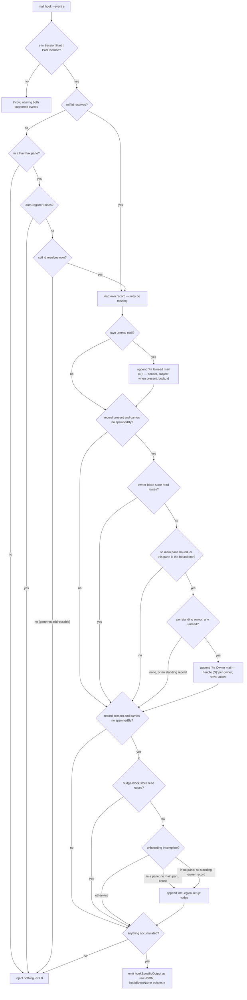

# mail surface — inject unread mail into a session across harnesses

## What

`mail hook --event SessionStart|PostToolUse` emits the harness hook payload that injects a session's
unread mail and (when this session is the hub's main pane) the standing owner's unread mail. It
carries no brief: a spawned peer's brief reaches it in the wake instruction (`unit/lifecycle`), not
through this hook. Migrated CR-2 from `surfacing/surfacing.feature`
(`cyberlegion-cli-realign`, ADR-0024): the former `surfacing/` concept-folder dissolves — `mail
surface` is a real mail sub-command group, correctly subordinate to `mail` instead of a top-level
sibling. The per-harness installer folded into [`init/`](../../init/README.md), which owns installation directly.

**Key terms.** A **root session** (top-level session) is one whose registry record carries no
`spawnedBy` — nobody in the legion spawned it. A **spawned unit** is the opposite: its record names
the agent that spawned it. The **standing owner** is the durable inbox a human reads
(`unit/registry`). The **main pane** is the one multiplexer pane a human designated as the owner's
live presence (`attach/`). **Onboarding is incomplete** while there is nothing to surface owner mail
into — no main pane bound (in a multiplexer) or no standing owner minted (outside one).

## Use Cases

**Subject** — surfacing a session's unread mail (its own and, when applicable, the standing owner's)
into its own next turn via the harness's own hook mechanism:

- **The `--event` value is validated, and echoed back in the payload** — `mail hook --event <e>`
  recognizes only `SessionStart` and `PostToolUse`; anything else throws naming both supported
  values. When a payload is emitted, its `hookEventName` field carries back the value the caller
  passed, so the harness sees the event it fired rather than a fixed one.
- **A live-pane caller with no identity auto-registers; an unregistered non-pane caller injects
  nothing** — when the calling session has no resolvable self id but is in a live multiplexer pane,
  `mail hook` registers it first (best-effort: the same mux-agnostic `register` the CLI runs, so the
  session's pane resolves to a fresh agent id and later calls recover it) before surfacing. When the
  session has no self id **and** is in no resolvable pane — or when auto-register cannot determine the
  harness, or the pane belongs to a multiplexer whose panes the registry cannot address — `mail hook`
  prints nothing and exits 0. Either way it never fails the harness turn.
- **`mail hook` emits the caller's own unread mail** — every currently-unread message appears under
  `## Unread mail (<N>)` with sender, subject when the message carries one, body, and id. An already
  acked message is excluded, and surfacing a message does not ack it: it re-surfaces on the next call
  until the caller acks it deliberately.
- **Owner mail surfaces into the bound main pane, never into a spawned unit** — beyond the caller's
  own unread mail, `mail hook` also surfaces **every standing owner** inbox's unread mail
  (bodies included) under its own owner-mail heading, so a human sees a frameless agent's report
  inline without pulling it manually. A spawned unit (record has a `spawnedBy`) **never** surfaces
  owner mail. Among root sessions (no `spawnedBy`) the gate keys on the hub's **main pane** (`attach`):
  when a main pane **is** bound, only the session in that pane surfaces owner mail — another root pane,
  or a root session in no pane at all, surfaces none; when **no** main pane is bound, the gate falls
  back to surfacing in **any** root session (the pre-onboarding behavior, so nothing regresses before a
  pane is bound). Surfacing **never acks** — an unread owner message re-surfaces on every hook call
  until it is explicitly acked (`mail ack --owner`), and once acked it no longer surfaces (showing a
  message is a model printing text, not proof a human read it, so read stays a deliberate act). When no
  standing owner record exists at all, `mail hook` surfaces no owner section and still exits 0.
- **An unbound root session gets a session-start setup nudge** — when the caller is a root session (no
  `spawnedBy`) and onboarding is incomplete, `mail hook` appends a best-effort `## Legion setup` line
  pointing at `cyberlegion init`, so a human is prompted to designate this pane as the owner's live
  presence. Incomplete means: **in a multiplexer pane** → no main pane is bound; **in no pane**
  (non-mux) → no standing owner record exists (there is no pane to bind, so a minted owner is the
  completion signal). Binding a main pane (mux) or minting the standing owner (non-mux) silences the
  nudge. A spawned unit never gets it. Computing the gate or the nudge is best-effort — each sits in
  its **own** swallowing `try`, so a store error drops **that** section only and the rest of the
  payload still emits, exit 0.
- **The payload joins every accumulated section into one `additionalContext`** — the three sections
  are independent. When nothing accumulated, `mail hook` prints nothing and exits 0. When something
  did, stdout is one line of raw JSON in the harness's `hookSpecificOutput` shape (not TOON — this
  command is consumed by the harness, not a human), whose `additionalContext` carries the sections
  that fired, blank-line separated, in the order **own mail → owner mail → setup nudge**.
- **No brief is injected, whatever the peer's record carries** — no branch of this hook reads or
  injects a spawned peer's brief file. The brief stays on disk and the payload carries no brief
  section. A record migrated from an older hub may still carry the retired `spawning` status; it gets
  no brief either, and the hook leaves that status untouched rather than flipping it.
- **The dedicated hook command is used, not a generic exec** — the injection payload is produced only
  by `mail hook`; no other CLI path emits `hookSpecificOutput`.

**Non-goals** — the mail primitives themselves (send/inbox/read/ack/delete, `mail/core`), thread
correlation and the bounded `mail await`/`watch` (`mail/wait`), the doorbell nudge and the spawn wake
instruction that points a peer at its brief file (`unit/lifecycle`), minting the standing owner
inbox (`unit/registry`) and binding the main pane (`attach/`), and the auto-detecting onboarding front door (`init/`) — this node only covers the hook
payload and the owner-mail/nudge surfacing gate.

The per-harness hook installer (the old `admin install`) is **not** here — it folded into
[`init/`](../../init/README.md), which now owns installation directly (CR-2 resolution #2: init's
PostToolUse coverage was extended to include codex rather than duplicating the install scenarios).

## Control Flow

Every use case enters one graph: `mail hook` validates the event, resolves the caller, then appends up
to three independent sections — the caller's own unread mail, every standing owner's unread mail, and
the setup nudge — and emits only if something accumulated. **No branch reads the brief**: the payload
carries no brief section whatever the record's status, which is what retires the split ADR-0027 chose
(ADR-0032).

Two details the graph draws that a coarser one hides, because both are where the defects live:

- The eligibility test **"a record is present and carries no `spawnedBy`"** is evaluated **twice**, at
  `H` and again at `M` — two textually identical guards, each inside its **own** `try`/`catch` and each
  taking its **own** main-pane read. So an owner-block failure does **not** skip the nudge, and the two
  reads need not agree.
- The record loaded at `F` **may be missing**. A self id can come from `$CYBERLEGION_AGENT_ID` with no
  record behind it; both eligibility guards then fail closed, so such a caller gets its own mail and
  nothing else.

## Scenario map

Grouped by use case. Every scenario in [`surface.feature`](./surface.feature) has exactly one row;
an edge carrying several rows is permutation coverage. Such rows are justified by **discrimination**,
not by differing outcomes — two rows may reach the same outcome by different routes and still both
earn their place, because each kills a subject the other admits. The two `I -- no` rows are exactly
that: both end in no owner-mail section, but the second kills a subject that routes a paneless caller
into the no-main-pane fallback. `any` in **Path** is a convergence claim — the outcome does not vary
with the upstream branch — and the fallback row makes one, leaving the caller's pane-ness unspecified.

**The map is derived from the graph, not from the suite.** It was rebuilt by deriving the required
`(path class, edge)` pairs from the implementation with the suite unseen, then diffing them against
the frozen scenarios; ten pairs had no scenario and were added, and the negatives whose `Given`
established nothing else in the payload were narrowed so the absence they assert can actually fail.
**Every** absence a `Then` asserts here is held to that bar, not only the refusals: the `Given` must
construct a state in which some wrong implementation would produce the thing the `Then` denies. Two
narrowings exist only for that reason and are load-bearing — the rejected-`--event` scenario carries a
registered caller with unread mail (otherwise no implementation, right or wrong, could emit a
payload), and the record-less caller sits **in a pane with no main pane bound** (outside a
multiplexer a standing owner already silences the nudge, so the nudge absence could not fail; in a
pane with none bound, an implementation that conflates "no record" with "not eligible" appends *both*
the owner-mail section and the nudge, and both absences fail together).

**Known gaps and co-owned rows**, recorded rather than papered over:

- **Three rows are doctrine fences, not control-flow branches.** `a spawned peer's hook call injects
  no brief` and `a peer record carrying a legacy spawning status still gets no brief` assert a branch
  that must **not** exist (the `barred` shape) — there is no file read anywhere in this hook. They are
  kept as an anti-regression fence against the retired ADR-0027 split. The legacy-status row also
  carries an assertion that belongs to record migration rather than to this hook — that a record
  migrated with an **off-enum** `spawning` status round-trips untouched. It is a load-bearing
  constraint (`admin migrate` carries records from older hubs), so it is **kept here** rather than
  dropped; relocating it to `unit/registry` is a filed follow-up, not this node's edit.
- **`only the dedicated mail hook command produces the injection payload` is co-owned with `init/`.**
  It asserts what the installed harness config invokes, which this node's own Non-goals hand to
  `init/`. Its row is anchored to entry node `A` because there is no edge in this graph for it to
  name — the tell that it is co-owned. Relocating it to `init/` is a filed follow-up.
- **Three implementation defects are specified as they behave today, and filed for review.** (1) A
  pane in a multiplexer whose panes the registry cannot address (wezterm, zellij) auto-registers a
  record that nothing can ever resolve, then injects nothing — `E2 -- no`. (2) A caller whose id comes
  from `$CYBERLEGION_AGENT_ID` with no record behind it loses **both** owner mail and the nudge,
  because each guard conflates "is not a spawned unit" with "has a record" — `H -- no` / `M -- no`.
  (3) The two main-pane reads at `HT` and `MT` need not agree, so a concurrent `attach` between them
  can produce owner mail without the nudge, or the inverse. Each scenario below records the current
  behavior; none of the three is fixed here.

### The `--event` value is validated and echoed

| Edge | Path (Given) | Scenario |
|---|---|---|
| `B -- no` reject | `--event PreToolUse`, a registered caller with one unread message | `an unsupported --event value is rejected` |
| `B -- yes` + `Z1` echo | `--event SessionStart`, a caller with unread mail | `a SessionStart hook call echoes SessionStart as the hook event name` |
| `B -- yes` + `Z1` echo | `--event PostToolUse`, a caller with unread mail | `a PostToolUse hook call echoes PostToolUse as the hook event name` |

### An unregistered caller registers from a live pane, or injects nothing

| Edge | Path (Given) | Scenario |
|---|---|---|
| `D -- no` no pane to register from | no resolvable self id, in no mux pane | `a caller with no identity and in no multiplexer pane gets no output and no error` |
| `E -- no` then `E2 -- yes` | in an addressable pane bound as the main pane, no identity yet | `a live-pane session with no identity auto-registers and injects nothing` |
| `E -- yes` auto-register raises | in a mux pane, no identity, no detectable harness | `auto-register in the hook is best-effort and never fails the turn` |
| `E2 -- no` id still unresolvable | in a wezterm pane, whose panes the registry cannot address | `a live pane the hub cannot address registers no reachable identity and injects nothing` |

### mail hook emits the caller's own unread mail

| Edge | Path (Given) | Scenario |
|---|---|---|
| `G -- yes` append unread section | a registered caller with two unread messages, one with a subject | `unread mail is included on every hook call` |
| `G1` subject segment omitted | the one unread message carries no subject | `a message with no subject renders without a subject segment` |
| `G -- yes` unread-only filter | two messages addressed to the caller, one already acked | `an acked message of the caller's own no longer surfaces` |
| `G1` read-only, never acks | one unread message, the hook called twice | `surfacing the caller's own mail never acks it` |
| `H -- no` / `M -- no` no record | an agent id whose record was removed while its inbox was kept, in a pane with none bound, an owner with unread mail | `a caller whose id resolves without an agent record still gets its own mail` |

### Owner mail surfaces into the bound main pane, never into a spawned unit

| Edge | Path (Given) | Scenario |
|---|---|---|
| `I -- yes` this pane is the bound one | an owner with unread mail; the caller is the bound main pane and has own unread mail | `the bound main pane surfaces the owner's unread mail with bodies` |
| `I -- no` bound to another pane | a main pane bound elsewhere; the caller is a root session in a different pane | `a root session that is not the bound main pane does not surface owner mail` |
| `I -- no` caller is in no pane | a main pane bound; the caller is a root session in no mux pane | `a root session in no multiplexer pane surfaces no owner mail once a main pane is bound` |
| `I -- yes` nothing bound (fallback) | no main pane bound, a root session | `with no main pane bound, any root session still surfaces owner mail` |
| `H -- no` spawned unit skips | the record carries a `spawnedBy`, and it has own unread mail | `a spawned unit does not surface the owner's mail` |
| `I0 -- yes` once per standing owner | two standing owners, both with unread mail | `every standing owner with unread mail gets its own heading` |
| `I1` read-only, never acks | an owner with one unread message, the hook called twice | `surfacing the owner's mail never acks it` |
| `I0 -- none` the owner's mail is acked | the owner's only message already acked; the caller has own unread mail | `an acked owner message no longer surfaces` |
| `I0 -- none` no standing record | no standing owner in the registry; the caller has own unread mail | `no standing owner means no owner-mail section` |
| `HT -- yes` owner block swallows | the main-pane read raises; the caller has own unread mail, an owner has unread mail | `a failing main-pane lookup drops the owner-mail section but keeps the caller's own mail` |

### The session-start setup nudge for an unbound root session

| Edge | Path (Given) | Scenario |
|---|---|---|
| `N -- in a pane: no main pane bound` | a root session in a pane, none bound | `an unbound root pane gets a Legion setup nudge` |
| `N -- otherwise` a main pane is bound | a root session in the bound main pane, with own unread mail | `binding a main pane silences the nudge` |
| `M -- no` spawned unit skips the nudge | the record carries a `spawnedBy`, in a pane, none bound, with own unread mail | `a spawned unit never gets the setup nudge` |
| `N -- in no pane: no standing owner record` | a root session in no mux pane, no standing owner | `a non-multiplexer root session with no standing owner gets the setup nudge` |
| `N -- otherwise` a standing owner exists | a root session in no mux pane, a standing owner present, with own unread mail | `a non-multiplexer root session that already has a standing owner gets no nudge` |
| `MT -- yes` nudge block swallows | the registry listing raises; a root session in no pane with own unread mail | `a failing registry read drops the setup nudge but keeps the caller's own mail` |

### The payload joins every accumulated section

| Edge | Path (Given) | Scenario |
|---|---|---|
| `L -- no` nothing accumulated | a root session in the bound main pane, its mail and the owner's all acked | `a caller with an empty inbox and completed onboarding injects nothing` |
| `Z1` raw JSON envelope | a registered caller with unread mail | `the payload uses the harness hookSpecificOutput shape as raw JSON` |
| `L -- yes` all three sections joined | own unread mail, an owner with unread mail, a root pane with none bound | `own mail, owner mail and the setup nudge appear in one payload in that order` |
| `G -- no` + `I1` + `N1` | the caller's own mail all acked, an owner with unread mail, a root pane with none bound | `an unbound root pane surfaces owner mail and the setup nudge without an unread-mail section` |

### No brief is injected, whatever the peer's record carries

| Edge | Path (Given) | Scenario |
|---|---|---|
| **barred**: no brief branch exists | a spawned peer whose brief file is on disk, with unread mail | `a spawned peer's hook call injects no brief` |
| **barred**: no brief branch exists | the same, on a record carrying a legacy `spawning` status | `a peer record carrying a legacy spawning status still gets no brief` |

### The dedicated hook command is used, not a generic exec

| Edge | Path (Given) | Scenario |
|---|---|---|
| `A` the entry point itself | a project with the surfacing hook installed | `only the dedicated mail hook command produces the injection payload` |
