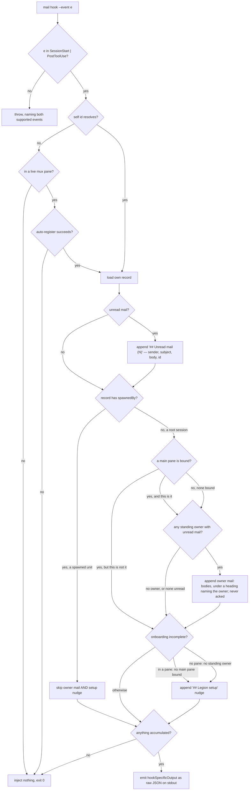

# mail surface — inject unread mail into a session across harnesses

## What

`mail hook --event SessionStart|PostToolUse` emits the harness hook payload that injects a session's
unread mail and (when this session is the hub's main pane) the standing owner's unread mail. It
carries no brief: a spawned peer's brief reaches it in the wake instruction (`unit/lifecycle`), not
through this hook. Migrated CR-2 from `surfacing/surfacing.feature`
(`cyberlegion-cli-realign`, ADR-0024): the former `surfacing/` concept-folder dissolves — `mail
surface` is a real mail sub-command group, correctly subordinate to `mail` instead of a top-level
sibling. The per-harness installer folded into [`init/`](../../init/README.md), which owns installation directly.

## Use Cases

**Subject** — surfacing a session's unread mail (its own and, when applicable, the standing owner's)
into its own next turn via the harness's own hook mechanism:

- **mail hook emits the harness injection payload for unread mail, never a brief** —
  `mail hook --event <SessionStart|PostToolUse>` resolves the calling agent's own identity, then:
  - includes every currently-unread message (`## Unread mail (<N>)`) with sender, subject, body, and
    id;
  - emits the payload as the harness's `hookSpecificOutput` shape (raw JSON on stdout, not
    TOON — this command is consumed by the harness, not a human) whenever there is unread mail to
    inject.
  - never reads or injects a spawned peer's brief file — the brief stays on disk and the payload
    carries no brief section, whatever status the peer's record carries. A record migrated from an
    older hub may still carry the retired `spawning` status; it gets no brief either, and the hook
    leaves that status untouched rather than flipping it.
- **The dedicated hook command is used, not a generic exec** — the injection payload is produced only
  by `mail hook`; no other CLI path emits `hookSpecificOutput`.
- **A live-pane caller with no identity auto-registers; an unregistered non-pane caller injects
  nothing** — when the calling session has no resolvable self id but is in a live multiplexer pane,
  `mail hook` registers it first (best-effort: the same mux-agnostic `register` the CLI runs, so the
  session's pane resolves to a fresh agent id and later calls recover it) before surfacing. When the
  session has no self id **and** is in no resolvable pane — or when auto-register cannot determine the
  harness — `mail hook` prints nothing and exits 0. Either way it never fails the harness turn.
- **No unread mail injects nothing** — a registered, active caller with an empty inbox produces no
  stdout output at all, still exit 0.
- **An unsupported --event is rejected** — only `SessionStart` and `PostToolUse` are recognized;
  anything else throws naming the two supported values.
- **Owner mail surfaces into the bound main pane, never into a spawned unit** — beyond the caller's
  own unread mail, `mail hook` also surfaces the **standing owner** inbox's unread mail
  (bodies included) under a distinct owner-mail heading, so a human sees a frameless agent's report
  inline without pulling it manually. A spawned unit (record has a `spawnedBy`) **never** surfaces
  owner mail. Among root sessions (no `spawnedBy`) the gate keys on the hub's **main pane** (`attach`):
  when a main pane **is** bound, only the session in that pane surfaces owner mail — another root pane
  surfaces none; when **no** main pane is bound, the gate falls back to surfacing in **any** root
  session (the pre-onboarding behavior, so nothing regresses before a pane is bound). Surfacing
  **never acks** — an unread owner message re-surfaces on every hook call until it is explicitly acked
  (`mail ack --owner`), and once acked it no longer surfaces (showing a message is a model printing
  text, not proof a human read it, so read stays a deliberate act). When no standing owner record
  exists at all, `mail hook` surfaces no owner section and still exits 0.
- **An unbound root session gets a session-start setup nudge** — when the caller is a root session (no
  `spawnedBy`) and onboarding is incomplete, `mail hook` appends a best-effort `## Legion setup` line
  pointing at `cyberlegion init`, so a human is prompted to designate this pane as the owner's live
  presence. Incomplete means: **in a multiplexer pane** → no main pane is bound; **in no pane**
  (non-mux) → no standing owner record exists (there is no pane to bind, so a minted owner is the
  completion signal). Binding a main pane (mux) or minting the standing owner (non-mux) silences the
  nudge. A spawned unit never gets it. Computing the gate or the nudge is best-effort — any store error
  is swallowed and the hook still exits 0, never failing the harness turn.

**Non-goals** — the mail primitives themselves (send/inbox/read/ack/delete, `mail/core`), thread
correlation and the bounded `mail await`/`watch` (`mail/wait`), the doorbell nudge and the spawn wake
instruction that points a peer at its brief file (`unit/lifecycle`), minting the standing owner
inbox (`unit/registry`) and binding the main pane (`attach/`), and the auto-detecting onboarding front door (`init/`) — this node only covers the hook
payload and the owner-mail/nudge surfacing gate.

The per-harness hook installer (the old `admin install`) is **not** here — it folded into
[`init/`](../../init/README.md), which now owns installation directly (CR-2 resolution #2: init's
PostToolUse coverage was extended to include codex rather than duplicating the install scenarios).

## Control Flow

Every use case enters one graph: `mail hook` resolves the caller, then appends up to three
independent sections — the caller's own unread mail, a standing owner's unread mail, and the setup
nudge — and emits only if something accumulated. **No branch reads the brief**: the payload carries
no brief section whatever the record's status, which is what retires the split ADR-0027 chose
(ADR-0032). The owner-mail and setup-nudge sub-graphs are best-effort: each sits in its own
swallowing `try`, so a store failure inside either drops that section and never fails the turn.

## Scenario map

Grouped by use case; 1:1 with [`surface.feature`](./surface.feature). `any` in **Path** is a
convergence claim — the outcome does not vary with the upstream branch.

Three things this map makes visible that the prose alone did not. All are in the **frozen** suite,
so none is closable here without narrowing a frozen scenario; they are recorded rather than papered
over.

**`G -- no` carries no row.** No frozen scenario asserts the unread section is absent from a payload
that *still emits*. The two whose `Given` touches an empty inbox assert the payload is empty
(`L -- no`) or that auto-registration happened (`E -- yes`). The three sections are independent in
the implementation, so nothing discriminates that edge — a gap in the suite, closable additively.

**Two frozen `Given`s under-determine their own `Then`.** *a SessionStart hook auto-registers a
live-pane session that has no identity yet* and *a registered, active caller with an empty inbox
injects nothing* both assert `stdout is empty`. Walk either class down this graph and it reaches
`J1`: a root session in a pane with no main pane bound gets the setup nudge, so the payload emits and
stdout is not empty. Neither `Given` says a main pane is bound, or that a standing owner exists. The
implementation already works around it — three fixtures bolt that state on with a comment saying so
(`inject-inbox.test.ts`, `cli.e2e.test.ts`). Adding the missing clause would **narrow** a frozen
scenario and fire Clearance, so it is disclosed here instead. Whoever re-opens these should fix the
`Given`, not the test.

**One scenario sits on the entry node, not an edge.** *only the dedicated mail hook command produces
the injection payload* asserts what the installed harness config invokes — which this node's own
Non-goals hand to `init/`. Its row is anchored to `A` because there is no edge in this graph for it
to name, which is the tell that it is co-owned rather than this node's decision.

### mail hook emits the injection payload for unread mail, never a brief

| Edge | Path (Given) | Scenario |
|---|---|---|
| `G -- yes` append unread section | a registered caller with two unread messages | `unread mail is included on every hook call` |
| `L -- yes` emit as raw JSON | a registered caller with unread mail | `the payload uses the harness hookSpecificOutput shape as raw JSON` |
| **barred**: no brief branch exists | a spawned peer whose brief file is on disk, with unread mail | `a spawned peer's hook call injects no brief` |
| **barred**: no brief branch exists | the same, on a record carrying a legacy `spawning` status | `a peer record carrying a legacy spawning status still gets no brief` |

### The dedicated hook command is used, not a generic exec

| Edge | Path (Given) | Scenario |
|---|---|---|
| `A` the entry point itself | a project with the surfacing hook installed | `only the dedicated mail hook command produces the injection payload` |

### An unregistered caller injects nothing rather than erroring

| Edge | Path (Given) | Scenario |
|---|---|---|
| `D -- no` no pane to register from | no resolvable self id, in no mux pane | `a caller with no identity and in no multiplexer pane gets no output and no error` |
| `E -- yes` auto-register succeeds | in a mux pane, no identity yet, empty inbox | `a SessionStart hook auto-registers a live-pane session that has no identity yet` |
| `E -- no` auto-register fails | in a mux pane, no identity, no detectable harness | `auto-register in the hook is best-effort and never fails the turn` |

### No unread mail injects nothing

| Edge | Path (Given) | Scenario |
|---|---|---|
| `L -- no` nothing accumulated | a registered active caller with no unread mail | `a registered, active caller with an empty inbox injects nothing` |

### An unsupported --event is rejected

| Edge | Path (Given) | Scenario |
|---|---|---|
| `B -- no` | a caller running `mail hook --event PreToolUse` | `an unsupported --event value is rejected` |

### Owner mail surfaces into the bound main pane

| Edge | Path (Given) | Scenario |
|---|---|---|
| `I -- yes, and this is it` | a standing owner with unread mail; this session is the bound main pane | `the bound main pane surfaces the owner's unread mail with bodies` |
| `I -- yes, but this is not it` | a main pane bound to a different pane | `a root session that is not the bound main pane does not surface owner mail` |
| `I -- no, none bound` (fallback) | no main pane bound, a root session | `with no main pane bound, any root session still surfaces owner mail` |
| `H -- yes` spawned unit skips | the record has a `spawnedBy` | `a spawned unit does not surface the owner's mail` |
| `I1` read-only, never acks | a standing owner with one unread, called twice | `surfacing the owner's mail never acks it` |
| `I0 -- no owner, or none unread` | the owner's only message already acked | `an acked owner message no longer surfaces` |
| `I0 -- no owner, or none unread` | no standing owner record exists | `no standing owner means no owner-mail section` |
| `I1` + `J1` both append | no main pane bound, an owner with unread, a root session in a pane | `an unbound root pane surfaces owner mail and the setup nudge together` |

### The session-start setup nudge for an unbound root session

| Edge | Path (Given) | Scenario |
|---|---|---|
| `J -- in a pane: no main pane bound` | a root session in a pane, none bound | `an unbound root pane gets a Legion setup nudge` |
| `J -- otherwise` (bound) | a root session in a pane bound as the main pane | `binding a main pane silences the nudge` |
| `H -- yes` skips the nudge too | a session with a `spawnedBy`, in a pane, none bound | `a spawned unit never gets the setup nudge` |
| `J -- no pane: no standing owner` | a root session in no mux pane, no standing owner | `a non-multiplexer root session with no standing owner gets the setup nudge` |
| `J -- otherwise` (owner exists) | a root session in no mux pane, a standing owner present | `a non-multiplexer root session that already has a standing owner gets no nudge` |
| `I`/`J` best-effort swallow | a root session whose main-pane lookup raises | `computing the gate or nudge never fails the turn` |
