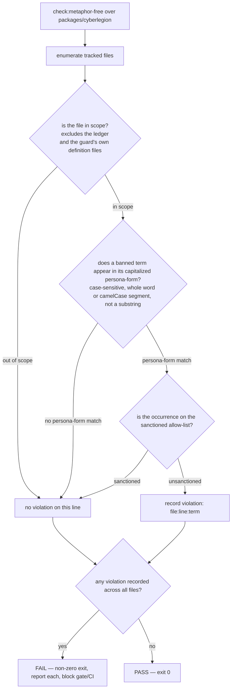

# metaphor-free — the vocabulary-boundary guard

## What

`cyberlegion` (the CLI/package) is chartered **metaphor-free**: it is pure mechanism and carries no
fleet-persona vocabulary (root [`spec.md`](../spec.md)). The fleet personas — **Operator**, **Council**,
**Pod** — and the **Bunker** place live in `plugins/cyberfleet`; the **Legate** routing brain lives in
`plugins/cyberlegion`. The package names things generically (`--owner <handle>`, "main pane", "unit",
"pane", "doorbell") and **never** a persona or place.

That boundary was, until now, enforced only by a human's memory: a cold spec-judge running a manual
"metaphor grep" at gate time. It leaked and was caught three times that way — "Bunker" into a command
and resolver (#159), "seat" into non-goals prose (#212), "Council" into a README and suite (#172) —
and a check that depends on someone remembering to look is not a guard. **This node specifies a
mechanical guard** that fails when a banned metaphor term appears in the package, so the boundary is
enforced by a script on every run rather than re-discovered each mission.

It is an **enforcement invariant of the package**, not a runtime CLI verb like its sibling nodes
(`mux/`, `mail/`, …). The guard is what runs; the invariant it protects is that the package's
vocabulary stays generic.

**Key terms**

- **Banned metaphor term** — a fleet-persona or place name owned by the plugin layers, matched in its
  **capitalized proper-noun form**, listed on a **maintained** banned-term list. The initial list is
  seeded from the three recurrences and the metaphor-boundary doctrine's own named personas/places:
  `Bunker`, `Council`, `Operator`, `Pod`. The list grows as new fleet personas appear; it is not a
  manufactured taxonomy.
- **Persona-form match** — the guard matches a banned term **case-sensitively** in its capitalized
  form, as a whole word **or** as a distinct capitalized segment of a compound identifier — so
  `resolveBunker` and `CouncilInbox` are caught (the #159 class of a persona name hidden in code).
  It does **not** match a lowercase generic word that merely shares the letters (`pod`, `operator`)
  nor a longer word that merely contains the term as a substring (`Podcast`). Matching the persona
  sense — always a capitalized proper noun — is what separates a leak from ordinary English, which the
  three recurrences confirm: `Bunker`, `Council`, and the `Council` seat were all capitalized names.
- **Sanctioned occurrence** — a legitimate mention of a metaphor term on the **allow-list**. Three
  boundary forms are legitimate: the charter sentence that names the cyberfleet layer to declare the
  boundary; a non-goals line that hands a persona to the plugins; and an outward-caller reference
  (e.g. `unit/lifecycle/`'s "the fleet-layer caller (e.g. `cyberfleet`'s Operator) is mux-agnostic").
  The guard flags only **unsanctioned** occurrences. The allow-list is keyed **per term-occurrence**
  (the same `file:line:term` unit the guard reports), so two terms on one line are two allow-list
  entries. It is **seeded from the legitimate references present today** — the outward-caller mentions
  in `unit/lifecycle/`: `README.md:37` (`Operator`), `README.md:72` (`Operator` **and** `Pod` — two
  entries on one line), and `lifecycle.feature:62` (`Operator`) — four term-occurrences across three
  lines. A new sanctioned reference is added by an **explicit edit to the allow-list**, a change visible
  in the diff and reviewed like any other, which is what makes the allow-list an audited record rather
  than the memory-dependent step this guard replaces.
- **In-scope file** — a tracked file under `packages/cyberlegion/` (the package `src/` and the
  `packages/cyberlegion/.agents/spec/` doc tree), with exactly **two file-level exclusions**:
  **(a) the ledger** (`packages/cyberlegion/.agents/spec/ledger/`) — provenance that records past leaks
  verbatim (e.g. `resolveBunker` and "Council metaphor-leak" appear in old `why` strings); and
  **(b) the guard's own definition files** — the allow-list and **this `metaphor-free/` node's own
  README + `.feature`** — which must name the banned terms literally in order to define, cite, and
  debate them. Scanning the guard's own defining documents would flag the definition as a leak — the
  same self-defeating trap as #212 (leaking "seat" while writing the boundary), inverted. Both
  exclusions are whole **files** (no within-file carve-out is needed: no spec's frontmatter carries a
  capitalized banned term today, so a `spec.md` is scanned whole), and both are explicit, reviewable
  sets. Everything else under the two roots is in scope.

**Non-goals** — deciding *which* terms are metaphors (that is the metaphor-boundary doctrine's call,
which this guard consumes as its list); policing the plugin layers, where persona/place naming is
correct and expected (`plugins/cyberfleet`, `plugins/cyberlegion`); detecting a *lowercase* or
prose-sense metaphor leak (the guard is a capitalized-proper-noun backstop, not a total metaphor
detector — Council-ratified scope, below); and natural-language spell- or style-checking. The guard
checks one thing: no unsanctioned capitalized banned term inside the package.

> **Council-ratified scope** (the two contract-scope decisions, resolved):
> 1. **Bare "seat" is dropped** from the mechanical list. The #212 recurrence leaked the lowercase word
>    "seat", which a capitalized-proper-noun guard cannot catch; banning it would flood on ordinary
>    English. The `Council` token already catches the "Council seat" construction, and a lone lowercase
>    "seat" with no adjacent persona name stays a **review-time** catch. The banned list is exactly
>    `Bunker`, `Council`, `Operator`, `Pod`.
> 2. **The guard is a capitalized-proper-noun backstop**, not a total metaphor detector. All three
>    recurrences were capitalized names, so the guard retires the manual grep for that class; a
>    lowercase prose-sense metaphor remains a review-time judgment. The scope is **not** broadened to
>    case-insensitive matching.
>
> Placement is also confirmed: this node stays in the cyberlegion spec tree as an enforcement invariant
> (not relocated to repo tooling).

## Use Cases

**Subject** — enforcing the package's metaphor-free vocabulary boundary mechanically:

| Trigger | Inputs | Outcome |
|---|---|---|
| **`check:metaphor-free`** — the guard run over the package tree in CI (`pnpm verify`) and at the SDD spec/impl gate, replacing the judge's manual metaphor-grep step | the tracked in-scope files under `packages/cyberlegion/`; the maintained banned-term list; the sanctioned allow-list | **pass** (exit 0) when no unsanctioned banned term is present; **fail** (non-zero, blocking the gate/CI) listing each violation as `file:line:term` when one is |

> The entry point is named to its intended surface (`check:metaphor-free`). Whether the impl gate
> realizes it as a standalone check, a step folded into `check:spec` (`sdd-check-specs`), or a
> `pnpm verify` stage is an implementation choice this contract does not pin.

## Control Flow

The scope filter (step S) is a **per-file** decision: it admits the package `src/` and the
`packages/cyberlegion/.agents/spec/` doc tree and **excludes** two whole-file sets — the ledger, and
the guard's own definition files (the allow-list and this node's own README + `.feature`). The match
(step C) has two guards, each isolated by a scenario below: it is **case-sensitive on the capitalized
persona-form** (a lowercase generic word does not match), and it matches a **whole word or a capitalized
compound segment** (`resolveBunker` matches; the substring in `Podcast` does not).

## Scenario map

| Edge | Path (Given) | Scenario |
|---|---|---|
| persona-form match, unsanctioned → FAIL | **in-scope source file**, persona name embedded in an identifier (camelCase), not on the allow-list | `a persona name in a source identifier fails the guard` |
| persona-form match, unsanctioned → FAIL | **in-scope spec document**, persona name in prose, not on the allow-list | `a persona name in a spec document fails the guard` |
| case guard: lowercase → no match | a **lowercase generic** word sharing a term's letters | `a lowercase generic word passes the guard` |
| boundary guard: substring → no match | a **longer word** containing a term as a substring | `a word that merely contains a banned term passes the guard` |
| persona-form match, sanctioned → no violation | a **sanctioned boundary reference** on the allow-list (charter / non-goals / outward-caller) | `a sanctioned boundary reference passes the guard` |
| out of scope (S) → not scanned | file in the **ledger** (provenance) | `a banned term recorded in provenance passes the guard` |
| out of scope (S) → not scanned | a **guard's own definition file** (allow-list or this node's README/`.feature`) | `the guard's own defining document passes the guard` |
| no violation anywhere → PASS | **several** in-scope files, every persona-form occurrence **allow-listed** | `a clean multi-file package passes the guard` |

Each of the 8 rows above binds 1:1 to a scenario in
[`metaphor-free.feature`](./metaphor-free.feature): two FAIL edges (the #159 source-identifier class
and the #172 / #212 doc class), the two match guards (case, substring), the sanctioned-allow-list
edge, the two out-of-scope edges (ledger provenance, the guard's own definition), and the clean
multi-file aggregate pass.
