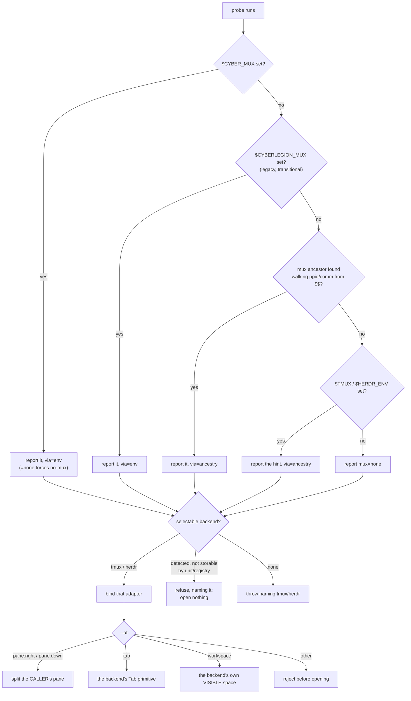

# mux — the unit-agnostic pane abstraction

The multiplexer layer the legion depends on one-way, per ADR-0024/ADR-0021: which session backend
(tmux or herdr) is available, where a new pane opens, and how a caller detects the multiplexer it is
really running inside. The **mechanism** is the `cyber-mux` package — this node owns what the legion
holds it to (which backends are usable, how `--at` resolves, which fast-path vars are read), never
how a pane is driven. Migrated CR-2 from `session/`'s backend-select and
placement scenarios and from `wake/`'s multiplexer-probe and `selectWakePath` scenarios
(`cyberlegion-cli-realign`, ADR-0024); a real architectural layer, not a command noun, so it earns its
own node per the decision.

## What

Every unit the legion spawns lives in a **pane** — one split of a terminal window. Which program owns
those panes differs per machine (tmux, herdr), and each calls the same ideas by different names. This
node is the one place that answers three questions on everyone else's behalf: **which pane program am
I actually running inside**, **which one may I use**, and **where does a new pane go**.

Getting the first question wrong is the expensive case. A caller that guesses wrong sends a message
to a pane that is not there, or opens a unit somewhere nobody can see it. So detection is answered
once, here, and every other part of the legion takes the answer rather than re-deriving it.

**Key terms** — **pane**: one split of a terminal window, where a unit runs. **backend**: the program
managing panes (tmux or herdr). **placement** (`--at`): where a new pane goes relative to the caller's.
**fast-path vars**: environment variables carrying an already-known answer, so detection can skip its
search. **pane locator**: the stored pointer (`unit/registry`'s) naming a unit's pane and its backend.

**Non-goals** — the unit registry and lifecycle that *use* the selected backend (`unit/`); the
wake-matrix routing decision (`selectWakePath` — which wake path a gateway drives a turn through),
which CR-4 moved out of the CLI to the Legate plugin's routing governance alongside `dispatch`; the
gateway/Legate routing brain that calls `selectWakePath` and drives a turn (`legion-gateway-legate`,
CR-5); the mail primitives and hook surfacing that ride on a pane once opened (`mail/`); and how a
pane is actually driven — that mechanism is the `cyber-mux` package, not this contract.

## Use Cases

Each entry point below enters the control-flow graph in the next section.

| Use case | Trigger | Inputs | Outcome |
|---|---|---|---|
| `unit spawn` (backend select + placement) | a caller spawns a unit | `--at`, the ambient environment | a pane opened on the selected backend, or a refusal before anything opens |
| `mux doctor` | a caller runs `cyberlegion mux doctor` | the ambient environment | harness, mux, pane, hub root, self-id, and a pin hint to fix the fast-path |
| `mux mode` | a caller runs `cyberlegion mux mode` | the ambient environment | the selected backend's name, or `none` at exit 0 |
| the focus probe | the doorbell asks before spending a turn | a pane locator | `focused`, `not-focused`, or `unknown` |

**Subject** — a genuine dependency boundary: detecting and selecting the pane backend a unit's
session opens through, independent of any unit's identity or lifecycle:

- **The session backend is selected by environment** — tmux when `$TMUX` is set, herdr when
  `$HERDR_ENV` is set and `$TMUX` is not; an environment with neither throws asking for one. The
  multiplexer package detects **more** backends than the legion can use. Which multiplexers a pane
  locator can be stored under is [`unit/registry`](../unit/registry/README.md)'s to state, not this
  node's; the decision here is what selection does with a detected backend outside that set —
  **refuse before anything opens**, naming the backend it found. Driving it would open a real pane no
  record could name, stranding a live session that `prune` cannot reap and no caller can nudge.
  Widening the storable set is a change to that node, not this one.
- **Placement maps each `--at` value onto the backend** — `--at pane:right|pane:down|tab|workspace`
  chooses where the new session opens. This layer only maps a **resolved** placement onto the backend;
  a **pane** placement splits the **caller's own** pane, named explicitly rather than left to the
  backend's default — each backend defaults to the pane the *human* is viewing, which is only
  coincidentally the caller's and diverges exactly when a program is driving, which spawn always is;
  the spawn-mode-keyed **default** (new-worktree → `workspace`, `--cwd` → `tab`) lives in `unit/`
  lifecycle, and `unit spawn` always resolves a concrete `--at` before calling this layer. (The
  adapter keeps a defensive `at ?? 'tab'` fallback in code, but it is unreachable from `unit spawn`
  and carries no user-observable behavior to spec — so it has no scenario.) `tab` maps to each
  backend's native Tab primitive — tmux `new-window`, herdr
  `tab create` — never a split pane. `workspace` maps to each backend's own **visible** space — herdr
  `worktree create` (a new workspace nested under the source), tmux `new-window` (a window visible in
  the status bar). Every placement opens without stealing the caller's focus.
- **A `workspace` placement opens under a name the legion resolved** — *what* the name says is
  [`unit/` lifecycle](../unit/lifecycle/README.md)'s; *how* a backend writes it onto its own tier is
  the multiplexer package's. What this node holds it to is only the handoff: a `workspace` placement
  opens under the resolved name, and a placement that opens into a space the caller is already in
  (`pane:*`, `tab`) carries none — the backend names whatever tier it opens, so a name passed on a
  `tab` would rename the caller's own tab rather than title a new space.
- **Multiplexer detection is two-mode** — `probeMultiplexer` first trusts `$CYBER_MUX`
  (`tmux`|`herdr`|`screen`|`none`) outright — this doubles as an override (`=none` forces no-mux even
  inside a real multiplexer). Failing that it walks the process ancestry from `$$` looking for a
  `tmux`/`tmux: server`, `herdr`, or `screen` ancestor; `$TMUX`/`$HERDR_ENV` are used only as a
  fast-positive hint the walk falls back to when it is itself inconclusive, never trusted alone.
  `mux doctor` runs discovery and prints an `export CYBER_MUX=<m> CYBER_MUX_PANE=
`
  hint so a caller can pin the fast-path; `unit spawn` injects the same vars into the spawned
  child's launch command so it inherits the fast-path instead of re-discovering.
  **Transitionally**, the legacy `$CYBERLEGION_MUX` / `$CYBERLEGION_MUX_PANE` pair is still read when
  the current pair is absent, so a pane spawned before the namespace migration keeps its identity
  instead of falling back to an ancestry walk that answers for the wrong pane; the current pair wins
  whenever both are set. This read is deleted once no pre-migration pane is still alive.
- **The backend reports whether a pane is currently focused** — a pane locator resolves to `focused`,
  `not-focused`, or `unknown`, so a caller can tell whether a human is actually viewing a pane before
  spending a turn on it (the doorbell's owner-mail focus gate, `mail/doorbell`). A pane is **focused**
  only when a live client is currently displaying it. Each backend answers with its own primitive: on
  **tmux**, the pane is the active pane of the current window in a session with an attached client
  (`pane_active` + `window_active` + `session_attached`) — any of those unset is **not-focused**; on
  **herdr**, the pane record's own `focused` flag (`pane get <id>`). A backend that has no primitive to
  report focus — or a query that errors or names a pane the backend can no longer resolve — answers
  **unknown** (a tri-state, not a boolean) so callers **fail open** — treat unknown as "go ahead"
  rather than as "absent" — never suppressing behavior on a mux that simply can't tell.
  This is a **read-only** probe: it moves no focus and opens nothing (unlike the `focus`/beam op that
  drives the attached client's view to a pane).

## Control Flow

Detection runs a **first-match-wins precedence chain**: the first tier that answers wins outright and
no lower tier is consulted. Every scenario's `Given` must therefore exclude every tier above the one
it exercises — that exclusion is the load-bearing part of the path, not a formality.

The focus probe is a separate read-only entry point: it takes a pane locator and answers
`focused` / `not-focused` / `unknown`, opening nothing and moving nothing.

### Placement vocabulary — what `--at` names on each backend

`--at` names a **placement concept**, not a backend-specific command. Every multiplexer nests the
same four levels — **Session › Workspace › Tab › Pane** — but each calls them something different
(notably: a tmux/screen "Window" is the **Tab** level, not a workspace). The adapter maps the
concept onto whatever the live backend calls it:

| Concept       | tmux    | screen | zellij  | cmux                          | Orca                  | herdr     |
| ------------- | ------- | ------ | ------- | ----------------------------- | --------------------- | --------- |
| **Session**   | Session | Session| Session | App (state saved on restart)  | ----                  | Session   |
| **Workspace** | ----    | ----   | ----    | Window/Workspace              | Worktree (git branch) | Workspace |
| **Tab**       | Window  | Window | Tab     | Vertical Tab (w/ git status)  | Tab                   | Tab       |
| **Pane**      | Pane    | Region | Pane    | Split Pane                    | Pane                  | Pane      |

cyberlegion drives two of these backends (tmux, herdr). `--at` exposes three of the levels —
`pane:right`/`pane:down` (**Pane**), `tab` (**Tab**), `workspace` (**Workspace**). The property
`workspace` guarantees is **its own space, VISIBLE in the attached client and navigable** — not a
structural tier. tmux, having no Workspace level, maps `workspace` onto the finest unit that keeps
that property: a new **Window** (visible in the status bar, `select-window`-able) — the same unit
`tab` maps to, so under tmux `workspace` and `tab` collapse to a Window. It is deliberately **not** a
new detached **Session** (`new-session -d`): a detached session is invisible to the attached client
and unreachable by beaming (`select-window`, #158), so a unit is never spawned there — a truly
detached session would be a separate explicit intent, out of scope. There is no `window` value —
"window" is tmux's local name for the **Tab** concept, already covered by `tab`.

## Scenario map

Binds each edge above to its scenario in [`mux.feature`](./mux.feature), grouped by use case. The
unit is the **(path class, edge)** pair — a repeated edge with a different path is permutation
coverage, not duplication.

### `unit spawn` — backend selection

| Edge | Path (Given) | Scenario |
|---|---|---|
| selectable backend → bind adapter | a detectable tmux or herdr environment | `the session backend is selected by environment` |
| no selectable backend → throw | neither `$TMUX` nor `$HERDR_ENV` set | `neither tmux nor herdr detected errors before opening anything` |
| detected but not storable → refuse | inside a backend `unit/registry` cannot store a locator under | `a detected backend a unit record cannot carry is refused before opening anything` |

### `unit spawn` — placement

| Edge | Path (Given) | Scenario |
|---|---|---|
| `--at` → that placement | a resolved placement on a bound adapter | `--at chooses where the new session opens` |
| `pane:*` → split the caller's pane | the caller's own pane is known, and a different pane is active | `a pane placement splits the calling pane, not whichever pane is active` |
| `workspace` → the backend's visible space | any bound adapter | `--at workspace opens the unit's own VISIBLE space on each backend` |
| `workspace` → the backend's visible space | tmux, which has no Workspace tier | `tmux --at workspace opens a visible window in the current session, never a detached session` |
| `workspace` → the backend's visible space | herdr, which has a Workspace tier | `herdr --at workspace creates its own workspace nested under the source` |
| a resolved name → the space it opens | any bound adapter | `a workspace placement opens under the label the legion resolved` |
| no name → a space the caller is already in | any bound adapter | `a pane or tab placement carries no name at all` |
| `tab` → the backend's Tab primitive | any bound adapter | `--at tab opens a new tab in the current window, never a split pane` |
| `tab` → the backend's Tab primitive | a caller currently focused elsewhere | `the tab placement opens in the background without stealing focus` |
| unrecognized `--at` → reject | any bound adapter | `--at accepts only pane:right, pane:down, tab, and workspace` |

### the mux probe — the precedence chain

| Edge | Path (Given) | Scenario |
|---|---|---|
| current pair set → report it | `$CYBER_MUX` names a real backend | `$CYBER_MUX is trusted outright as a fast-path` |
| current pair set → report it | `$CYBER_MUX=none` inside a real multiplexer | `$CYBER_MUX=none is an override even inside a real multiplexer` |
| current absent, legacy set → report it | only the legacy pair is exported | `a pane carrying only the legacy fast-path vars is still honored` |
| current pair set → report it | both pairs exported | `the current fast-path vars win over the legacy pair when both are set` |
| both env tiers absent → walk ancestry | neither pair set, a tmux ancestor present | `absent every env fast-path, the probe walks the process ancestry from $$` |
| walk inconclusive → the env hint | neither pair set, `$TMUX` set, walk inconclusive | `$TMUX/$HERDR_ENV alone are not trusted — only a fast-positive hint the walk falls back to` |

### `mux doctor` / `mux mode` / fast-path propagation

| Edge | Path (Given) | Scenario |
|---|---|---|
| report the probe + a pin hint | running behind a detected multiplexer | `mux doctor reports the detected mux and prints a pin hint` |
| carry the fast-path into the child | spawning behind a detected multiplexer | `unit spawn propagates the fast-path to the spawned child` |
| report the selected backend | running inside a detected multiplexer | `mux mode reports the detected session backend` |
| report the selected backend | no detectable multiplexer | `mux mode reports none when no backend is selectable` |

### the focus probe

| Edge | Path (Given) | Scenario |
|---|---|---|
| → focused | a tmux pane active in a current window with an attached client | `tmux reports a pane focused when an attached client is currently viewing it` |
| → not-focused | a tmux pane failing any of those three conditions | `tmux reports a pane not focused when no attached client is viewing it` |
| → focused | a herdr pane record reporting a viewing client | `herdr reports a pane focused when its pane record is focused` |
| → not-focused | a herdr pane record reporting no viewing client | `herdr reports a pane not focused when its pane record is not focused` |
| → unknown | no focus primitive, an unresolvable pane, or an erroring query | `a focus query that cannot be answered is unknown, not a boolean` |
