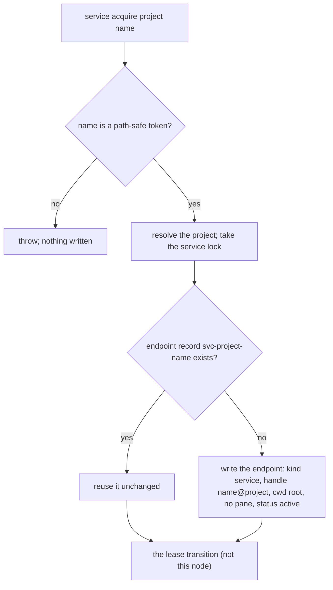
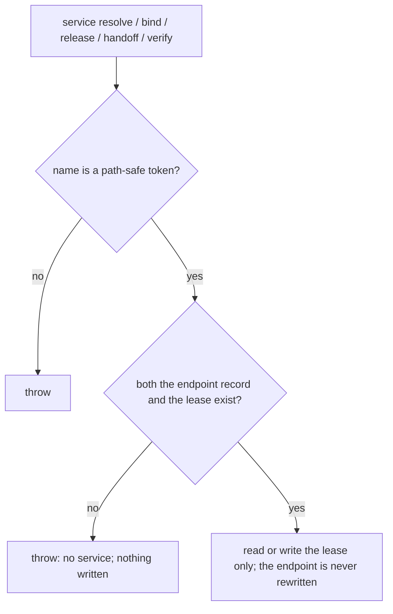
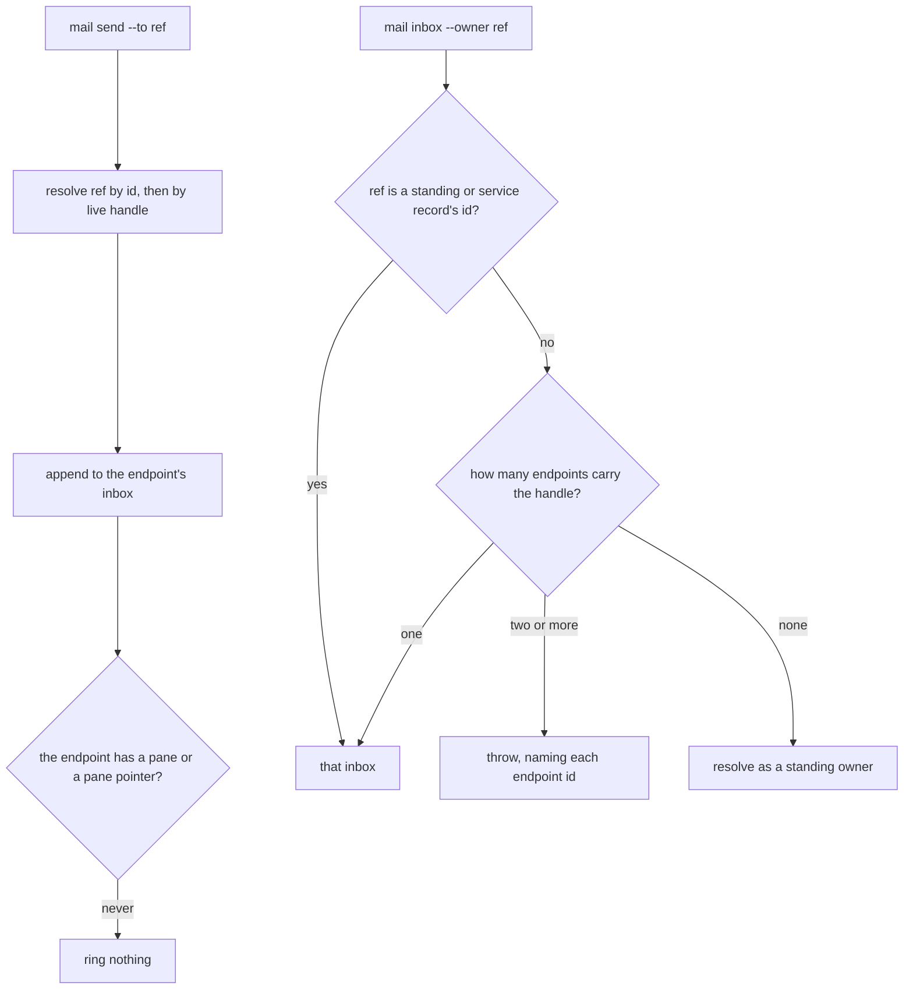
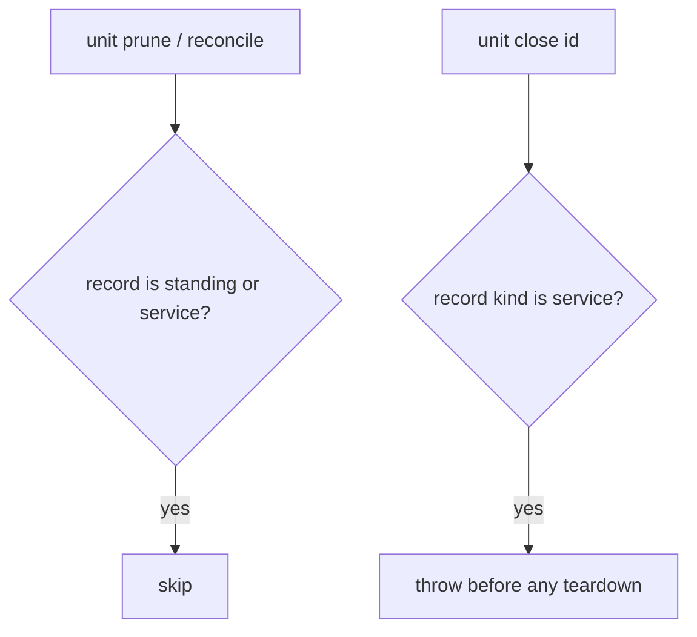

# service endpoint — the durable address of a project service

## What

A **project service** is a named role inside a registered project that exactly one unit owns at a
time (ADR-0033). The service has two parts that live apart:

- the **endpoint** — a registry record whose id and mailbox are the service's stable reference;
- the **lease** — who owns the service now, at which fencing generation
  (`services/<project>/<name>.json`).

This node specifies the endpoint. The lease (reserve, bind, release, handoff, and the generation
check) is a separate concern this node does not cover.

**Why the endpoint is a registry record.** Peers address a service the way they address any unit:
by id or handle, through `mail send`. Owners come and go: a crash, a recovery under a new
generation, a handoff. If the address were the owner's own unit, every replacement would change it,
and mail sent to the old owner would be stranded in an inbox nobody reads. The endpoint has no
session, so nothing about a session can end it. Its mail stays pending until whichever unit owns the
service reads it with `mail inbox --owner <endpoint>`.

**The record.** An `AgentRecord` with:

| Field | Value |
|---|---|
| `id` | `svc-<project id>-<service name>` — deterministic, so every caller derives the same id |
| `handle` | `<service name>@<project display name>` |
| `kind` | `service` |
| `service` | `{ project, name }` |
| `cwd` | the project's root |
| `pane` | `null`; no harness, no worktree, no brief, and no `conversation` (the session-start hook never records one on an endpoint — `unit/runtime`) |
| `status` | `active`, never changed by any verb |

A service name is a path-safe token: lowercase letters, digits, `-` and `_`, starting with a
letter or digit, at most 63 characters.

**Key terms**

- **session-independent** — a record with no runtime of its own (standing and service records).
  Prune and reconcile never judge it, and the runtime verbs refuse it.
- **owner mail** — a standing owner's unread mail, surfaced read-only into a root session's hook
  payload (`mail/surface`). An endpoint's mail is never owner mail: it belongs to whichever unit
  owns the service.

**Non-goals.**

- **Ringing the owner.** Mail to an endpoint rings no pane. Routing delivery to the current owner is
  cyberuni/cyberlegion#7.
- **Deleting an endpoint.** No verb removes one, and `unit close` refuses it. An unused endpoint
  costs one small file.
- **Ownership.** Whether the service has a healthy owner is the lease's state, not the endpoint's
  `status`.
- **Unambiguous handles across same-named projects.** Two repositories with the same directory name
  give their endpoints the same handle. `mail inbox --owner` fails loud on that handle; other
  handle lookups take the first match. Address such an endpoint by id.

## Use Cases

**Actors**

- **A service starter** (a controller, a person) — runs `service acquire` or `service start` and
  needs the service to have an address before any owner exists.
- **A peer sending work** — mails the service and must not lose the message when the owner changes.
- **The owner** — reads the service's pending mail.
- **Stakeholder: hub maintenance** — `unit prune`, `unit close`, and the runtime verbs must not end
  or reshape the address.

| Actor | Goal | Entry point |
|---|---|---|
| service starter | the service has a stable address | `service acquire`, `service start` |
| peer sending work | the message reaches the service, whoever owns it | `mail send --to <endpoint id or handle>` |
| owner | read the service's mail | `mail inbox --owner <endpoint id or handle>` |
| hub maintenance | never reap or reshape the address | `unit prune`, `unit close`, `unit stop`/`restart`/`rebind`/`show` |

### Create the endpoint

- **Actor / goal:** a service starter wants a service that peers can address.
- **Entry point:** `service acquire [project] <name>` (and `service start`, which acquires first).
  Under the service's named lock, the acquire loads the endpoint. When none exists, it writes the
  record above. When one exists, it is reused unchanged.
- **Extensions:**
  - the service name is not a path-safe token → error; nothing is written.
  - `service resolve` on a service never acquired → error "no service"; nothing is written.
    Resolving never creates.
  - the endpoint record was deleted from the hub → the next acquire writes it again under the same
    id. Until then, `service resolve`, `bind`, `release`, `handoff`, and `verify` fail with "no
    service", because they need both the endpoint and the lease.

### Send to a service

- **Actor / goal:** a peer wants its message to reach the service, not one particular owner.
- **Entry point:** `mail send --to <endpoint id or handle>`. The message lands in the endpoint's
  inbox, keyed by the endpoint's id.
- **Extensions:**
  - the service has an owner with a pane → still no ring. The endpoint has no pane and no pane
    pointer, so the doorbell finds nothing to ring.

### Read the service's mail

- **Actor / goal:** the owner wants the work sent to the service.
- **Entry point:** `mail inbox --owner <ref>` (also `mail read` and `mail ack`). The ref is the
  endpoint's id, or its handle when exactly one endpoint carries it.
- **Extensions:**
  - two endpoints share the handle → error naming both ids; address one by id.
  - a root session's mail hook → never shows endpoint mail; only standing owners' mail is
    surfaced.

### Outlive the owner

- **Actor / goal:** a peer's pending mail must survive any change of owner.
- **Entry point:** no verb of this node. Acquire, bind, release, and handoff write only the lease,
  so the endpoint record and its inbox are untouched by every change of ownership.
- **Extensions:**
  - `unit prune` (and reconcile) → skips the endpoint, whatever its last-seen.
  - `unit close <endpoint id>` → refused, even with `--force`; the record and mail stay.
  - `unit stop`, `restart`, `rebind` → refused; `unit show` reports no runtime and no controls
    (`unit/runtime`).

## Control Flow

### acquire, as it touches the endpoint

### resolve, bind, release, handoff, verify

### mail addressed to an endpoint

### hub maintenance

## Scenario map

1:1 with [`endpoint.feature`](./endpoint.feature). The runtime verbs' refusals of a service endpoint
are specified in `unit/runtime` (`stop refuses a service endpoint` and its three siblings).

### creation

| Edge | Path (Given) | Scenario |
|---|---|---|
| `E4` | a project with no such service | `the first acquire of a service creates its endpoint record` |
| `R2X` | a project with no such service | `resolving a service that was never acquired creates no endpoint record` |
| `E1X` | a project, a name with a space and capitals | `an invalid service name creates no endpoint record` |
| `E3Y` | an existing endpoint | `a later acquire reuses the endpoint record unchanged` |
| `E3 -- no` after deletion | an endpoint deleted from the hub | `a deleted endpoint record is recreated under the same id by the next acquire` |

### mail

| Edge | Path (Given) | Scenario |
|---|---|---|
| `M2` | a service, sent to by handle | `mail sent to the endpoint's handle lands in the endpoint's inbox` |
| `M3X` | a service whose owner has a pane | `mail sent to an endpoint rings no pane, even while the service has an owner` |
| owner-mail surfacing | a root session, a standing owner and an endpoint each with unread mail | `an endpoint's unread mail is not surfaced as owner mail` |
| `O2 -- one` | one endpoint with the handle | `mail inbox --owner resolves the endpoint's handle to the endpoint's inbox` |
| `O2X`, `O1Y` | two same-named repositories, one service each | `mail inbox --owner fails loud on a handle that two endpoints share` |

### lifecycle

| Edge | Path (Given) | Scenario |
|---|---|---|
| `R3` via acquire and bind | an owned service with pending mail, owner gone | `the endpoint's id and pending mail survive replacing its owner` |
| `R3` via release | an owned service with pending mail | `releasing a service keeps its endpoint record and pending mail` |
| `H1Y` | an endpoint a day old | `prune never marks a service endpoint exited` |
| `C1X` | an endpoint with pending mail, `--force` | `unit close refuses a service endpoint, leaving its record and pending mail intact` |
