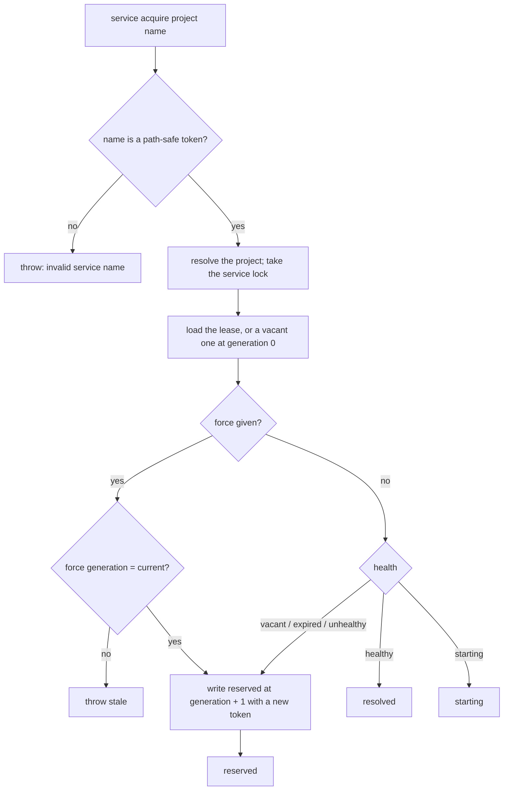
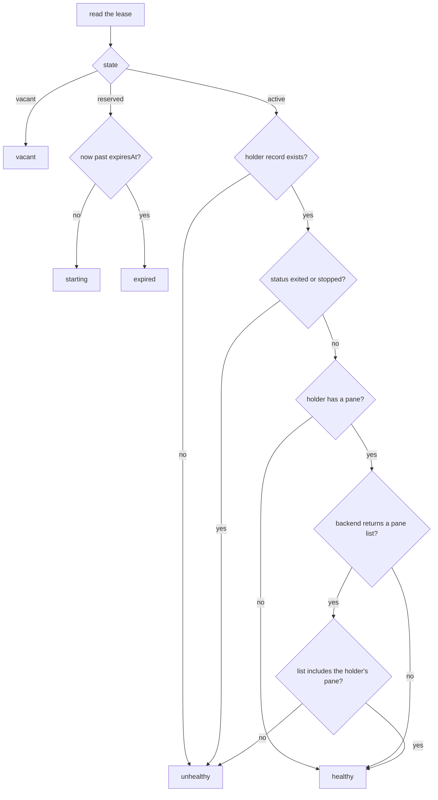
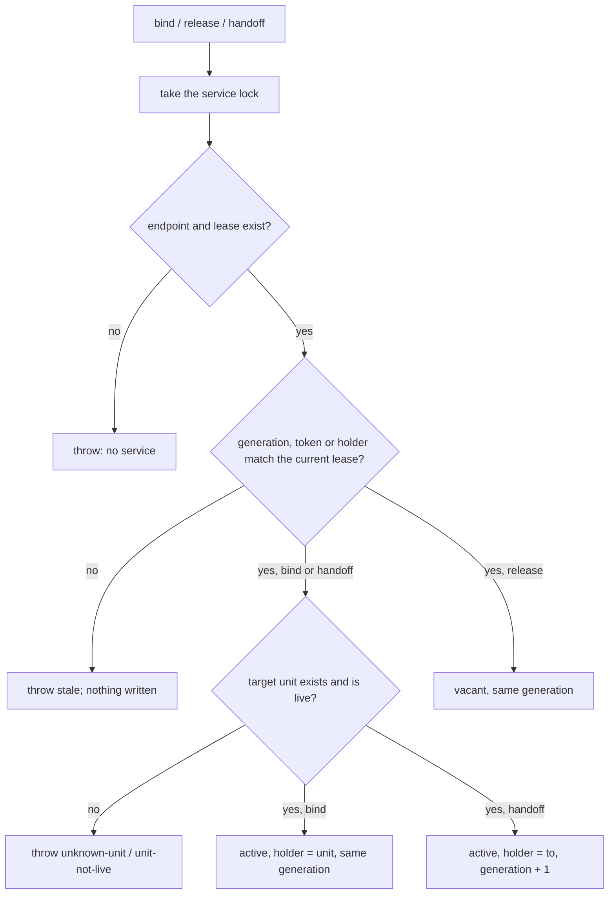
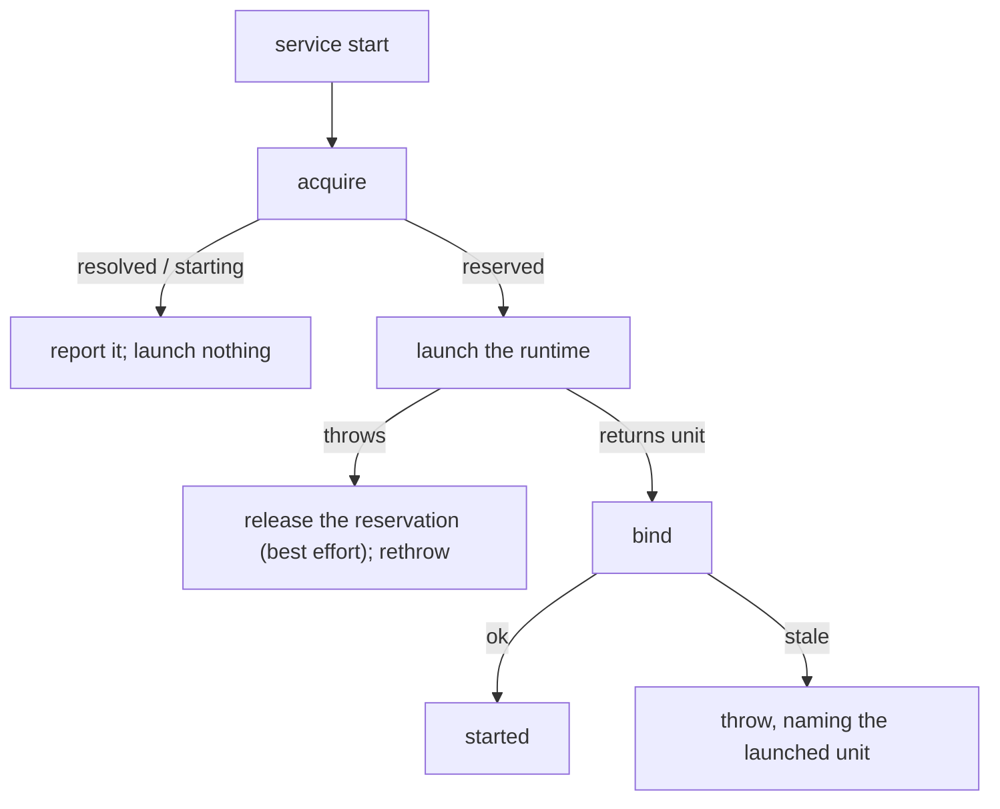
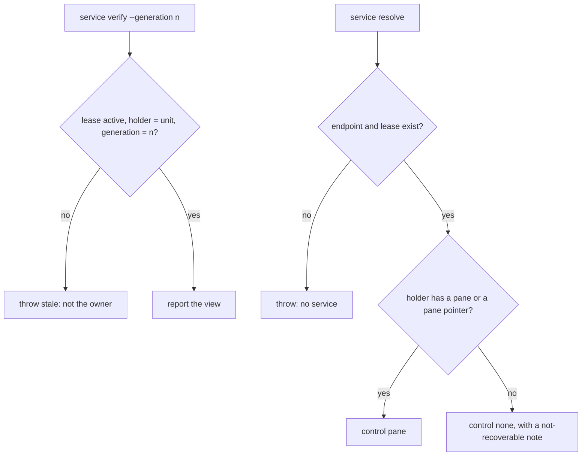

# service lease — one fenced owner per project service

## What

A **project service** is a named role inside a registered project that exactly one unit owns at a
time (ADR-0033). It has two parts that live apart. The **endpoint** is the service's durable address
(`service/endpoint`). The **lease** is who owns the service now, at which fencing generation. This
node specifies the lease.

**The record.** `services/<project id>/<service name>.json` in the hub:

| Field | Value |
|---|---|
| `project`, `service` | the project id and the service name |
| `endpoint` | the endpoint record's id, `svc-<project id>-<service name>` |
| `generation` | starts at 0; +1 on every new reservation and every handoff, never otherwise |
| `state` | `vacant`, `reserved`, or `active` |
| `reservation` | while `reserved`: a random `token`, `by` (the acquiring session, when known), `at`, `expiresAt`, and `forced` when the reservation displaced a holder |
| `holder` | while `active`: the owning unit's id |

Every write to the lease runs under the service's named lock (`service-<project id>-<name>`), which
is held only for a bounded wait. `resolve` and `verify` read without the lock.

**Why resolve-or-start is two steps.** Launching a runtime takes far longer than the lock may be
held. So `acquire` decides under the lock and returns at once: it resolves a healthy owner, reports
that a start is in progress, or writes a time-bounded **reservation** (default five minutes) under a
new generation. Exactly one of any number of concurrent callers gets the reservation. That caller
launches the runtime and calls `bind` with the generation and token. A start that dies leaves a
reservation that expires. The next acquire takes it over under a new generation, so a late `bind`
from the dead start is refused as stale and a slow start can never produce a second authority.

**Health.** Derived on each read, never stored:

| Lease | Health |
|---|---|
| `vacant` | `vacant` |
| `reserved`, before `expiresAt` | `starting` |
| `reserved`, past `expiresAt` | `expired` |
| `active`, the holder's record missing | `unhealthy` |
| `active`, the holder not live | `unhealthy` |
| `active`, the holder live | `healthy` |

**Liveness fails closed.** A holder is not live when its record is `exited` or `stopped`, or when its
multiplexer answers with a pane list that leaves out the holder's pane. A pane-less holder cannot be
probed, and a backend the caller cannot reach answers with no list, so both read as live. A healthy
owner is therefore never displaced on a guess. It is recovered once `unit prune` marks it exited, or
by an explicit force that names the current generation.

**Control is reported, never implied.** Resolving an owner says whether its session can be driven
from here: `control: pane` when the holder has a multiplexer pane (on its record or through a pane
pointer), `control: none` otherwise, with a note that control is not recoverable.

**Key terms**

- **generation** — the fencing number. A unit is the authority only while it is the holder at the
  current generation, and every change of authority bumps it.
- **stale** — a refused transition whose generation, token, or holder claim is not the current one.
  The caller is not, or is no longer, the authority it claims to be.
- **reservation** — the right to start one runtime, held by whoever has its token until it is bound,
  released, or taken over after expiry.

**How the lease is keyed today.** The lease takes a project reference (an id, a path, or a unique
project name) and resolves it to a registered project, registering a path's repository on first
use. Its file path, lock name, and endpoint id are all derived from that project's id. With no
project argument, the CLI uses the project of the current directory. Cross-package decision
[0004](https://cyber-civitas.github.io/decisions/0004-opaque-service-keys/) says a service lease
takes an opaque key from its caller and does not know what a project is. This node specifies
today's behavior. Moving to an opaque key is a separate change.

**Non-goals.**

- **The endpoint.** The record, its mail, and its survival across owners are `service/endpoint`.
- **Fencing arbitrary side effects.** Only a writer that checks the generation (`service verify`, or
  `withOwnership`) is fenced. The hub cannot stop a stale runtime that acts without checking.
- **Stopping a superseded runtime.** When a launch finishes after its reservation was taken over,
  `service start` names the launched unit in its error and leaves stopping it to the caller.
- **Routing mail to the owner.** cyberuni/cyberlegion#7.

## Use Cases

**Actors**

- **A service starter** (a controller, a person): wants the service to have exactly one owner,
  whoever else is starting it at the same time.
- **The owner**: a unit that holds the service and must find out when it no longer does.
- **A recovering caller**: finds the owner gone and must take over without trampling a live one.
- **A peer**: wants to know who owns the service and whether it can drive that session.

| Actor | Goal | Entry point |
|---|---|---|
| service starter | resolve the owner, or start one exactly once | `service acquire` + `service bind`, or `service start` |
| service starter | give up a failed start | `service release --token` |
| owner | check it is still the authority before acting | `service verify`, `withOwnership` |
| owner | pass the service on, or step down | `service handoff`, `service release` |
| recovering caller | take over a dead owner, or force past a live one | `service acquire`, `--force-generation` |
| peer | see the owner, its health, and its control | `service resolve` |

### Resolve or reserve

- **Actor / goal:** a service starter wants the healthy owner, or the sole right to start one.
- **Entry point:** `service acquire [project] <name> [--ttl <ms>]`. Under the lock, a healthy owner
  is `resolved` and an unexpired reservation is `starting`; either is returned unchanged. Otherwise
  (vacant, unhealthy, or expired) a reservation is written at generation + 1 and returned with its
  token as `reserved`.
- **Extensions:**
  - the name is not a path-safe token → error; nothing written.
  - eight processes acquire at once → one `reserved`, seven `starting`, all at generation 1.
  - `--force-generation <n>` with `n` the current generation → reserved at n + 1 even over a healthy
    owner, marked `forced`.
  - `--force-generation <n>` with any other `n` → stale; nothing written.

### Bind the reservation

- **Actor / goal:** the starter that won the reservation makes its runtime the owner.
- **Entry point:** `service bind [project] <name> --generation <n> --token <t> [--unit <ref>]` (the
  unit defaults to the calling session). Requires the lease to be `reserved` at that generation with
  that token. The lease becomes `active` with the unit as holder, at the same generation.
- **Extensions:**
  - wrong generation or token, or the reservation was released or taken over → stale, "no longer
    current"; the lease is unchanged.
  - an expired reservation nobody has taken over → still bindable; nothing replaced it.
  - the unit has no record → refused as `unknown-unit`.
  - the unit is not live → refused as `unit-not-live`.
  - the service was never acquired → error "no service".

### Start in one step

- **Actor / goal:** a service starter wants acquire, launch, and bind done together.
- **Entry point:** `service start [project] <name>` with the `unit spawn` flags. It acquires. Only
  when this caller wins the reservation does it spawn one peer and bind it. Otherwise it reports
  `resolved` or `starting` and spawns nothing.
- **Extensions:**
  - the launch throws → the reservation is released (best effort; expiry covers a failed release),
    the error is raised, and the service is vacant for an immediate retry.
  - the launch finishes after its reservation was taken over → the bind is refused, and the error
    names the launched unit so the caller can stop it.

### Release

- **Actor / goal:** a starter abandons a failed start, or an owner steps down.
- **Entry point:** `service release [project] <name> --generation <n>` with `--token <t>` (a
  reservation) or as the holder (`--unit <ref>`, default the calling session). The lease becomes
  `vacant` and keeps its generation; the next acquire bumps it.
- **Extensions:**
  - the generation, token, or holder does not match the current lease → stale; nothing written.

### Hand off

- **Actor / goal:** the owner passes the service to another unit.
- **Entry point:** `service handoff [project] <name> --generation <n> --to <ref> [--from <ref>]`.
  Allowed only from the holder at the current generation, to a live unit. The holder changes and the
  generation goes up by one, so the old holder is stale from then on.
- **Extensions:**
  - the caller is not the holder, or names an old generation → stale; nothing written.
  - the target has no record or is not live → `unknown-unit` or `unit-not-live`.

### Verify (the fencing check)

- **Actor / goal:** an owner confirms it is still the authority before acting as the service.
- **Entry point:** `service verify [project] <name> --generation <n> [--unit <ref>]`. Exit 0 only
  when the lease is `active` with that unit as holder at exactly that generation. `withOwnership`
  runs the same check and then a short critical section under the service lock.
- **Extensions:**
  - replaced, handed off, recovered past, or never the owner → non-zero, "not the owner".

### Resolve

- **Actor / goal:** a peer wants the owner, its health, and its control, without changing anything.
- **Entry point:** `service resolve [project] <name>`. Reports project, service, endpoint,
  generation, state, holder, health, control, and a note when there is one.
- **Extensions:**
  - a service never acquired → error "no service"; nothing written.

## Control Flow

### acquire

### health and liveness

### bind, release, handoff

### start

### verify and resolve

## Scenario map

1:1 with [`lease.feature`](./lease.feature).

### resolve-or-start

| Edge | Path (Given) | Scenario |
|---|---|---|
| `A10`, `A8` | a vacant service, two acquires | `the first caller reserves a vacant service; a concurrent caller sees it starting, not a second reservation` |
| `TB`, `A7` | a reservation and a live unit | `binding the reservation makes one healthy owner that later callers resolve to` |
| `HE` → `A9`, `T3X` | an expired, unbound reservation | `a failed start can be retried: an expired reservation is re-reserved under a new generation` |
| `TR` → `A9` | an unbound reservation, released | `a failed start released explicitly is retryable immediately` |
| `R1X` | no service | `resolving a service never creates it` |
| `A1X` | the name `../escape` | `a service name is a path-safe token` |

### a healthy owner is never silently stolen

| Edge | Path (Given) | Scenario |
|---|---|---|
| `A7` | a live owner | `acquire resolves to a healthy owner instead of reserving over it` |
| `HU` → `A9`, `V1X` | an owner whose session is gone | `an owner whose session is gone is recovered under a new generation, and the old owner is stale` |
| `L1 -- yes` → `A9` | a pane-less, exited owner | `an exited owner is recovered even when its liveness cannot be probed` |
| `A5X`, `A5 -- yes` | a live owner, two forces | `forcing past a healthy owner is explicit and must name the current generation` |
| `T4X` | a reservation, a unit not live | `binding a unit that is not live is refused` |

### handoff and fencing

| Edge | Path (Given) | Scenario |
|---|---|---|
| `TH`, `V1X`, `V2` | u1 owns, u2 live | `the holder hands off to another unit; the old holder is rejected afterwards` |
| `T3X` via handoff | u1 owns, u2 live | `only the current holder at the current generation can hand off` |
| `T3X` via release | handed off from u1 to u2 | `a stale holder cannot release the current owner` |

### control is reported, never implied

| Edge | Path (Given) | Scenario |
|---|---|---|
| `L2 -- no`, `R4` | a pane-less owner | `an owner with no session pane resolves but reports that control is not recoverable` |
| `R3` | an owner with a pane | `an owner with a session pane reports pane control` |

### startService composes acquire, launch, and bind

| Edge | Path (Given) | Scenario |
|---|---|---|
| `S2` → `S5` | a vacant service | `a vacant service is launched once and bound to the launched unit` |
| `S1R` (resolved) | a live owner | `a healthy owner is resolved without launching anything` |
| `S1R` (starting) | two starts, the first still launching | `two simultaneous starts launch one runtime; the other reports starting` |
| `S3` | a launcher that throws | `a launch that throws releases its reservation, so the start can be retried at once` |
| `S6` | a launch past its time-to-live, re-reserved | `a launch that outlives its reservation is refused, naming the unit that is not the owner` |

### owner liveness fails closed

| Edge | Path (Given) | Scenario |
|---|---|---|
| `L3 -- no` | a backend with no pane list | `a backend the caller cannot reach cannot declare the owner gone` |
| `L4 -- no` | a backend listing another pane | `a reachable backend that lists other panes but not the owner declares it gone` |
| `L4 -- yes` | a backend listing the owner's pane | `a reachable backend listing the owner pane keeps it live` |
| `L1 -- yes` (stopped) | a stopped, pane-less owner | `a stopped owner is never live, even with no pane to probe` |
| `L1 -- yes` (exited) | an exited owner | `an exited owner is never live` |

### CLI

| Edge | Path (Given) | Scenario |
|---|---|---|
| `A10`, `A8` across processes | eight concurrent processes | `concurrent service acquire from real processes: exactly one reservation, everyone else sees starting` |
| `TB`, `V2`, `TH`, `V1X` | two pane-less units | `acquire → bind → verify → handoff, with the old owner rejected by verify` |
| `R4` | a pane-less owner | `service resolve reports that a pane-less owner resolves without recoverable control` |
| `T3X` via bind | a reservation, a wrong token | `a stale bind fails loud and leaves the current reservation in place` |
| `A2`, project from the current directory | an unregistered repository with a linked worktree | `with no project argument, a service resolves the project of the current directory and registers it` |
| `S5`, then `S1R` | `service start`, twice | `a vacant service spawns one peer with the spawn flags and binds it; a second start spawns nothing` |
| `S3` | `service start`, a spawn that throws | `a spawn that throws leaves the service vacant for an immediate retry` |
