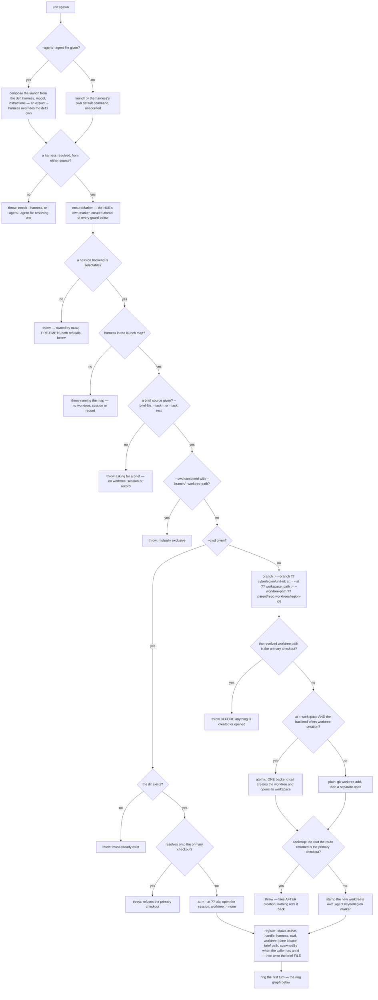
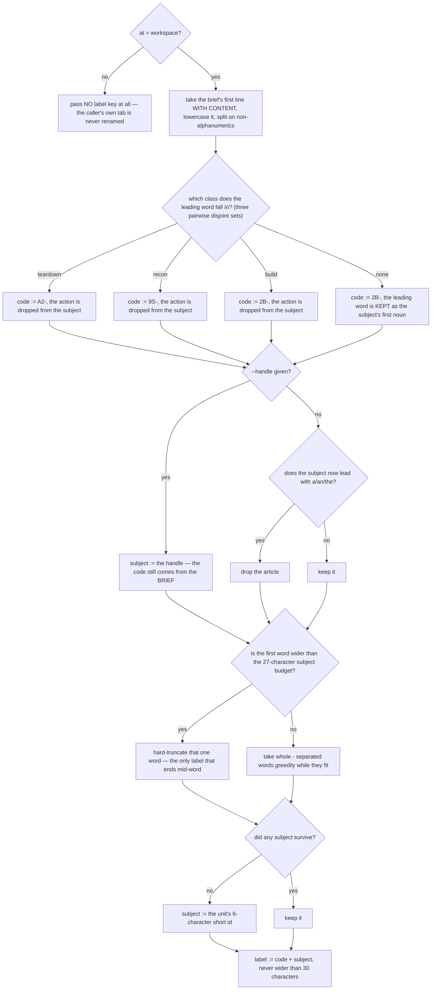
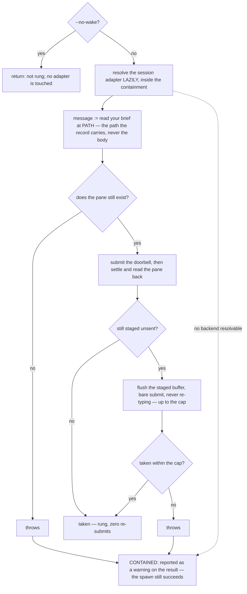
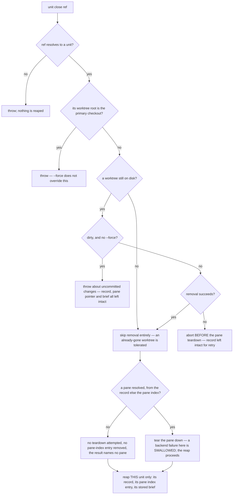
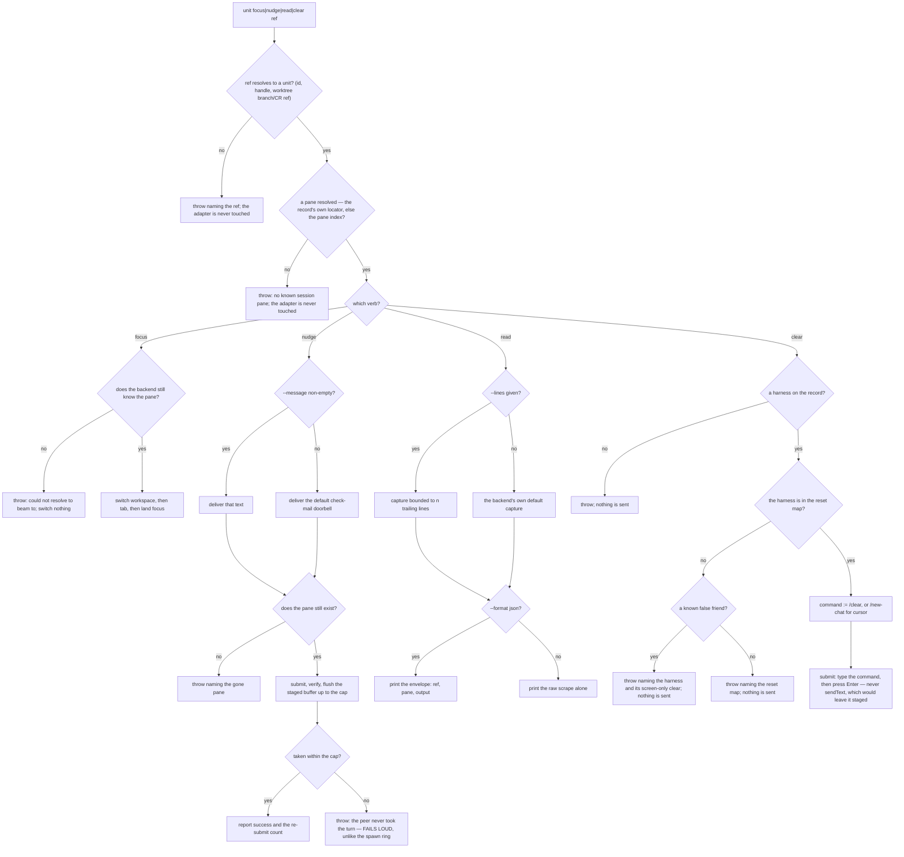

# unit lifecycle — warm peer session lifecycle over a multiplexer

## What

Spawn, scrape, focus, nudge, **clear**, and close a warm interactive peer via tmux/herdr. Migrated
CR-2 from `session/` (`cyberlegion-cli-realign`, ADR-0024): the lifecycle half of `unit` —
registration and discovery live in the sibling `unit/registry` node; backend selection and placement
moved to the new `mux/` node (a real architectural layer, not a command noun).

## Use Cases

**Subject** — opening a genuine sibling peer session — in a new git worktree it creates, or in an
existing directory a caller supplies (`--cwd`) — and its session pane, then tearing it back down
cleanly — the deterministic inverse pair:

- **spawn opens a new peer session and registers the peer it opened** — `unit spawn
  --harness <h> --task <text>` (or `--brief-file`) creates a real git worktree distinct from the
  primary checkout, opens a session backend (tmux or herdr, selected by environment — see `mux/`)
  with its cwd set to that worktree, then registers the peer (`status: active`, `spawnedBy` the
  caller's own id when it has one) and writes its pane pointer and brief file. There is no
  intermediate spawning status, and nothing later flips it (the hook injects no brief and mutates no
  status — `mail/surface`).
    - **Registration follows the launch, and no longer needs to precede it.** Under the retired
      split (ADR-0027) the child's own `SessionStart` hook read the record and the brief, so both had
      to exist before the harness booted. Nothing in the child reads either now — the peer learns of
      its brief from the wake, which is rung after `spawn` returns — so the ordering carries no
      contract. It does leave a window in which a crash strands a pane with no record; that is a
      robustness question for `unit/registry`'s reaping, not a claim this node makes.
      The scenario was titled *"spawn pre-registers the peer before the session actually launches"*
      and its section comment read *"registers the peer before it starts"* — both written under the
      old design, and neither backed by any `Then`. This re-spec **retitled both under Clearance**
      to what the scenario actually asserts (the peer is registered, active, attributed to its
      caller), rather than leaving a title that reads as a contract the suite does not hold.
    - **The record's `spawnedBy` is present or absent, never empty.** A caller that is itself a
      registered unit is recorded as the parent; a caller with no unit id of its own leaves the
      field off the record entirely rather than writing an empty or fabricated parent.
    - **The unit's `handle` is `--handle`, else the id's first 6 characters** — the same slice the
      default worktree directory's `legion-<id6>` suffix uses, so the directory on disk and the name
      shown to the caller line up.
  - **The new worktree is always distinct from the primary checkout** — spawn refuses (throws) a
    `--worktree-path` that resolves onto the primary checkout rather than opening a session there,
    and the refusal runs **before anything is created**: afterwards no worktree was added at that
    path, no session was opened, and no unit was registered. That ordering is the promise, not the
    throw — the backstop checks that run *after* creation cannot honor it, and nothing rolls the
    created worktree (or, on the atomic route, the pane) back. A `--worktree-path` **outside** the
    primary checkout is accepted and the worktree created there.
  - **Where the worktree lands, and on which branch** — with no `--worktree-path`, the checkout goes
    to a **sibling** of the primary checkout, `<parent>/<repo>.worktrees/legion-<id6>`, never nested
    inside the primary's own tree. With no `--branch`, it is created on `cyberlegion/unit-<id>`;
    `--branch <name>` names it instead.
  - **Which route creates the worktree** — when the selected backend offers worktree creation **and**
    the placement is `workspace`, one atomic backend call creates the worktree and opens its
    workspace together (herdr nests the worktree under its source workspace). Otherwise — a backend
    without that capability, **or** a `tab`/`pane:*` placement on one that has it — `git worktree
    add` runs first and the session is opened by a separate call. Both halves of that compound
    condition matter: the plain route is reached two ways. Either way the new worktree is stamped
    with its own tracked `.agents/cyberlegion` marker, so the freshly spawned unit detects itself
    before its first commit.
  - **Or spawn into an existing directory without a worktree (`--cwd`)** — `unit spawn --cwd <dir>`
    opens the session in a directory that already exists, creating and removing no git worktree; the
    peer is registered with that directory as its cwd and no created worktree. `--cwd` requires the
    directory to already exist (cyberlegion creates no directory), refuses the primary checkout (the
    same guard the created-worktree path enforces), and is mutually exclusive with the
    worktree-creating flags (`--branch` / `--worktree-path`). This is the enabler that lets a caller
    (e.g. the `cyberfleet` fleet layer) own the worktree lifecycle and hand cyberlegion a ready
    directory to run in.
  - **Spawn resolves the default placement by mode — own visible space vs the caller's current
    space** — the fleet-layer caller (e.g. `cyberfleet`'s Operator) is mux-agnostic: it expresses
    intent ("this ship gets its own isolated, VISIBLE space"), never a mux placement. A spawn that
    **creates a new worktree** is exactly that intent, so with no `--at` it defaults to `workspace`
    (its own isolated, visible space, mapped per-mux in `mux/` — herdr nested workspace, tmux window)
    — deterministic, independent of whichever workspace is currently focused. A `--cwd` spawn opted
    into an existing space, so with no `--at` it defaults to a `tab` in the caller's current space. An
    explicit `--at` always overrides the mode default (either direction). This keeps a bare `unit
    spawn` doing the right thing on any mux without the caller naming a mux-specific placement.
  - **A `workspace` placement is labeled so a human can find it by eye** — a unit's own visible space
    is what the human scans to locate a session, so spawn resolves a **label** for it and hands it to
    `mux/`: `<code>-<subject>`, capped at **30 characters including the code**. The **code** is a NieR
    YoRHa unit class chosen from the brief's leading action word, which falls into one of **three
    pairwise disjoint classes** — `A2-` when the action tears down or reverts, `9S-` when it is
    read-only recon (investigate / audit / review / diagnose and kin), `2B-` for build-and-change
    work, which is also the code for a brief whose leading word matches no action at all — so the
    same brief always yields the same code. (The classes share no word, so no brief can fall in two
    of them; the contract is the three classes, not the order the implementation happens to test
    them in.) The **subject** is `--handle` when the caller gave one (already the human's own short
    name for the unit), otherwise the brief's **first line with any content** — a leading blank line
    is skipped: lowercased, a **recognized** action word and any leading article dropped (the code
    already carries the action — an **unrecognized** leading word is kept, since it is the subject's
    own first noun), every run of non-alphanumerics collapsed to a single `-`, then whole
    `-`-separated words taken greedily while they fit the remaining budget, so the label ends on a
    whole word rather than mid-word — **with one exception**: a single first word wider than the
    whole budget is hard-truncated to fit, since the alternative is no subject at all, and that is
    the only case a label legitimately ends mid-word. A subject
    that survives none of that falls back to the unit's own 6-character short id — the same slice the
    default handle uses — so a label is always resolvable and always carries a code. Only a
    `workspace` placement is labeled; `pane:*` and `tab` pass none.
  - **The brief is delivered by file, never typed** — the resolved brief text is written to the peer's
    own brief file in the hub, never appended to the typed launch command.
  - **Spawn delivers the peer's first turn — a fresh paned session boots idle otherwise** — for a
    paned agent, payload-delivery (the brief file, above) and turn-delivery (a taken turn) are two
    separate acts: the brief stays on disk and no hook injects it, and the model takes no turn on its
    own — it sits at an idle prompt, brief unread, until something rings it.
    A subagent needs no ring (the caller's Task call *is* the turn), but `unit spawn` always opens a
    real session, so it rings a **best-effort first-turn doorbell** over the same boot-race-aware
    submit-verify path `nudge` uses (submit once, then flush the staged buffer up to a bounded cap).
    That ring **carries the instruction**: it tells the peer to read the brief **at its file path** and
    begin, naming the path rather than carrying the brief's body — so the peer acts on its brief with
    no human nudge and the brief is still never re-typed. This is **mechanism, not routing** —
    it completes the spawn, it does not select a backend — so it stays within the CLI's dumb-hands
    charter and fixes every caller at once (Operator, Pod, and the Legate's `channel` dispatch
    strategy). The ring is best-effort exactly like `mail/doorbell`'s delivery ring — and the
    containment covers **all three** of its ways to fail, not just the visible one: the harness never
    boots past its splash within the cap, the pane is already gone, or **no session backend can be
    resolved at all** by the time the ring runs (the adapter is resolved lazily *inside* the
    containment, so a backend that has since gone away degrades to a warned no-op rather than a
    failed spawn). Each is reported as a **warning**, never a failed spawn — the peer, worktree, and
    session are already created. The containment covers the **ring only**: spawn's own refusals
    (harness, brief, primary checkout) still throw. `--no-wake` opts out
    (mirroring `mail send --no-nudge`) for a caller that will drive the first turn itself.
  - **An unmapped harness errors before anything launches** — `--harness` outside the launch map
    (`claude | cursor | codex`) throws naming the launch map, before any worktree/session is opened
    and before any unit is registered.
  - **No brief source errors** — neither `--task`, `--task -` (stdin), nor `--brief-file` given
    throws asking for a brief; no worktree is created, no session is opened, and no unit is
    registered.
  - **What "before anything launches" does and does not cover.** Every refusal above guarantees the
    same three absences — **no worktree, no session, no registry record** — and no more. The suite
    holds that at every one of the seven refusal edges, checked as a family rather than site by
    site: two judge rounds running found this same gap at sites a per-site fix had missed. The hub's
    own marker directory (`ensureMarker`) is created *ahead of every guard*, so a blanket "nothing
    is created" would be false; the suite deliberately asserts the three artifacts rather than the
    blanket. Separately, **backend selection runs first and pre-empts both refusals**: outside tmux
    and herdr, `--harness grok` and a brief-less spawn alike report that a session backend is
    required, never the launch-map or brief message. That refusal belongs to `mux/` (see
    Non-goals), and the discriminating errors above are reachable only where a backend exists.
  - **A brief source is read from exactly one of three places** — `--brief-file <path>` reads the
    file, `--task -` reads stdin, and `--task <text>` takes the text itself. All three land in the
    peer's own brief file; none is ever typed into the launch command.
  - **--agent/--agent-file realizes a resolved def's launch** — when `--agent <name>` or
    `--agent-file <path>` is given, the resolved def's harness/model/instructions compose the launch
    command in place of the harness's bare default binary; an explicit `--harness` still overrides the
    def's own harness tag.
- **close tears down the worktree + session and reaps the state — spawn's deterministic inverse** —
  `unit close <ref>` removes the peer's git worktree, tears down its session pane, and reaps its
  registry record, pane pointer, and stored data (brief).
  - **Refuses the primary checkout even with --force** — a unit whose worktree root equals the
    primary checkout is refused; `--force` never overrides this refusal.
  - **Refuses a dirty worktree unless --force** — uncommitted changes in the worktree abort the
    close and leave the worktree and its uncommitted changes on disk, together with the record, the
    pane pointer, and the stored brief — which is what makes the close retryable; `--force` discards the changes and proceeds. A **clean**
    worktree needs no `--force`.
  - **Completes the reap when the worktree or pane is already gone** — a worktree already absent from
    disk, or a pane the session backend can no longer find, is tolerated; the reap (record, pane
    index, stored data) still completes. When **no pane can be resolved at all** (the record carries
    no locator and the pane index holds no entry for it), nothing is torn down, another unit’s
    pane-index entry is left unchanged, the reap still completes, and the result names no pane.
  - **A genuine teardown failure aborts before any reap** — when worktree removal itself fails (not
    "already gone" but a real error), the command aborts, **before the pane teardown**, and leaves
    the record intact so the close is retryable, never leaving a half-reaped unit. The ordering is
    the contract: a close that tore the pane down and only then threw would destroy exactly what the
    retry needs.
  - **An unresolvable id errors** — closing an id that resolves to no registered unit (by id, handle,
    or worktree branch/CR ref) throws naming it; nothing is reaped.
  - **Reaps only the targeted unit's state** — another unit's record, pane pointer, and stored data are
    left untouched.
  - **close on a `--cwd` unit removes no worktree** — a unit spawned with `--cwd` has a recorded cwd
    and no created worktree; close tears down its session pane and reaps its record but attempts no
    worktree removal, and **the directory the caller supplied is still there afterwards** —
    cyberlegion removes no directory it did not create.
- **focus beams the attached view all the way to a peer's pane — across workspace and tab** — `unit
  focus <ref>` resolves the peer (by id, handle, or worktree branch/CR ref) to its pane and moves the
  attached client's *view* all the way there, not just within the current workspace. A single
  pane-level focus is not enough: a peer in another workspace/tab is never reached that way (herdr has
  no focus-a-pane-by-id form, and even a valid pane focus never switches the client's active
  workspace/tab). So focus **resolves that pane's own workspace and tab from the backend** and drives
  the full chain — herdr `workspace focus <ws>` → `tab focus <tab>` → the pane (the peer's pane is its
  tab's active pane); tmux `switch-client` → `select-window` → `select-pane` — so the attached view
  lands on the peer's pane rather than silently no-opping in the caller's current workspace. It stays
  **best-effort within** (the backend owns the actual move) but **surfaces a failure rather than a
  false success**: if the recorded pane no longer resolves to a live pane in the backend, focus throws
  that it could not beam there and switches nothing — never reporting `focused` on a silent no-op.
  (The unresolvable-ref / no-known-pane cases fail loud earlier still, at ref resolution — see below.)
- **nudge rings a peer's session — a doorbell that carries a message, robust to the harness boot
  race** — `unit nudge <ref>` delivers a message as a turn to the peer's pane through the session
  adapter (a live agent session only acts on real input; an empty keystroke is a no-op). The default
  message points the peer at its inbox; `--message <text>` overrides it, and an **empty**
  `--message` falls back to the default rather than ringing an empty keystroke. The mail the peer already
  has is the real payload — `mail/surface`/`mail/wait` read it on that turn. **A successful nudge
  means the peer actually took the turn (input submitted), not merely received staged text.** A
  single atomic text+Enter submit races the harness boot: fired while the TUI is still on its
  splash/init screen, the Enter is swallowed and the text stages unsent in the input box while the
  ship idles at $0.00. So nudge **submits, then verifies and retries**: it reads the pane back, and if
  the nudge text is still staged unsent it **flushes the already-staged buffer** (a bare submit, never
  re-typing — so the turn carries the message once, not once per retry) up to a **bounded cap**. If
  the turn is still not taken after the cap, nudge **fails loud** rather than reporting a false
  success — killing the silent idle-at-$0.00 mode. `nudge` has **two** distinguishable failure
  exits and says which it hit: a pane the backend no longer knows fails naming the gone pane, and a
  pane that keeps the text staged past the cap fails saying the peer never took the turn. This is
  also where `nudge` and the spawn ring deliberately part: the same staged-past-the-cap condition
  **fails** `nudge` and only **warns** a spawn. This is adapter-general: the same fire-and-forget
  submit shape exists on both the herdr and tmux adapters, so the verify+retry lives above them and
  the bare-submit primitive is added to each.
- **read scrapes a peer's session screen** — `unit read <ref> [--lines <n>]` captures the target
  pane's current output through the session adapter. `--lines <n>` **bounds** the capture to that
  many trailing lines; with no `--lines`, the backend's own default capture is taken. Output follows
  the global `--format`: `json` wraps the scrape in an envelope naming the ref and the pane, the
  default prints the raw scrape alone.
- **focus, nudge, and read need a live target — the same fail-loud floor as `clear`** — each first
  resolves the ref to a peer and then to a live pane before touching the session adapter, so both
  error cases fail loud with the adapter untouched: an **unresolvable ref** (no unit addressable by
  that id, handle, or worktree branch/CR ref) throws naming the ref, and a **registered unit with no
  known session pane** throws that the unit has no known session pane. Nothing is focused, delivered,
  or scraped in either case — the guard runs before any adapter call.
  - **Two routes resolve the pane** — the record's own pane locator, else the pane index keyed by the
    unit's id. The index is the herdr route: a herdr peer stores its pane only there.
    **Known implementation defect, filed as a follow-up and deliberately not specified as correct:**
    the index lookup returns a *sanitized filename stem* — every character outside `[A-Za-z0-9_-]`
    replaced by `_` — so a tmux pane `%3` comes back as `_3` and addresses nothing. Only the record
    route round-trips safely on tmux. The frozen scenario covers the herdr route the code intends;
    it does not bless the tmux behavior.
- **clear resets a warm peer's context while keeping it warm** — `unit clear <ref>` injects the
  peer's **own harness in-session fresh-context command** into its pane through the session adapter,
  returning the conversation to a cold state **without** tearing down the session, removing the
  worktree, or reaping the registry record — the pane/process stays warm (no cold-start cost), only
  the context goes cold. This is the warm/cold decoupling primitive: warmth is the unit, coldness is
  the context. The command is resolved from a **per-harness reset map** keyed on genuine
  fresh-context semantics, never on the literal word `/clear`: `claude`/`codex`/`copilot` → `/clear`,
  `cursor` → `/new-chat`. A harness whose apparent clear does **not** truly empty the model context
  (e.g. `gemini`, where `/clear` wipes only the terminal screen), or any harness absent from the map,
  **fails loud** naming the harness — never a silent no-op and never a false-friend command that
  leaves stale context behind, and so does a record carrying **no harness at all**, which is refused
  before any command is even resolved. Injection is best-effort like `nudge` (the harness owns the
  actual reset); `clear` asserts the command was sent, not that the context is provably empty.
  - **Sent means typed *and* entered.** The reset goes in through `submit` (type the text, then
    press Enter), never `sendText` (type the characters, press nothing) — a one-shot reset command
    left staged in the input box never runs, which would be a silent no-op wearing the shape of a
    success. **Known exposure, filed as a follow-up:** `clear` submits without the read-back verify
    `nudge` uses, so a reset fired at a still-booting harness can stage unsent while `clear` reports
    success. That is the *submission* race, a different thing from the best-effort caveat above.
  - **`copilot` is in the reset map but cannot be reached through spawn.** The map is deliberately
    string-keyed, while `Harness`/the launch map span only `claude | cursor | codex`, so a `copilot`
    record can only be hand-written or migrated. The suite's per-harness rows therefore cover the
    three spawnable harnesses; `copilot` carries no row rather than a row nothing can construct.

**Non-goals** — resolving an agent definition and realizing its launch string from `--agent`/
`--agent-file` (`agent/` owns the def format, lookup and `realizeLaunch`; this node owns only the
seam where the realized command reaches `unit spawn`, which its own `--agent` scenarios freeze), the
unit registry and self/peer discovery (`unit/registry`), backend selection and
placement (`mux/`), mail send/inbox/read/ack (`mail/`), thread correlation and the bounded `mail
await`/`watch` (`mail/wait`), hook-based mail injection into a harness turn (`mail/surface`) —
this node only owns the session lifecycle (spawn/close/focus/nudge/read/clear) and the worktree it
creates (when it creates one — a `--cwd` spawn opens into a caller-supplied directory and owns no
worktree). `clear` owns only injecting the harness's fresh-context command into the pane — it never
verifies the harness actually emptied its context (best-effort, the harness owns the reset), and the
routing decision to reset a warm unit belongs to the caller (the Legate plugin / an SDD conductor),
not this mechanism. The **first-turn ring** owns only delivering the taken turn on a fresh paned
spawn — two adjacent capabilities are explicitly out of scope: a **warm agent pool** (mailing +
ringing an existing idle unit instead of spawning a fresh one) and a **`--visible` axis** (letting a
human force a paned session for a cold one-shot they want to watch — paned-vs-subagent is derived
today from `warm × interactive × mux`). Both are noted, not built here.

## Control Flow

Six verbs over **four decision graphs plus one shared prelude**. `spawn` runs the creation graph and
then two sub-graphs of its own — the workspace **label** resolution and the **first-turn ring**;
`close` is its deterministic inverse; and `focus` / `nudge` / `read` / `clear` all enter through the
same **live-target prelude**, which is why their guard scenarios are identical in shape.

The graphs are drawn from the implementation, not from the suite: an edge with no scenario shows up
below as a gap in the `## Scenario map`, which is the only thing that map is for.

### spawn — resolve the launch, guard, create, register

Launch resolution runs in the CLI (`cli-input`) **before** `spawn`'s own guards, so a spawn that can
name no harness is refused ahead of a missing `--task`. Def resolution itself belongs to `agent/`;
this graph draws only the seam. Two nodes below are drawn because they **change what the other
refusals can be observed to do**: `SPM` creates hub state ahead of every guard, and `SPX` (backend
selection, owned by `mux/`) throws ahead of both the launch-map and brief refusals.

### spawn — the workspace label (only on a `workspace` placement)

### spawn — the first-turn ring (best-effort; it can never fail a landed spawn)

### close — the inverse: tear down and reap

### focus / nudge / read / clear — the shared live-target prelude, then the verb

## Scenario map

Grouped by use case, 1:1 with [`lifecycle.feature`](./lifecycle.feature). `any` in **Path** is a
convergence claim — the outcome does not vary with the upstream branch.

**This table is a coverage instrument, not a completeness certificate.** It was rebuilt from the
control-flow graphs above — derived from the implementation with the suite unseen — and then
diffed against the frozen suite, so a row exists because an edge needs one, not because a scenario
existed. That direction is the whole point: a map built the other way round is 1:1 by construction
and can never report a hole. The edges below that carry **no** row are the ones that survived that
diff, and the list is open — read it as "at least these".

### Edges that carry no scenario

- **`SPX -- no`, `SPX -- yes`** — backend selection is `mux/`'s (see Non-goals). All four of its
  outcomes — tmux admit, herdr admit, the wezterm/zellij refusal, the no-backend refusal — are frozen
  in `mux/mux.feature`. Referenced, deliberately not duplicated here.
- **`SPM`** — the hub marker is created ahead of every guard. Disclosed in `## Use Cases` and
  asserted by nothing: it is a straight-line effect, not a decision, and `unit/registry` owns hub
  state. Recorded so the refusals' "nothing is created" is read with its real scope.
- **`SPBK -- yes`** — the post-creation backstop. A **genuine gap**: it can only fire when a creation
  route returns a root other than the one asked for, and nothing rolls back the worktree (or, on the
  atomic route, the pane) it then strands. Closing it needs a backend fixture that lies about the
  root it created.
- **`PT1` by handle / by worktree branch ref** — `resolveAgent`'s alternate matching is
  `unit/registry`'s subject (`identity.ts`); this node freezes only the resolve/no-resolve outcomes.
  Co-owned, not a hole here.
- **`CR2Y` for `copilot`** — in the reset map but unreachable through spawn: `Harness` and the launch
  map span `claude`/`cursor`/`codex`, so only a hand-written or migrated record can carry it. A row
  would specify a state nothing can construct.
- **the pane-index route on tmux** — the index returns a sanitized filename stem, so a tmux pane
  `%3` comes back as `_3`. Filed as an implementation follow-up; the frozen row covers the herdr
  route the code intends and deliberately does not bless the tmux behavior.

Happy-path pass-throughs (`SPB -- yes`, `SPC -- yes`, `SPD -- no`, `SPF -- yes`) carry no row of
their own by design: each is a path prefix subsumed by a downstream row, which is what the `Path`
column records. They are not gaps.

### spawn resolves its launch before its own guards run

| Edge | Path (Given) | Scenario |
|---|---|---|
| `SPH -- no` | neither --harness nor a def-resolving --agent | `spawn with neither --harness nor a def-resolving --agent errors naming both routes` |
| `SPA -- no` → `SPA2` | a plain --harness spawn, no def | `a spawn with no --agent launches the harness's own default command, unadorned` |
| `SPA -- yes` → `SPA1` | an agent def carrying a harness, model and instructions | `--agent resolves a def whose harness/model/instructions compose the launch` |
| `SPA1` override wins | the same def, plus an explicit --harness | `an explicit --harness overrides the resolved def's own harness` |

### spawn registers the peer it opened

| Edge | Path (Given) | Scenario |
|---|---|---|
| `SPN` the record and pane pointer | a spawn by a caller that has its own unit id | `spawn registers the peer it opened, active and attributed to its caller` |
| `SPN` spawnedBy omitted | a spawn by a caller that is no registered unit | `a spawn by a caller with no unit id of its own records no spawnedBy at all` |
| `SPN` handle from --handle | a spawn given --handle | `--handle names the unit on its own record` |
| `SPN` handle defaulted | a spawn with no --handle | `a spawn with no --handle defaults the handle to the unit's 6-character short id` |

### The brief is delivered by file, never typed

| Edge | Path (Given) | Scenario |
|---|---|---|
| `SPN` brief by file, not by command | any spawn carrying a brief | `the resolved brief is written to the peer's brief file, not into the launch command` |
| `SPC` the stdin branch | --task - with text piped in | `--task - reads the brief from stdin` |
| `SPC` the file branch | --brief-file naming a file with content | `--brief-file reads the brief from the file it names` |

### The refusals, and the ordering they promise

| Edge | Path (Given) | Scenario |
|---|---|---|
| `SPB -- no` | a harness absent from the launch map | `an unmapped --harness errors without opening a worktree or session` |
| `SPC -- no` | no --task, --task -, or --brief-file | `spawn with no --task, --task -, or --brief-file errors` |

### Spawn resolves the default placement by mode

| Edge | Path (Given) | Scenario |
|---|---|---|
| `SPI` new-worktree default | a new-worktree spawn with no --at | `a new-worktree spawn with no --at defaults to its own visible space (workspace), deterministically` |
| `SPO` --cwd default | a --cwd spawn with no --at | `a --cwd spawn with no --at defaults to a tab in the caller's current space, not its own workspace` |
| `SPI` explicit --at overrides | a new-worktree spawn with an explicit --at | `an explicit --at overrides the new-worktree default of workspace` |
| `SPO` explicit --at overrides | a --cwd spawn with an explicit --at | `an explicit --at overrides the --cwd default of tab` |

### The new worktree is always distinct from the primary checkout

| Edge | Path (Given) | Scenario |
|---|---|---|
| `SPJ -- yes` refuse before creating | a --worktree-path resolving onto the primary checkout | `spawn refuses a --worktree-path that resolves onto the primary checkout` |
| `SPJ -- no` admit | a --worktree-path outside the primary checkout | `a --worktree-path outside the primary checkout is accepted and the worktree created there` |
| `SPI` default path | a new-worktree spawn with no --worktree-path | `a spawn with no --worktree-path checks out beside the primary checkout, never inside it` |
| `SPI` default branch | a new-worktree spawn with no --branch | `a spawn with no --branch creates the worktree on a branch named for the unit` |
| `SPI` explicit branch | a new-worktree spawn given --branch | `--branch names the branch the worktree is created on` |

### Which route creates the worktree

| Edge | Path (Given) | Scenario |
|---|---|---|
| `SPK -- yes` → `SPK1` | at = workspace on a backend that creates worktrees | `a workspace spawn on a backend that can create worktrees takes the atomic route` |
| `SPK -- no` → `SPK2` | at = workspace on a backend that does not | `a workspace spawn on a backend that cannot create worktrees takes the plain route` |
| `SPK -- no` → `SPK2` | at = tab on a backend that does create worktrees | `a tab placement takes the plain route even on a backend that can create worktrees` |
| `SPL` marker stamped | any (either creation route) | `the created worktree carries its own tracked cyberlegion marker, whichever route created it` |

### A workspace placement is labeled so a human can find it by eye

| Edge | Path (Given) | Scenario |
|---|---|---|
| `LBOUT` code + subject | a workspace spawn whose brief leads with a build action | `a workspace spawn labels the space with a code and a subject drawn from the brief` |
| `LBC` three disjoint classes | briefs whose leading actions fall in each class | `the brief's leading action selects the code from three disjoint action classes` |
| `LBART -- yes` | a brief opening with a recognized action and an article | `a matched leading action and article are dropped from the subject, never repeated in it` |
| `LBC -- none` → `LB2BK` | a brief whose leading word matches no action | `a leading word that matches no action is kept — only a recognized action is dropped` |
| `LB1` first line with content | a brief opening with blank lines | `the subject is drawn from the brief's first line that has content` |
| `LBW -- no` → `LBF` | a multi-word brief longer than the subject cap | `a brief too long for the cap is cut at a word boundary, not mid-word` |
| `LBW -- yes` → `LBT` | a brief whose FIRST word alone exceeds the budget | `a single first word wider than the whole budget is truncated rather than dropped` |
| `LBH -- yes` | a workspace spawn with --handle | `--handle supplies the subject in place of the brief-derived one, and the code still comes from the brief` |
| `LBE -- no` → `LBID` | a brief with no usable subject | `a brief with no usable subject falls back to the unit's own short id` |
| `LB0 -- no` → `LB0N` | a pane or tab placement | `no label is derived at all for a pane or tab placement` |

### Spawn into an existing dir without a worktree (--cwd)

| Edge | Path (Given) | Scenario |
|---|---|---|
| `SPE -- yes` → `SPO` | --cwd naming an existing directory | `--cwd spawns a session into an existing directory and creates no worktree` |
| `SPF -- no` | --cwd naming a directory that does not exist | `--cwd requires the directory to already exist` |
| `SPG -- yes` | --cwd naming the primary checkout | `--cwd refuses the primary checkout, the same as a created worktree` |
| `SPD -- yes` | --cwd combined with --branch/--worktree-path | `--cwd is mutually exclusive with the worktree-creating flags` |

### spawn delivers the peer's first turn

| Edge | Path (Given) | Scenario |
|---|---|---|
| `WK2` ring the instruction | a paned spawn that opened cleanly | `spawn delivers a first turn to the freshly-opened pane so the peer acts on its brief` |
| `WK5 -- yes` → `WK6` | a freshly-launched harness still booting | `the first turn is delivered as a taken turn, robust to the harness boot race` |
| `WK6X` → `WKC` | a pane that never takes the turn within the cap | `a first-turn ring that never completes never fails the spawn` |
| `WK3 -- no` → `WKC` | a pane the backend reports as already gone | `a first-turn ring against a pane the backend reports as gone never fails the spawn` |
| `WK1` no backend → `WKC` | an environment naming no session backend at ring time | `a first-turn ring with no session backend left to resolve never fails the spawn` |
| `WK0 -- yes` | a spawn passing --no-wake | `--no-wake spawns without delivering the first turn` |

### close tears down and reaps (spawn's inverse)

| Edge | Path (Given) | Scenario |
|---|---|---|
| `CL10` full teardown + reap | a unit with a clean worktree and a live pane, no --force | `close removes the worktree, tears down the session, and reaps the registry record` |
| `CL3 -- no` nothing to remove | a unit spawned with --cwd (owns no worktree) | `close on a unit spawned with --cwd removes no worktree` |
| `CL2 -- yes` | a unit whose worktree is the primary checkout | `close refuses a unit whose worktree is the primary checkout` |
| `CL2 -- yes` under --force | the same, with --force | `--force does not override the primary-checkout refusal` |
| `CL4 -- yes` | a unit with uncommitted changes, no --force | `close refuses a unit with uncommitted changes in its worktree` |
| `CL4 -- no` under --force | the same, with --force | `--force discards uncommitted changes and completes the close` |
| `CL3 -- no` worktree already gone | a unit whose worktree is no longer on disk | `close completes the reap when the worktree no longer exists on disk` |
| `CL9` swallowed teardown failure | a unit whose pane the backend can no longer find | `close completes the reap when the session pane no longer exists` |
| `CL7 -- no` → `CL8` | a unit with no pane locator and a pane index holding another unit’s entry | `close reaps a unit no pane can be resolved for, tearing nothing down` |
| `CL5 -- no` → `CL5X` | a worktree removal that genuinely fails | `a genuine worktree-removal failure aborts the close and leaves the record intact` |
| `CL1 -- no` | an id that resolves to no unit | `closing an unresolvable id errors` |
| `CL10` reaps only the target | two registered units, one closed | `close leaves another unit's state untouched` |

### focus, nudge and read drive a live pane

| Edge | Path (Given) | Scenario |
|---|---|---|
| `FC2` land focus | a registered peer with a live pane | `focus moves input focus to a peer's session` |
| `PT2` via the pane index | a herdr peer whose record carries no pane locator | `a peer whose record carries no pane locator is reached through the pane index` |
| `FC2` ordered beam | a peer whose pane sits in another workspace and tab | `focus beams the attached client across workspace and tab to a peer's pane` |
| `ND1 -- no` → `ND1N` | a registered peer with a live pane, no --message | `nudge delivers a default check-mail doorbell message to a peer's session` |
| `ND1 -- yes` → `ND1Y` | the same, with a non-empty --message | `nudge carries a caller-supplied message with --message` |
| `ND1 -- no` → `ND1N` | the same, with --message given as an empty string | `an empty --message falls back to the default check-mail doorbell` |
| `ND4 -- yes` taken first time | a pane that takes the first submit | `nudge confirms the turn was taken and reports success without re-submitting` |
| `ND3` re-submit | a harness still booting, first submit staged | `nudge re-submits when the harness boot swallows the first submit` |
| `ND3` flush, never re-type | the same staged-first-submit path | `a boot-race re-submit does not duplicate the message` |
| `ND4 -- no` → `ND4X` | a pane that keeps it staged past the cap | `nudge fails loud when the turn is never taken within the bounded retry cap` |
| `ND2 -- no` → `ND2X` | a recorded pane the backend no longer knows | `nudge on a pane the backend no longer knows fails naming the gone pane` |
| `RD1 -- yes` → `RD1Y` | a peer whose pane holds some output, --lines given | `read scrapes a peer's session screen, bounded by --lines` |
| `RD1 -- no` → `RD1N` | the same, no --lines | `read with no --lines takes the backend's own default capture` |
| `RD2 -- yes` → `RD2Y` | a peer whose pane holds some output, --format json | `read --format json wraps the scrape in an envelope naming the ref and the pane` |
| `RD2 -- no` → `RD2N` | the same, no --format | `read in the default format prints the raw scrape alone` |

### focus, nudge, read: error cases

| Edge | Path (Given) | Scenario |
|---|---|---|
| `PT1 -- no` (focus) | a ref resolving to no unit | `focus on an unresolvable ref errors and focuses nothing` |
| `PT2 -- no` (focus) | a unit with no recorded pane | `focus on a unit with no known session pane errors and focuses nothing` |
| `FC1 -- no` | a recorded pane the backend no longer knows | `focus surfaces an error instead of a false success when the recorded pane no longer resolves in the backend` |
| `PT1 -- no` (nudge) | a ref resolving to no unit | `nudge on an unresolvable ref errors and delivers nothing` |
| `PT2 -- no` (nudge) | a unit with no recorded pane | `nudge on a unit with no known session pane errors and delivers nothing` |
| `PT1 -- no` (read) | a ref resolving to no unit | `read on an unresolvable ref errors and scrapes nothing` |
| `PT2 -- no` (read) | a unit with no recorded pane | `read on a unit with no known session pane errors and scrapes nothing` |

### clear resets context while keeping the pane warm

| Edge | Path (Given) | Scenario |
|---|---|---|
| `CR4` submit, not sendText | a warm claude peer with a live pane | `clear injects the harness's own in-session reset into a warm peer and tears nothing down` |
| `CR2Y` per-harness command | peers on each spawnable mapped harness | `clear resolves each harness's own fresh-context command from a per-harness map` |
| `CR3 -- yes` false friend | a harness whose reset clears only the screen | `clear fails loud on a harness whose reset would not truly empty the context` |
| `CR3 -- no` unmapped | a harness absent from the reset map | `clear errors on an unmapped harness rather than guessing a command` |
| `CR1 -- no` | a record whose harness field is empty | `clear on a record with an empty harness field fails loud before any command is resolved` |
| `PT1 -- no` (clear) | a ref resolving to no unit | `clear on an unresolvable ref errors and sends nothing` |
| `PT2 -- no` (clear) | a unit with no recorded pane | `clear on a unit with no known session pane errors and sends nothing` |
