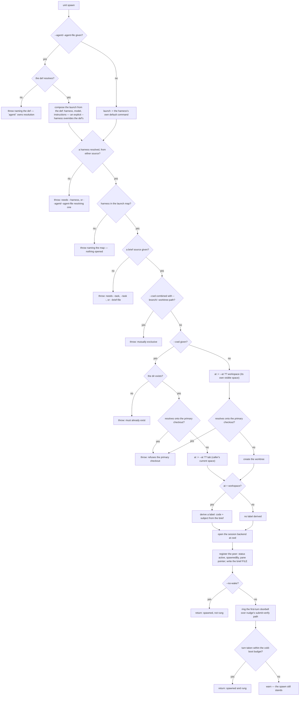
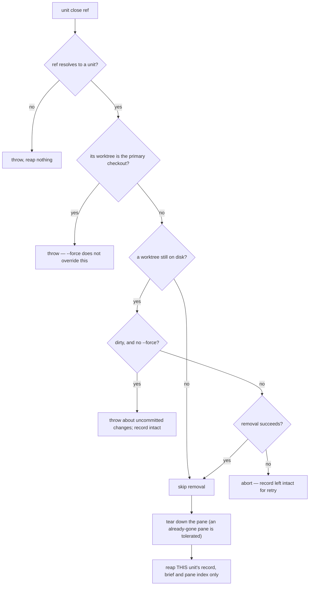
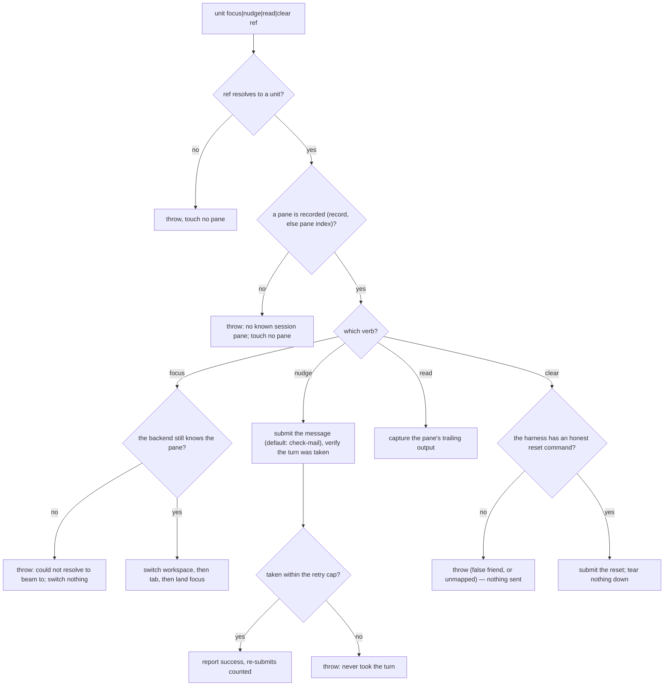

# unit lifecycle — warm peer session lifecycle over a multiplexer

## What

Spawn, scrape, focus, nudge, **clear**, and close a warm interactive peer via tmux/herdr. Migrated
CR-2 from `session/` (`cyberlegion-cli-realign`, ADR-0024): the lifecycle half of `unit` —
registration and discovery live in the sibling `unit/registry` node; backend selection and placement
moved to the new `mux/` node (a real architectural layer, not a command noun).

## Use Cases

**Subject** — opening a genuine sibling peer session — in a new git worktree it creates, or in an
existing directory a caller supplies (`--cwd`) — and its session pane, then tearing it back down
cleanly — the deterministic inverse pair:

- **spawn opens a new peer session and registers the peer it opened** — `unit spawn
  --harness <h> --task <text>` (or `--brief-file`) creates a real git worktree distinct from the
  primary checkout, opens a session backend (tmux or herdr, selected by environment — see `mux/`)
  with its cwd set to that worktree, then registers the peer (`status: active`, `spawnedBy` the
  caller's own id when it has one) and writes its pane pointer and brief file. There is no
  intermediate spawning status, and nothing later flips it (the hook injects no brief and mutates no
  status — `mail/surface`).
    - **Registration follows the launch, and no longer needs to precede it.** Under the retired
      split (ADR-0027) the child's own `SessionStart` hook read the record and the brief, so both had
      to exist before the harness booted. Nothing in the child reads either now — the peer learns of
      its brief from the wake, which is rung after `spawn` returns — so the ordering carries no
      contract. It does leave a window in which a crash strands a pane with no record; that is a
      robustness question for `unit/registry`'s reaping, not a claim this node makes.
      The frozen scenario is still titled *"spawn pre-registers the peer before the session actually
      launches"* and its section comment still reads *"registers the peer before it starts"* — titles
      written under the old design. Neither `Then` asserts an ordering, so the suite is not falsified;
      retitling would narrow a frozen scenario and fire Clearance, so the divergence is recorded here
      rather than papered over.
  - **The new worktree is always distinct from the primary checkout** — spawn refuses (throws) a
    `--worktree-path` that resolves onto the primary checkout rather than opening a session there.
  - **Or spawn into an existing directory without a worktree (`--cwd`)** — `unit spawn --cwd <dir>`
    opens the session in a directory that already exists, creating and removing no git worktree; the
    peer is registered with that directory as its cwd and no created worktree. `--cwd` requires the
    directory to already exist (cyberlegion creates no directory), refuses the primary checkout (the
    same guard the created-worktree path enforces), and is mutually exclusive with the
    worktree-creating flags (`--branch` / `--worktree-path`). This is the enabler that lets a caller
    (e.g. the `cyberfleet` fleet layer) own the worktree lifecycle and hand cyberlegion a ready
    directory to run in.
  - **Spawn resolves the default placement by mode — own visible space vs the caller's current
    space** — the fleet-layer caller (e.g. `cyberfleet`'s Operator) is mux-agnostic: it expresses
    intent ("this ship gets its own isolated, VISIBLE space"), never a mux placement. A spawn that
    **creates a new worktree** is exactly that intent, so with no `--at` it defaults to `workspace`
    (its own isolated, visible space, mapped per-mux in `mux/` — herdr nested workspace, tmux window)
    — deterministic, independent of whichever workspace is currently focused. A `--cwd` spawn opted
    into an existing space, so with no `--at` it defaults to a `tab` in the caller's current space. An
    explicit `--at` always overrides the mode default (either direction). This keeps a bare `unit
    spawn` doing the right thing on any mux without the caller naming a mux-specific placement.
  - **A `workspace` placement is labeled so a human can find it by eye** — a unit's own visible space
    is what the human scans to locate a session, so spawn resolves a **label** for it and hands it to
    `mux/`: `<code>-<subject>`, capped at **30 characters including the code**. The **code** is a NieR
    YoRHa unit class chosen from the brief's leading action word in one fixed order — `A2-` when the
    action tears down or reverts, else `9S-` when it is read-only recon (investigate / audit / review
    / diagnose and kin), else `2B-`, the build-and-change class, which is also the code for a brief
    whose leading word matches no action at all — so the same brief always yields the same code. The
    **subject** is `--handle` when the caller gave one (already the human's own short name for the
    unit), otherwise the brief's first non-empty line: lowercased, a **recognized** action word and
    any leading article dropped (the code already carries the action — an **unrecognized** leading
    word is kept, since it is the subject's own first noun), every run of
    non-alphanumerics collapsed to a single `-`, then whole `-`-separated words taken greedily while
    they fit the remaining budget, so the label ends on a whole word rather than mid-word. A subject
    that survives none of that falls back to the unit's own 6-character short id — the same slice the
    default handle uses — so a label is always resolvable and always carries a code. Only a
    `workspace` placement is labeled; `pane:*` and `tab` pass none.
  - **The brief is delivered by file, never typed** — the resolved brief text is written to the peer's
    own brief file in the hub, never appended to the typed launch command.
  - **Spawn delivers the peer's first turn — a fresh paned session boots idle otherwise** — for a
    paned agent, payload-delivery (the brief file, above) and turn-delivery (a taken turn) are two
    separate acts: the brief stays on disk and no hook injects it, and the model takes no turn on its
    own — it sits at an idle prompt, brief unread, until something rings it.
    A subagent needs no ring (the caller's Task call *is* the turn), but `unit spawn` always opens a
    real session, so it rings a **best-effort first-turn doorbell** over the same boot-race-aware
    submit-verify path `nudge` uses (submit once, then flush the staged buffer up to a bounded cap).
    That ring **carries the instruction**: it tells the peer to read the brief **at its file path** and
    begin, naming the path rather than carrying the brief's body — so the peer acts on its brief with
    no human nudge and the brief is still never re-typed. This is **mechanism, not routing** —
    it completes the spawn, it does not select a backend — so it stays within the CLI's dumb-hands
    charter and fixes every caller at once (Operator, Pod, and the Legate's `channel` dispatch
    strategy). The ring is best-effort exactly like `mail/doorbell`'s delivery ring: a ring that never
    completes (the harness never boots past its splash within the cap) is reported as a **warning**,
    never a failed spawn — the peer, worktree, and session are already created. `--no-wake` opts out
    (mirroring `mail send --no-nudge`) for a caller that will drive the first turn itself.
  - **An unmapped harness errors before anything launches** — `--harness` outside the launch map
    (`claude | cursor | codex`) throws naming the launch map, before any worktree/session is opened.
  - **No brief source errors** — neither `--task`, `--task -` (stdin), nor `--brief-file` given
    throws asking for a brief; nothing is spawned.
  - **--agent/--agent-file realizes a resolved def's launch** — when `--agent <name>` or
    `--agent-file <path>` is given, the resolved def's harness/model/instructions compose the launch
    command in place of the harness's bare default binary; an explicit `--harness` still overrides the
    def's own harness tag.
- **close tears down the worktree + session and reaps the state — spawn's deterministic inverse** —
  `unit close <ref>` removes the peer's git worktree, tears down its session pane, and reaps its
  registry record, pane pointer, and stored data (brief).
  - **Refuses the primary checkout even with --force** — a unit whose worktree root equals the
    primary checkout is refused; `--force` never overrides this refusal.
  - **Refuses a dirty worktree unless --force** — uncommitted changes in the worktree abort the
    close (record left intact, retryable); `--force` discards them and proceeds.
  - **Completes the reap when the worktree or pane is already gone** — a worktree already absent from
    disk, or a pane the session backend can no longer find, is tolerated; the reap (record, pane
    index, stored data) still completes.
  - **A genuine teardown failure aborts before any reap** — when worktree removal itself fails (not
    "already gone" but a real error), the command aborts and leaves the record intact so the close is
    retryable, never leaving a half-reaped unit.
  - **An unresolvable id errors** — closing an id that resolves to no registered unit (by id, handle,
    or worktree branch/CR ref) throws naming it; nothing is reaped.
  - **Reaps only the targeted unit's state** — another unit's record, pane pointer, and stored data are
    left untouched.
  - **close on a `--cwd` unit removes no worktree** — a unit spawned with `--cwd` has a recorded cwd
    and no created worktree; close tears down its session pane and reaps its record but attempts no
    worktree removal.
- **focus beams the attached view all the way to a peer's pane — across workspace and tab** — `unit
  focus <ref>` resolves the peer (by id, handle, or worktree branch/CR ref) to its pane and moves the
  attached client's *view* all the way there, not just within the current workspace. A single
  pane-level focus is not enough: a peer in another workspace/tab is never reached that way (herdr has
  no focus-a-pane-by-id form, and even a valid pane focus never switches the client's active
  workspace/tab). So focus **resolves that pane's own workspace and tab from the backend** and drives
  the full chain — herdr `workspace focus <ws>` → `tab focus <tab>` → the pane (the peer's pane is its
  tab's active pane); tmux `switch-client` → `select-window` → `select-pane` — so the attached view
  lands on the peer's pane rather than silently no-opping in the caller's current workspace. It stays
  **best-effort within** (the backend owns the actual move) but **surfaces a failure rather than a
  false success**: if the recorded pane no longer resolves to a live pane in the backend, focus throws
  that it could not beam there and switches nothing — never reporting `focused` on a silent no-op.
  (The unresolvable-ref / no-known-pane cases fail loud earlier still, at ref resolution — see below.)
- **nudge rings a peer's session — a doorbell that carries a message, robust to the harness boot
  race** — `unit nudge <ref>` delivers a message as a turn to the peer's pane through the session
  adapter (a live agent session only acts on real input; an empty keystroke is a no-op). The default
  message points the peer at its inbox; `--message <text>` overrides it. The mail the peer already
  has is the real payload — `mail/surface`/`mail/wait` read it on that turn. **A successful nudge
  means the peer actually took the turn (input submitted), not merely received staged text.** A
  single atomic text+Enter submit races the harness boot: fired while the TUI is still on its
  splash/init screen, the Enter is swallowed and the text stages unsent in the input box while the
  ship idles at $0.00. So nudge **submits, then verifies and retries**: it reads the pane back, and if
  the nudge text is still staged unsent it **flushes the already-staged buffer** (a bare submit, never
  re-typing — so the turn carries the message once, not once per retry) up to a **bounded cap**. If
  the turn is still not taken after the cap, nudge **fails loud** rather than reporting a false
  success — killing the silent idle-at-$0.00 mode. This is adapter-general: the same fire-and-forget
  submit shape exists on both the herdr and tmux adapters, so the verify+retry lives above them and
  the bare-submit primitive is added to each.
- **read scrapes a peer's session screen** — `unit read <ref> [--lines <n>]` captures the target
  pane's current output through the session adapter.
- **focus, nudge, and read need a live target — the same fail-loud floor as `clear`** — each first
  resolves the ref to a peer and then to a live pane before touching the session adapter, so both
  error cases fail loud with the adapter untouched: an **unresolvable ref** (no unit addressable by
  that id, handle, or worktree branch/CR ref) throws naming the ref, and a **registered unit with no
  known session pane** throws that the unit has no known session pane. Nothing is focused, delivered,
  or scraped in either case — the guard runs before any adapter call.
- **clear resets a warm peer's context while keeping it warm** — `unit clear <ref>` injects the
  peer's **own harness in-session fresh-context command** into its pane through the session adapter,
  returning the conversation to a cold state **without** tearing down the session, removing the
  worktree, or reaping the registry record — the pane/process stays warm (no cold-start cost), only
  the context goes cold. This is the warm/cold decoupling primitive: warmth is the unit, coldness is
  the context. The command is resolved from a **per-harness reset map** keyed on genuine
  fresh-context semantics, never on the literal word `/clear`: `claude`/`codex`/`copilot` → `/clear`,
  `cursor` → `/new-chat`. A harness whose apparent clear does **not** truly empty the model context
  (e.g. `gemini`, where `/clear` wipes only the terminal screen), or any harness absent from the map,
  **fails loud** naming the harness — never a silent no-op and never a false-friend command that
  leaves stale context behind. Injection is best-effort like `nudge` (the harness owns the actual
  reset); `clear` asserts the command was sent, not that the context is provably empty.

**Non-goals** — resolving an agent definition and realizing its launch string from `--agent`/
`--agent-file` (`agent/` owns the def format, lookup and `realizeLaunch`; this node owns only the
seam where the realized command reaches `unit spawn`, which its own `--agent` scenarios freeze), the
unit registry and self/peer discovery (`unit/registry`), backend selection and
placement (`mux/`), mail send/inbox/read/ack (`mail/`), thread correlation and the bounded `mail
await`/`watch` (`mail/wait`), hook-based mail injection into a harness turn (`mail/surface`) —
this node only owns the session lifecycle (spawn/close/focus/nudge/read/clear) and the worktree it
creates (when it creates one — a `--cwd` spawn opens into a caller-supplied directory and owns no
worktree). `clear` owns only injecting the harness's fresh-context command into the pane — it never
verifies the harness actually emptied its context (best-effort, the harness owns the reset), and the
routing decision to reset a warm unit belongs to the caller (the Legate plugin / an SDD conductor),
not this mechanism. The **first-turn ring** owns only delivering the taken turn on a fresh paned
spawn — two adjacent capabilities are explicitly out of scope: a **warm agent pool** (mailing +
ringing an existing idle unit instead of spawning a fresh one) and a **`--visible` axis** (letting a
human force a paned session for a cold one-shot they want to watch — paned-vs-subagent is derived
today from `warm × interactive × mux`). Both are noted, not built here.

## Control Flow

Six verbs with genuinely distinct decision logic, so the graph is sectioned by sub-graph. The four
pane verbs share one entry (`paneTargetOf`), which is why their guard scenarios are identical in
shape; `spawn` and `close` are the deterministic inverse pair.

### spawn — open a peer and deliver its first turn

Launch resolution runs in the CLI (`cli-input`) **before** `spawn`'s own guards, so a bad
`--agent` is refused ahead of a missing `--task`. Def resolution itself belongs to `agent/`; this
graph draws only the seam.

### close — the inverse: tear down and reap

### focus / nudge / read / clear — drive an existing pane

## Scenario map

Grouped by use case; 1:1 with [`lifecycle.feature`](./lifecycle.feature). `any` in **Path** is a
convergence claim — the outcome does not vary with the upstream branch.

These edges carry no row. The list is open — read it as "at least these", and add to it rather than
re-asserting completeness:

- **`CL -- no`** — the launch is the harness's own default binary. No frozen scenario discriminates
  that from a def-composed launch at spawn's own boundary (`--agent` is asserted through the composed
  command). A gap in the suite, closable additively without Clearance.
- **`CLH -- no`** — `unit spawn` with neither `--harness` nor an `--agent`/`--agent-file` that
  resolves one. The throw is real (`cli-input.ts`) and nothing in the corpus covers it. A second gap,
  also closable additively.
- **`CLR -- no`** — a named def that does not resolve. Covered, but **not here**: `agent/` freezes the
  unresolvable-name and missing-file errors. Co-owned, like the entry-node row in `mail/surface` —
  recorded so it is not mistaken for a hole.

Happy-path pass-throughs carry no row of their own by design: each is a path prefix subsumed by a
downstream row, which is what the `Path` column records. They are not gaps.

### spawn opens a peer and registers it

| Edge | Path (Given) | Scenario |
|---|---|---|
| `N` the record and pane pointer | a spawn by a caller that has its own id | `spawn pre-registers the peer before the session actually launches` |
| `J -- yes` refuse the primary | a --worktree-path resolving onto the primary checkout | `spawn refuses a --worktree-path that resolves onto the primary checkout` |
| `N` brief by file, not by command | any spawn carrying a brief | `the resolved brief is written to the peer's brief file, not into the launch command` |
| `B -- no` | a harness absent from the launch map | `an unmapped --harness errors without opening a worktree or session` |
| `C -- no` | no --task, --task -, or --brief-file | `spawn with no --task, --task -, or --brief-file errors` |

### --agent/--agent-file realizes a resolved def's launch

| Edge | Path (Given) | Scenario |
|---|---|---|
| `CL -- yes` → `CL1` | an agent def carrying a harness, model and instructions | `--agent resolves a def whose harness/model/instructions compose the launch` |
| `CL1` override wins | the same def, plus an explicit --harness | `an explicit --harness overrides the resolved def's own harness` |

### Spawn resolves the default placement by mode

| Edge | Path (Given) | Scenario |
|---|---|---|
| `I` new-worktree default | a new-worktree spawn with no --at | `a new-worktree spawn with no --at defaults to its own visible space (workspace), deterministically` |
| `H` --cwd default | a --cwd spawn with no --at | `a --cwd spawn with no --at defaults to a tab in the caller's current space, not its own workspace` |
| `I` explicit --at overrides | a new-worktree spawn with an explicit --at | `an explicit --at overrides the new-worktree default of workspace` |
| `H` explicit --at overrides | a --cwd spawn with an explicit --at | `an explicit --at overrides the --cwd default of tab` |

### A workspace placement is labeled so a human can find it by eye

| Edge | Path (Given) | Scenario |
|---|---|---|
| `L1` derive code + subject | a workspace spawn whose brief has a leading action | `a workspace spawn labels the space with a code and a subject drawn from the brief` |
| `L1` code selection order | briefs whose leading actions differ | `the brief's leading action selects the code, in a fixed order` |
| `L1` action + article dropped | a brief opening with a recognized action and an article | `a matched leading action and article are dropped from the subject, never repeated in it` |
| `L1` unrecognized word kept | a brief whose leading word matches no action | `a leading word that matches no action is kept — only a recognized action is dropped` |
| `L1` cut at a word boundary | a brief longer than the subject cap | `a brief too long for the cap is cut at a word boundary, not mid-word` |
| `L1` --handle supplies the subject | a workspace spawn with --handle | `--handle supplies the subject in place of the brief-derived one, and the code still comes from the brief` |
| `L1` fall back to the short id | a brief with no usable subject | `a brief with no usable subject falls back to the unit's own short id` |
| `L -- no` → `L2` no label at all | a pane or tab placement | `no label is derived at all for a pane or tab placement` |

### Spawn into an existing dir without a worktree (--cwd)

| Edge | Path (Given) | Scenario |
|---|---|---|
| `E -- yes` no worktree created | --cwd naming an existing directory | `--cwd spawns a session into an existing directory and creates no worktree` |
| `F -- no` | --cwd naming a directory that does not exist | `--cwd requires the directory to already exist` |
| `G -- yes` | --cwd naming the primary checkout | `--cwd refuses the primary checkout, the same as a created worktree` |
| `D -- yes` | --cwd combined with --branch/--worktree-path | `--cwd is mutually exclusive with the worktree-creating flags` |

### spawn delivers the peer's first turn

| Edge | Path (Given) | Scenario |
|---|---|---|
| `P` ring the instruction | a paned spawn that opened cleanly | `spawn delivers a first turn to the freshly-opened pane so the peer acts on its brief` |
| `Q -- yes` after a swallowed submit | a freshly-launched harness still booting | `the first turn is delivered as a taken turn, robust to the harness boot race` |
| `Q -- no` warn, never fail | a pane that never takes the turn | `a first-turn ring that never completes never fails the spawn` |
| `O -- yes` | a spawn passing --no-wake | `--no-wake spawns without delivering the first turn` |

### close tears down and reaps (spawn's inverse)

| Edge | Path (Given) | Scenario |
|---|---|---|
| `CI` full teardown + reap | a unit with a worktree and a live pane | `close removes the worktree, tears down the session, and reaps the registry record` |
| `CD -- no` nothing to remove | a unit spawned with --cwd (owns no worktree) | `close on a unit spawned with --cwd removes no worktree` |
| `CC -- yes` | a unit whose worktree is the primary checkout | `close refuses a unit whose worktree is the primary checkout` |
| `CC -- yes` under --force | the same, with --force | `--force does not override the primary-checkout refusal` |
| `CE -- yes` | a unit with uncommitted changes, no --force | `close refuses a unit with uncommitted changes in its worktree` |
| `CE -- no` under --force | the same, with --force | `--force discards uncommitted changes and completes the close` |
| `CD -- no` worktree already gone | a unit whose worktree is no longer on disk | `close completes the reap when the worktree no longer exists on disk` |
| `CH` pane already gone | a unit whose pane no longer exists | `close completes the reap when the session pane no longer exists` |
| `CG -- no` | a worktree removal that genuinely fails | `a genuine worktree-removal failure aborts the close and leaves the record intact` |
| `CB -- no` | an id that resolves to no unit | `closing an unresolvable id errors and reaps nothing` |
| `CI` reaps only the target | two registered units, one closed | `close leaves another unit's state untouched` |

### focus, nudge and read drive a live pane

| Edge | Path (Given) | Scenario |
|---|---|---|
| `PE2` land focus | a registered peer with a live pane | `focus moves input focus to a peer's session` |
| `PE2` ordered beam | a peer whose pane sits in another workspace and tab | `focus beams the attached client across workspace and tab to a peer's pane` |
| `PF` default message | a registered peer with a live pane | `nudge delivers a default check-mail doorbell message to a peer's session` |
| `PF` caller-supplied message | the same, with --message | `nudge carries a caller-supplied message with --message` |
| `PG -- yes` taken first time | a pane that takes the first submit | `nudge confirms the turn was taken and reports success without re-submitting` |
| `PG -- yes` after re-submits | a harness still booting, first submit staged | `nudge re-submits when the harness boot swallows the first submit` |
| `PF` flush, never re-type | the same staged-first-submit path | `a boot-race re-submit does not duplicate the message` |
| `PG -- no` | a pane that keeps it staged past the cap | `nudge fails loud when the turn is never taken within the bounded retry cap` |
| `PH` capture trailing output | a peer whose pane holds some output | `read scrapes a peer's session screen` |

### focus, nudge, read: error cases

| Edge | Path (Given) | Scenario |
|---|---|---|
| `PB -- no` (focus) | a ref resolving to no unit | `focus on an unresolvable ref errors and focuses nothing` |
| `PC -- no` (focus) | a unit with no recorded pane | `focus on a unit with no known session pane errors and focuses nothing` |
| `PE -- no` | a recorded pane the backend no longer knows | `focus surfaces an error instead of a false success when the recorded pane no longer resolves in the backend` |
| `PB -- no` (nudge) | a ref resolving to no unit | `nudge on an unresolvable ref errors and delivers nothing` |
| `PC -- no` (nudge) | a unit with no recorded pane | `nudge on a unit with no known session pane errors and delivers nothing` |
| `PB -- no` (read) | a ref resolving to no unit | `read on an unresolvable ref errors and scrapes nothing` |
| `PC -- no` (read) | a unit with no recorded pane | `read on a unit with no known session pane errors and scrapes nothing` |

### clear resets context while keeping the pane warm

| Edge | Path (Given) | Scenario |
|---|---|---|
| `PI2` submit the reset | a warm claude peer with a live pane | `clear injects the harness's own in-session reset into a warm peer and tears nothing down` |
| `PI2` per-harness command | peers on each mapped harness | `clear resolves each harness's own fresh-context command from a per-harness map` |
| `PI -- no` false friend | a harness whose reset clears only the screen | `clear fails loud on a harness whose reset would not truly empty the context` |
| `PI -- no` unmapped | a harness absent from the reset map | `clear errors on an unmapped harness rather than guessing a command` |
| `PB -- no` (clear) | a ref resolving to no unit | `clear on an unresolvable ref errors and sends nothing` |
| `PC -- no` (clear) | a unit with no recorded pane | `clear on a unit with no known session pane errors and sends nothing` |
