# unit registry — register, discover, and prune legion units

## What

The **registry** is the list of who is in the legion. A session registers itself, recovers its own
id on later calls without being told it, discovers the peers it can address, and reaps the ones
whose session is gone. All of it is records in the global hub (the `Store`); there is no server.

The registry also holds **standing** records: a durable inbox for a person (an owner), with no
session of its own, so an agent with nobody to report to — a cron-started session — can mail its
result and exit. A standing owner can have a **presence**: one live unit standing in for it.

**Key terms**

- **record** — one entry in the registry: id, handle, harness, cwd, worktree, a pane locator tagged
  with its multiplexer (tmux or herdr), status, and timestamps (`createdAt`, `lastSeen`).
- **pane pointer** — a pane-id → unit-id entry, written when a session registers inside a pane.
  It is how a later call finds its own id.
- **self id** — the caller's own unit id, recovered by `resolveSelfId`.
- **harness** — the agent program running the session: `claude`, `cursor`, or `codex`.
- **kind** — `session` (the default; a record with no `kind` field is a session, so records written
  before the field existed need no migration), `standing`, or `service` (a project service's
  endpoint, spec'd in [`service/endpoint`](../../service/endpoint/README.md)).
- **staleness window** — 15 minutes. A record with no pane is judged dead when its `lastSeen` is
  older than this.
- **standing record** — a session-independent, prune-exempt owner inbox, keyed by handle.
- **presence** — the one live unit bound as a standing owner's stand-in, so the owner's mail has
  someone who can act on it.
- **home** — an optional folder on a standing record, plus how to launch a session there (an agent
  definition or a harness), where a presence is spawned when mail arrives and none is live.
- **reconcile** — comparing the registry against the panes the multiplexer actually shows: **cull**
  records whose pane is gone, and **adopt** live harness panes that have no record.

**Non-goals.**

- Sending and reading mail (`mail/`).
- Spawning or closing a peer session (`unit/lifecycle`).
- Backend selection and placement (`mux/`), and the multiplexer probe itself — this node only
  *consults* it to gate a claim.
- Ringing a bound presence on delivery, and spawning one into the owner's home when none is live
  (`mail/doorbell`). This node only stores the home.
- Hook-based injection of mail into a harness turn (`mail/surface`).
- The human's read-pane pointer (`attach/`).
- Inferring the harness of a tmux pane for adoption — structurally deferred until tmux exposes a
  harness signal.
- Exited-record retention and garbage collection — a separate change.
- Any persona or place name for the standing owner or for the unit that stands in for it. That is a
  higher-layer concern; this node knows only "standing owner", "presence", and "spawn capability".

This node owns the registry only: register, recover, discover, prune, reconcile (both its cull and
adopt halves), the standing owner's presence pointer, and the standing owner's home. The pointer is
also written by `mail/doorbell` when it binds (and, on a stuck trust prompt, unbinds) a presence it
spawned into the home, under the same presence lock `unit claim` takes.

**Provenance.** Migrated in CR-2 from `identity/` (register, whoami, who, prune, self-id, harness,
touch, standing) plus `session/`'s `list` scenario (`cyberlegion-cli-realign`, ADR-0024): the
registry half of `unit` — the instance registry a unit's identity always was.

## Use Cases

**Actors**

- **A session** (an agent in a harness) — wants to be findable and addressable, and to know its own
  id on every later call without carrying it.
- **Any CLI command run by a session** — needs the caller's own id, and keeps the caller's
  `lastSeen` fresh as a side effect.
- **A controller or peer** — wants the list of units it can address right now.
- **A person at the terminal** — wants a one-glance status of this session and the legion.
- **A maintainer of the hub** (a person, or a controller sweeping) — wants dead units marked dead
  and hand-opened harness panes made addressable.
- **A frameless agent** (a cron-started session with no parent) — wants to `mail send --to <owner>`
  and exit.
- **A person as standing owner** — wants one durable inbox, and a live unit acting for them — one
  that appears on its own when mail arrives and nobody is standing in.
- **Stakeholder: a mail sender** (`mail/`) — resolves handles through this registry; an owner report
  must never land in a dying session's inbox, and a name must never resolve to a dead unit.
- **Stakeholder: the multiplexer backends** (`mux/`) — supply `listPanes`, the bulk pane enumeration
  this node builds reconcile on.

### unit register — record who and where this session is

| | |
|---|---|
| Actor / goal | A session wants to be in the registry, addressable by handle. |
| Trigger | `unit register [--handle <name>] [--harness <h>]` |
| Outcome | A record (id, handle, harness, cwd, worktree, pane locator tagged with its multiplexer, status `active`, timestamps) is written; inside any multiplexer pane, a pane pointer too. The hub root is stamped with the tracked `config.json` marker on first use. |

Registering is **safe to repeat per pane** (idempotent): from the same pane it keeps the same id and
refreshes the record rather than minting a second identity. Registration never happens implicitly.

Extensions:

- **The hub root cannot be written** — throws; no partial record is written.
- **No harness can be detected** — throws asking for `--harness` rather than guessing (see
  `detectHarness`).
- **An unrecognized `--harness`** — throws naming `claude | cursor | codex`.

Surface: `--handle` (else the existing handle, else the id's first 6 characters), `--harness` (else
detected). `--standing` switches to the next use case.

### unit register --standing — a durable owner inbox

| | |
|---|---|
| Actor / goal | A person, or whoever sets up the hub for them, wants an inbox that outlives every session. |
| Trigger | `unit register --standing --handle <name>` |
| Outcome | A record with `kind: standing`, an id **derived from the handle** (stable across calls, distinct from a random session id and from any pane pointer), and **no** pane. It is not pane-indexed, and `resolveSelfId` never resolves to it. |

Extensions:

- **Same handle again** — the same id, refreshed (idempotent per handle).
- **A live session already claims that handle** — the standing record is still written, with a
  warning.
- **No `--handle`** — lists the registered standing records only, without any session agents.

What else holds for a standing record, owned by the use cases named:

- `prune` **never** marks it exited: it has no pane and is exempt from the staleness window
  (`unit prune`).
- `who` lists it alongside sessions (`unit who`).
- When a session and a standing record share a handle, **recipient resolution prefers the standing
  record**, so an owner report never lands in a dying session's inbox (`resolveRecipient`).
- Sending to an unknown recipient still throws (fail-loud); it never auto-creates an owner.

### unit register --standing --home — where the owner's presence is spawned on demand

| | |
|---|---|
| Actor / goal | A person, or whoever sets up the hub for them, wants mail to the owner acted on even when no unit is standing in for it — above all mail from a sender with nobody watching, such as a cron job. |
| Trigger | `unit register --standing --handle <name> --home <dir> (--agent <def> \| --harness <h>)`; `--clear-home` drops it |
| Outcome | The standing record carries a **home**: an absolute folder plus how to launch a session there (an agent definition, or a bare harness). The delivery doorbell uses it to spawn a presence when none is live ([`mail/doorbell`](../../mail/doorbell/README.md)). |

The home is **its own field**, separate from the record's `cwd`. `cwd` is wherever the registering
process happened to run, rewritten on every refresh, so it cannot say where the owner lives. The
home changes only when a registration names `--home` or `--clear-home`.

Everything that can go wrong with a home is checked **here, when it is registered**, not at the
first delivery. A failure at delivery time can only be a warning on someone else's send, so a typo
caught then would surface late, to the wrong person.

Extensions:

- **A re-register naming neither `--home` nor `--clear-home`** keeps the home, and keeps the bound
  presence. Refreshing the inbox is not reconfiguring it.
- **The folder does not exist** — throws; nothing is written. cyberlegion creates no directory, the
  same rule `unit spawn --cwd` follows.
- **No launch named, or both `--agent` and `--harness`** — throws; nothing is written. A home needs
  exactly one way to launch a session. An agent definition already names its harness, so a second
  harness would be a conflict, not a refinement.
- **`--agent` names a definition that does not resolve from the home** — throws; nothing is written.
  The definition is looked up from the home, because that is where the spawn will look it up. The
  record stores the definition's **name**, not its contents, so an edit to the definition reaches the
  next spawn.
- **`--harness` names an unrecognized harness** — throws naming `claude | cursor | codex`.
- **The folder is the primary checkout of its repository** — throws; nothing is written. A spawned
  unit never works in the primary checkout (`unit/lifecycle`), and a presence spawned on demand is a
  spawned unit.
- **`--agent` or `--harness` without `--home`** on a standing registration — throws. A launch with
  nowhere to run it is not a home.
- **`--home` together with `--clear-home`** — throws; the two contradict.
- **A home flag (`--home`, `--clear-home`, `--agent`) without `--standing --handle`** — throws. Only a
  named standing owner has a home. A plain `unit register` still takes `--harness` for itself.
- **`--clear-home` on a record with no home** — a no-op, never an error.

Surface trace: `--home` needs exactly one of `--agent` / `--harness`; `--clear-home` takes neither and
excludes `--home`. All three apply only with `--standing --handle`.

### detectHarness — which harness is this session

| | |
|---|---|
| Actor / goal | `unit register` needs the harness without the caller always naming it. |
| Trigger | every non-standing `unit register` |
| Outcome | `claude`, `cursor`, or `codex`, by layered detection: explicit `--harness`, then harness-specific env vars (`CLAUDECODE`/`CLAUDE_CODE_ENTRYPOINT`, any `CURSOR*` or `CODEX*` key), then — inside tmux — the pane's own running command (`tmux display-message … #{pane_current_command}`). |

Extensions: an explicit value outside `claude | cursor | codex` throws; nothing detected makes
`register` throw asking for `--harness`.

### resolveSelfId — recover this session's own id

| | |
|---|---|
| Actor / goal | Every command that acts as the caller needs the caller's id without being told it. |
| Trigger | any command that resolves its own identity |
| Outcome | In a multiplexer pane: the pane pointer's id. In **no** multiplexer pane at all: `$CYBERLEGION_AGENT_ID`. |

"My pane id" is resolved mux-agnostically through the shared current-pane helper: tmux
`$TMUX_PANE` or herdr `$HERDR_PANE_ID`, the `$CYBER_MUX_PANE` fast-path a spawn propagates, and the
legacy `$CYBERLEGION_MUX_PANE` transitionally. There is one source of truth per context and **no
shared bare `self` file** — self-id is always pane-keyed or explicit through the env var.

Extensions: an **unmapped pane** resolves to `undefined` and does **not** fall back to
`$CYBERLEGION_AGENT_ID`.

### touch — every call refreshes last-seen

| | |
|---|---|
| Actor / goal | The registry wants a recent `lastSeen` for every active caller, without asking callers to do anything. |
| Trigger | `who`, `prune`, the bare status, and every mail/unit command that resolves the caller's own identity |
| Outcome | The caller's `lastSeen` becomes now. |

Extensions: an unregistered caller — a no-op, never throwing (best-effort). `prune` reads
`lastSeen` only for a pane-less record; a pane-bound one is judged by its pane.

### unit whoami — print this session's own identity

| | |
|---|---|
| Actor / goal | A session wants to see which unit it is. |
| Trigger | `unit whoami` |
| Outcome | The caller's own record: id, handle, harness, status. |

Extensions: no self id yet — errors asking to run `unit register` first; a self id with no backing
record — errors.

### unit who — list the addressable peers

| | |
|---|---|
| Actor / goal | A controller or peer wants the units it can address. |
| Trigger | `unit who [--all] [--reconcile]`; top-level `who` is a plain alias |
| Outcome | A TOON list `units[N]{id,handle,harness,status,pane}:` plus a `<N> units` aggregate line, exit 0. |

`unit who` is the single list command: the old `session list` folded in here (CR-2 resolution #1).

Extensions:

- **Empty registry** — `0 units`, never an error.
- **Exited units** — filtered out by default; `--all` includes them.
- **`--reconcile`** — runs reconcile, with adopt, before listing (see `unit who --reconcile`).

### cyberlegion (bare) — a content-first status

| | |
|---|---|
| Actor / goal | A person wants a one-glance status rather than a help screen. |
| Trigger | `cyberlegion` with no subcommand |
| Outcome | A compact status — `self · harness · unread · units` — of this session's own identity, its unread count, and how many units are live. Exit 0 (AXI #8 content-first). |

Extensions: unregistered — still exit 0, with `self: -` and a register next-step; never
help-and-error.

### unit prune — mark dead units exited

| | |
|---|---|
| Actor / goal | A maintainer wants dead units out of the addressable set. |
| Trigger | `unit prune` |
| Outcome | Every non-exited record whose session is gone becomes `exited`. Only the records it changed are returned, as a TOON list plus a `<N> pruned` aggregate. |

A record is judged dead when its pane is gone, or — for a record with **no pane** — when its
`lastSeen` is older than the staleness window. Liveness is checked **against the pane's own
multiplexer** — a tmux locator through `tmux has-session`/`list-panes`, a herdr locator through a
herdr pane-existence query — so a live herdr pane is never false-reaped by a tmux check, and the
reverse. `prune` reconcile-culls too, before judging each record.

Extensions — each is a record `prune` leaves alone:

- **A live pane outranks the timer.** A pane-bound record is judged by its pane alone. A unit working
  for an hour without calling the CLI, or idle at its prompt, still has a live pane, and flipping it
  to `exited` would strand its handle; so its `lastSeen` is not consulted. The staleness window
  applies only to a record with no pane, which has nothing else to be probed by.
- **A multiplexer that cannot be queried proves nothing.** A pane reads as gone only on positive
  evidence: the existence probe fails *and* the pane's multiplexer answers with a non-empty pane
  list that does not contain it. When the multiplexer answers no pane list at all (server down,
  unreachable from this caller, a failed query), `prune` cannot rule the unit alive or dead and
  leaves it untouched — the same fail-closed rule `sessionLive` and `store/lock.ts` take on an
  ambiguous holder. The cost is that a record whose multiplexer is truly gone stays `active` until
  that multiplexer answers again (or the unit is closed); the alternative, reaping a possibly live
  unit and stranding its handle and mail, is the worse failure.
- **A stopped unit is never pruned.** `unit stop` (`unit/runtime`) leaves a record with status
  `stopped` and no pane, on purpose. Neither a pane check nor the staleness timer can say anything
  about a runtime that was ended deliberately, so `prune` skips it however old its `lastSeen` is.
  This is what keeps a stopped unit addressable by handle (a handle never resolves to an exited
  unit), and so what keeps its mail arriving while it has no session.
- **A standing record is never pruned** (see `unit register --standing`), nor is a service endpoint
  (`service/endpoint`).
- **`prune` never adopts** — the reaper never mints records.

### unit who --reconcile — cull and adopt against the live multiplexer

| | |
|---|---|
| Actor / goal | A maintainer wants the registry to match the panes that actually exist: dead records culled, hand-opened or hook-failed harness panes made listable, mailable, and dispatchable. |
| Trigger | `unit who --reconcile` (cull + adopt); `unit prune` (cull only) |
| Outcome | **Cull:** every non-standing, pane-bearing record whose pane is absent from the live set becomes `exited`. **Adopt:** every live pane with a detectable harness and no matching record gets one. The changes are returned. |

`--reconcile` mirrors `--all`, the settled seam that keeps `who` cheap by default. Reconcile probes
the live panes through the adapter's `listPanes` primitive.

Cull extensions:

- **Mux-scoped.** Reconcile enumerates only the multiplexer the caller is currently inside (tmux
  `list-panes -a` or herdr `pane list`) and never declares the *other* mux's records dead, since it
  cannot see them.
- **A `kind: standing` record** is never touched.
- **A record whose `pane` is `null`** cannot be pane-culled by enumeration; it is left to the
  staleness timer.
- **Outside any multiplexer pane** there is nothing to enumerate; nothing is culled.
- **An empty live set** culls nothing: the caller is itself inside a pane of that multiplexer, so an
  empty answer means the query failed, not that every pane died.

Adopt — a minted record binds pane → id, derives the handle, sets the harness, `status: active`,
`lastSeen` now. **Handle derivation (frozen rule):** the sanitized basename of the pane's reported
`cwd`; when the backend reports no cwd, the `id.slice(0, 6)` default.

Adopt extensions:

- **Detectable harness only.** The backend-reported agent string must map to a known harness
  (`claude | cursor | codex`, substring-matched like the pane-command probe); anything else is
  unclassifiable and is **never** adopted.
- **tmux adoption is structurally deferred.** herdr's `pane list` exposes each pane's running agent;
  tmux's `list-panes` does not, so a tmux pane is never adopted.
- **Already bound.** A pane is matched — and never adopted — when its pane pointer resolves to an
  existing record, or any record of **any** status, exited included, bears that pane. So it is
  idempotent with cull: an already-bound live pane is never re-adopted, and a second reconcile mints
  no duplicate.
- **Bound to an exited record.** Never adopted. Resurrection is the in-pane session's own
  `unit register` (which recovers its id through the pane pointer), never reconcile's.
- **Under `prune`** — adopt does not run; `prune` stays cull-only.

### unit claim — bind a live unit as a standing owner's presence

| | |
|---|---|
| Actor / goal | A standing owner is durable but has no session, so it cannot take a turn. The person wants a live unit to stand in for them and act on what their mailbox delivers. |
| Trigger | `unit claim <handle>`; `--clear` unbinds; `--show` prints the bound unit or a definitive `none` |
| Outcome | The **caller's own unit** becomes that standing owner's presence: a per-standing-record singleton pointer. Last claim wins, so the pointer **moves** as the person moves between units, and exactly one unit is ever the presence. |

Extensions:

- **Unknown handle** — throws (fail-loud) and never auto-mints a standing record, for a claim and for
  `--clear` alike. The unknown-handle throw wins over `--clear`'s tolerance: `--clear` is forgiving
  about *nothing being bound*, never about *the owner not existing*, so a typo'd handle fails loudly
  instead of reporting a clear it never performed.
- **`--clear` with nothing bound** — a no-op, never an error.
- **The presence unit has exited** — reads as **no presence bound**, exactly as if none were ever
  claimed. The pointer records a unit id, and that unit can exit while the standing record never
  does, so the pointer is **resolved live**, not trusted: a name must never resolve to a dead reader
  — the same rule handle resolution already follows. Nothing self-heals the pointer; a stale claim
  is simply inert until re-claimed.
- **The caller reports no multiplexer** — cannot claim; throws and leaves the pointer untouched.
  A presence is only useful if it can act on what the mailbox delivers, and the caller's dispatch
  mechanism is its **own** multiplexer (this CLI has no subagent-spawning primitive by design —
  spawning is always the caller's). So the gate is a **checkable precondition**: probe the
  multiplexer (`mux`'s `probeMultiplexer`, which already honors the `CYBER_MUX=none` override). This
  is deliberately **not** an introspective carve-out about whether the caller is a subagent: a named
  subagent inside a real pane can spawn and may hold the presence, while a pane-less caller cannot
  regardless of how it was realized. Probe the capability; never ask the agent what it is.
- **The caller has no self id** — throws asking to run `unit register` first.

Binding a presence **neither creates nor requires a main pane.** The standing inbox (`unit register
--standing`), the human's read-pane (`attach`), and the standing owner's presence (`unit claim`) are
three independent pointers, minted independently. A presence is a **unit** standing in for the
person; the main pane is the **pane a human reads from**. They are frequently different, and neither
implies the other.

Surface: `--show` and `--clear` are alternatives to claiming; given together, `--show` wins.

### resolveRecipient — a handle names the standing record first

| | |
|---|---|
| Actor / goal | A mail sender (`mail/`) wants a handle to reach the reader who should get it. |
| Trigger | `mail send --to <id-or-handle>` and every other recipient lookup |
| Outcome | An id resolves to itself; a handle resolves among non-exited records, preferring the **standing** record when one shares the handle. |

Extensions: a handle that matches only exited records, or nothing, throws — it never falls through to
a corpse. A handle that two or more non-exited, non-standing records carry (with no standing record
among them) throws, naming each id — it never silently takes the first. Two same-named repositories
give their service endpoints the same handle (`service/endpoint`), and two sessions can register the
same `--handle`. `resolveAgent`, behind the verbs that take a unit ref, applies the same rule to a
handle before it tries a worktree branch.

### listPanes — the bulk pane enumeration

| | |
|---|---|
| Actor / goal | Reconcile needs every live pane the backend can see, in one call. |
| Trigger | a `SessionAdapter`'s `listPanes` — the counterpart to `paneExists`'s single targeted query |
| Outcome | Every live pane as `{ id, mux, harness?, cwd? }`. |

Extensions: herdr's `pane list` reports each pane's running agent, and a pane with no agent (a bare
or scaffold pane) is dropped. tmux's `list-panes -a` reports id, command, and cwd; the harness is not
directly knowable from tmux, so it is omitted.

## Control Flow

Each use case enters its own sub-graph. Several share pieces: `register` runs `detectHarness` and
`resolveSelfId`; `who`, `prune`, and the bare status run `touch` first; `prune` runs reconcile's cull.

### register

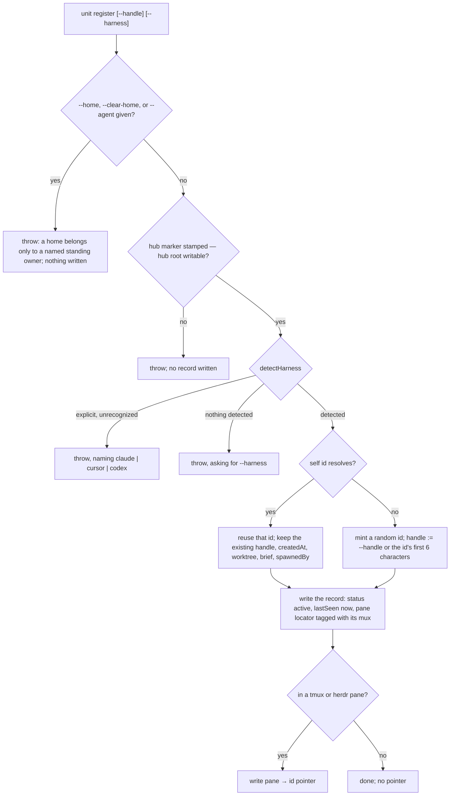

### register --standing

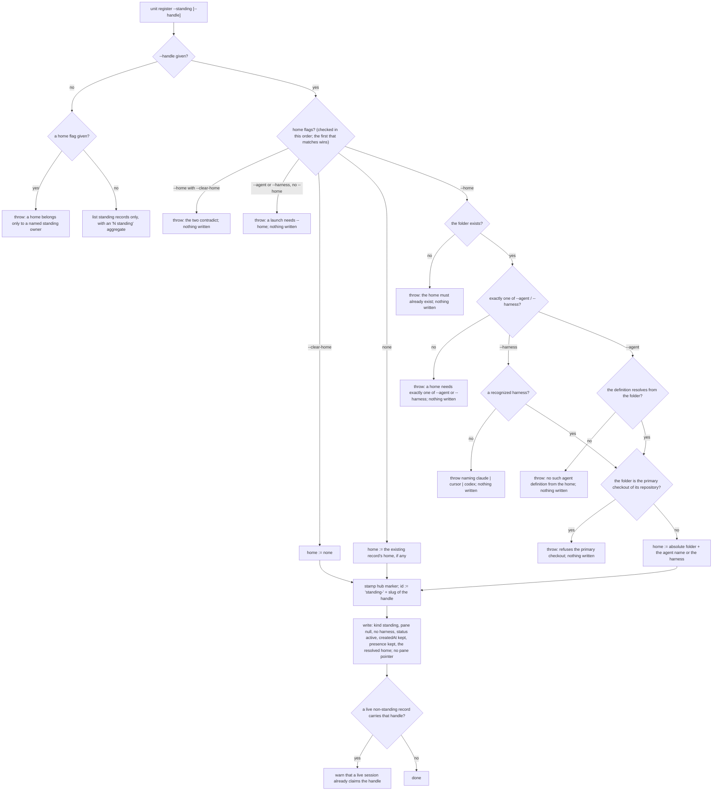

### detectHarness

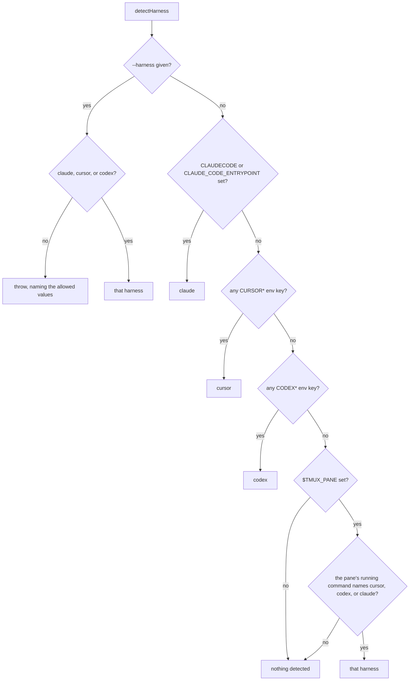

### resolveSelfId

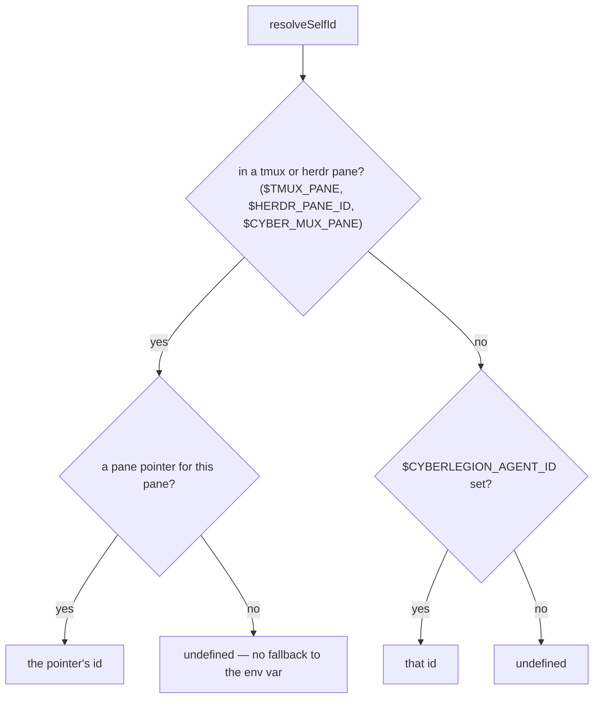

### touch

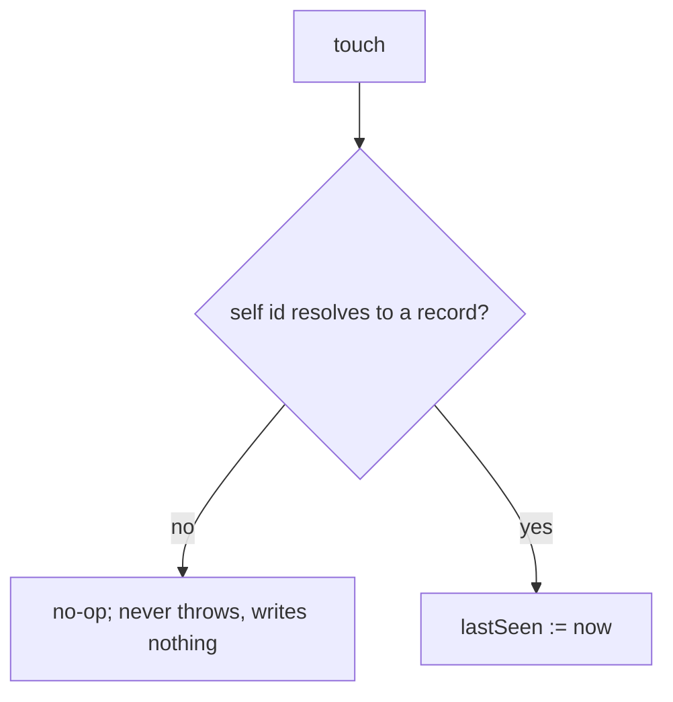

### whoami

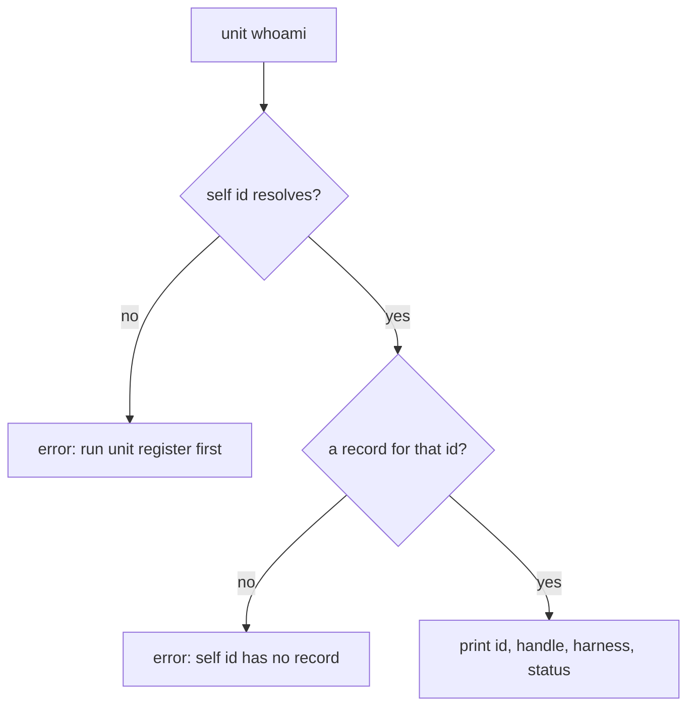

### who

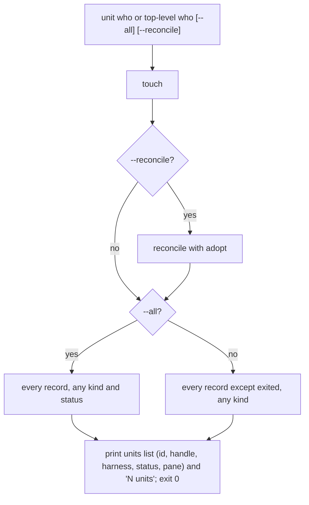

### bare status

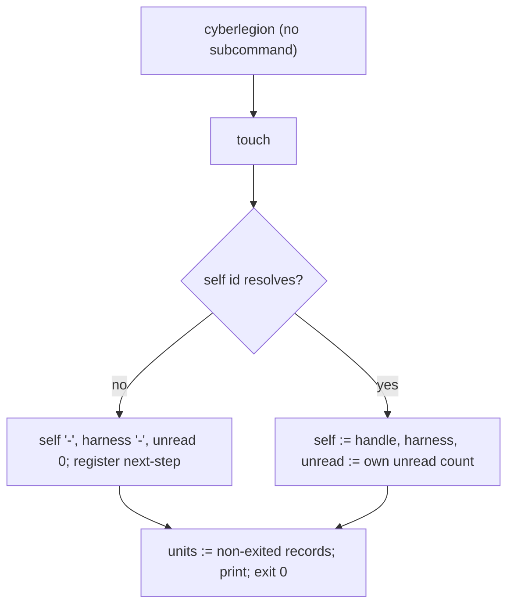

### prune

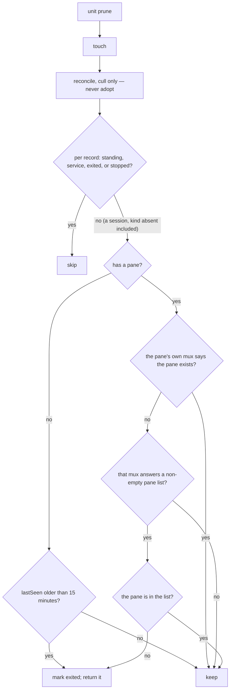

The result is the reconcile changes plus every `PRX`, printed with a `<N> pruned` aggregate.

### reconcile

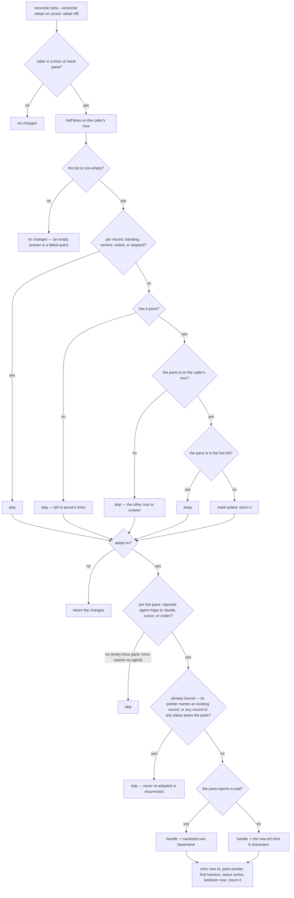

### claim

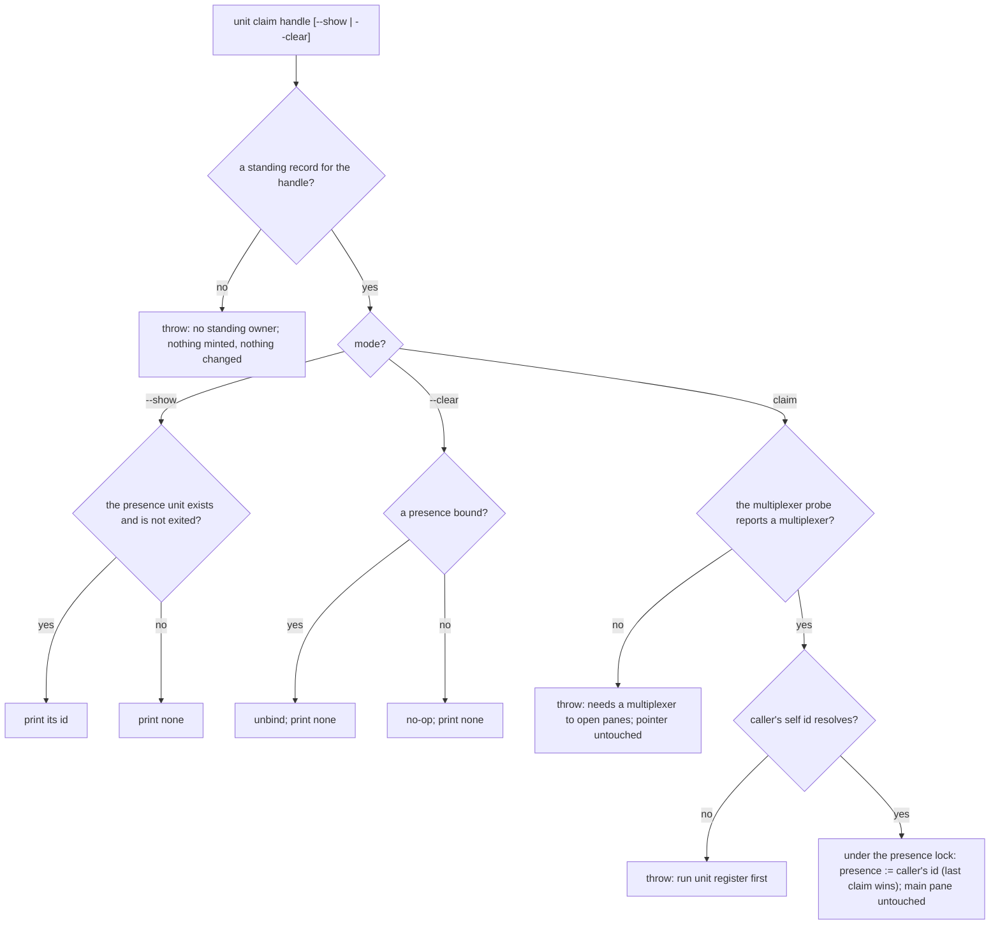

The live-only rule at `CL3` is the same one the delivery doorbell uses to find a presence.

### resolveRecipient

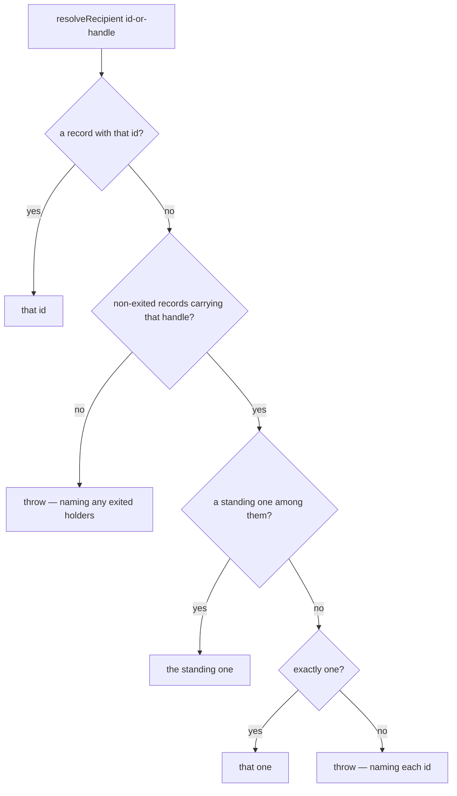

### listPanes

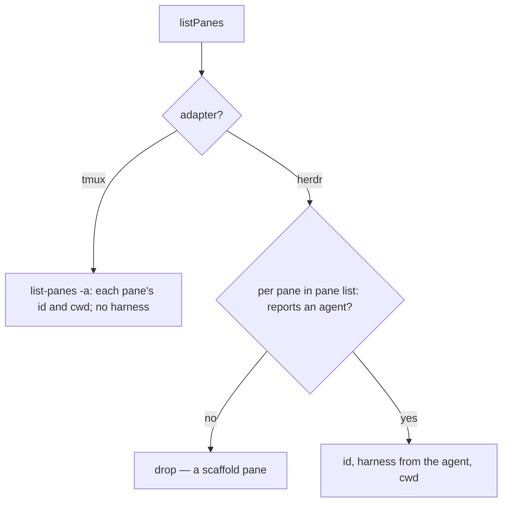

## Scenario map

Grouped by use case, 1:1 with [`registry.feature`](./registry.feature). `any` in **Path** is a
convergence claim. A row whose path names a multiplexer is permutation coverage across the per-mux
adapters.

### unit register

| Edge | Path (Given) | Scenario |
|---|---|---|
| `RG8` tmux | an unregistered session in a tmux pane | `register writes the agent record and a pane pointer` |
| `RG8` herdr | an unregistered session in a herdr pane | `register writes the agent record and a pane pointer in a herdr pane` |
| `RG1 -- yes` | a fresh, unmarked hub root | `register stamps the hub root with the tracked marker` |
| `RG4` | a session already registered in the current pane | `register is idempotent for the same pane` |
| `RG1X` | a hub root whose path is a file | `register fails cleanly when the registry cannot be written` |

### unit register --standing

| Edge | Path (Given) | Scenario |
|---|---|---|
| `SR3` new | an empty registry | `unit register --standing mints a standing record with a handle-derived stable id` |
| `SR3` again | a standing record already registered for the handle | `registering the same owner handle again is idempotent` |
| `SR3` in a pane | a caller inside a tmux pane | `a standing record carries no tmux pane and is not pane-indexed` |
| `SR4W` | a live session holding the handle | `unit register --standing warns when a live session already claims that handle` |
| `SR1L` | two standing records and session agents | `bare unit register --standing lists the standing records` |
| `PR3S` standing | a standing record with a stale lastSeen | `prune never marks a standing record exited even when its last-seen is stale` |
| `WH5` any kind | a session agent and a standing record | `who lists a standing record alongside session agents` |
| `RR3Y` | a live session and a standing record sharing a handle | `an owner handle colliding with a live session resolves to the standing record` |
| `RR4X` | two live sessions sharing a handle, no standing record | `a handle two live records share fails loud rather than taking the first` |
| `PR3 -- no` kind absent | a legacy record with no kind field | `a record with no kind field is treated as a session` |

### unit register --standing --home

| Edge | Path (Given) | Scenario |
|---|---|---|
| `SRH6` agent | an existing folder resolving the definition, a session in another folder | `unit register --standing --home --agent records the owner's home and its agent definition` |
| `SRH6` harness | an existing folder | `unit register --standing --home --harness records the owner's home and its harness` |
| `SRHK` | a standing record with a home and a bound presence, a session in another folder | `re-registering a standing owner from another folder keeps its home and its presence` |
| `SRHD` | a standing record with a home | `unit register --standing --clear-home drops the owner's home` |
| `SRHD` no home | a standing record with no home | `--clear-home on a standing owner with no home is a no-op` |
| `SRH1X` | an empty registry, a missing folder | `a home folder that does not exist is refused and nothing is written` |
| `SRH2X` none | a standing record with a home, no launch named | `a home with no launch is refused` |
| `SRH2X` both | a standing record with a home, both launches named | `a home naming both an agent definition and a harness is refused` |
| `SRH3X` | an empty registry, an unrecognized harness | `a home with an unrecognized harness is refused` |
| `SRH4X` | an empty registry, a folder resolving no such definition | `a home whose agent definition does not resolve from the folder is refused` |
| `SRH5X` | an empty registry, the folder is a primary checkout | `a home on the primary checkout of its repository is refused` |
| `SRHN` | a standing record with no home | `a launch with no home is refused` |
| `SRHC` | a standing record with a home | `--home together with --clear-home is refused` |
| `RGHX` | an unregistered session in a pane | `a home flag on a session registration is refused` |
| `SR1HX` | a standing record with no home, no `--handle` | `a home flag on the bare standing listing is refused` |

### detectHarness

| Edge | Path (Given) | Scenario |
|---|---|---|
| `HD2Y` | `$CLAUDECODE` set, `--harness codex` | `explicit --harness overrides detection` |
| `HD2X` | `--harness grok` | `an unrecognized explicit --harness is rejected` |
| `HD3Y` / `HD4Y` / `HD5Y` | one harness env var per Examples row, no `--harness` | `harness-specific env vars are detected absent --harness` |
| `HD7Y` | `$TMUX_PANE` set, no harness env vars, the pane runs cursor-agent | `absent env signals, the tmux pane's own running command is probed` |
| `HD8` → `RG2X` | no `--harness` and no signal at all | `an undetectable harness requires --harness rather than guessing` |

### resolveSelfId

| Edge | Path (Given) | Scenario |
|---|---|---|
| `SI2Y` via register | an agent registered by `unit register` in the current pane | `a later call recovers the agent's own id from its pane` |
| `SI2Y` per mux | a pane pointer keyed by each mux's pane env var | `the current multiplexer pane keys self-identity` |
| `SI3Y` | no multiplexer pane, `$CYBERLEGION_AGENT_ID` set | `$CYBERLEGION_AGENT_ID resolves self-id only when the session is in no multiplexer pane` |
| `SI2N` | a tmux or herdr pane with no pointer, `$CYBERLEGION_AGENT_ID` set | `an unregistered multiplexer pane does not fall back to $CYBERLEGION_AGENT_ID` |

### touch

| Edge | Path (Given) | Scenario |
|---|---|---|
| `TC2` | a registered agent with an old lastSeen | `touch refreshes the caller's last-seen` |
| `TC1N` | no resolvable self id | `touch is a no-op for an unregistered caller` |

### unit whoami

| Edge | Path (Given) | Scenario |
|---|---|---|
| `WA3` | a session registered in the current pane | `whoami prints this session's own identity` |
| `WA1X` | no resolvable self id | `whoami errors when the session has no identity yet` |
| `WA2X` | a self id that resolves to no record | `whoami errors when the session's self id has no agent record` |

### unit who

| Edge | Path (Given) | Scenario |
|---|---|---|
| `WH6` | two registered units | `who lists every non-exited unit with a definitive aggregate line` |
| `WH6` empty | an empty registry | `who reports a definitive empty state when nothing is registered` |
| `WH5` then `WH4` | one active agent and one exited agent | `who excludes exited agents by default, --all includes them` |
| `WH0` alias | a registered agent | `the top-level who command behaves like unit who` |

### cyberlegion (bare)

| Edge | Path (Given) | Scenario |
|---|---|---|
| `BS2N` | no identity, an empty registry | `bare cyberlegion prints a compact status and exits 0` |
| `BS2Y` | a registered session with one unread message and one live unit | `bare status reflects this session's own identity, unread, and live units` |

### unit prune

| Edge | Path (Given) | Scenario |
|---|---|---|
| `PR8 -- no` tmux | a tmux pane that no longer exists | `prune marks an agent exited when its tmux pane is gone` |
| `PR8 -- no` herdr | a herdr pane that no longer exists | `prune marks an agent exited when its herdr pane is gone` |
| `PR6 -- yes` herdr | a live herdr pane, a fresh lastSeen | `prune leaves a live herdr-pane agent untouched` |
| `PR5 -- yes` | no pane, a stale lastSeen | `prune marks a pane-less agent exited when its last-seen is stale` |
| `PR6 -- yes` stale | a live tmux pane, a stale lastSeen | `prune leaves an agent whose pane is live untouched however stale its last-seen` |
| `PR7 -- no` | a tmux pane, tmux answering no pane list, a stale lastSeen | `prune leaves a pane-bound agent untouched when its multiplexer cannot be queried` |
| `PR6 -- yes` fresh | a live pane, a fresh lastSeen | `prune leaves a live, recently-seen agent untouched` |
| `PR3S` stopped | a stopped unit with no pane and a stale lastSeen | `prune leaves a stopped unit untouched however stale its last-seen` |

### unit who --reconcile

| Edge | Path (Given) | Scenario |
|---|---|---|
| `RC7X` tmux | caller in tmux, a record's tmux pane absent from the live list | `reconcile marks a record exited when its pane is absent from the live set` |
| `RC7X` herdr | caller in herdr, a record's herdr pane absent from the live list | `reconcile marks a record exited from within a herdr session too` |
| `RC6S` | caller in tmux, a record on a herdr pane | `reconcile is mux-scoped and never culls the other mux's records` |
| `RC4S` | caller in tmux, a standing record | `reconcile never touches a standing record` |
| `RC5S` | caller in tmux, a record with pane null | `a pane-null record is not pane-culled by reconcile` |
| `RC1N` | caller in no multiplexer pane | `reconcile outside any multiplexer pane culls nothing` |
| `RC3N` | caller in tmux, tmux answering no pane list | `reconcile culls nothing when the current multiplexer cannot be queried` |
| `PR2` → `RC7X` | caller in tmux, a record's tmux pane absent, run through `unit prune` | `prune reconcile-culls too` |
| `AD4` | caller in herdr, a live claude pane with no record | `reconcile adopts a live herdr pane with a detectable harness and no record` |
| `AD3Y` | a live unregistered claude pane with a cwd | `an adopted record's handle derives from the pane's reported cwd basename` |
| `AD3N` | a live unregistered claude pane with no cwd | `an adopted pane with no reported cwd falls back to the id-prefix handle` |
| `AD1S` herdr | caller in herdr, a pane whose agent is gemini | `a pane whose reported agent is not a known harness is never adopted` |
| `AD1S` tmux | caller in tmux, a live unregistered tmux pane | `tmux panes are never adopted because tmux exposes no harness signal` |
| `AD2S` adopted | a herdr pane adopted by a prior reconcile | `adopt is idempotent — a second reconcile mints no duplicate` |
| `RC7K`, `AD2S` registered | a registered agent whose herdr pane is live | `a live pane already bound to a registered agent is not re-adopted` |
| `AD2S` exited | caller in herdr, a live claude pane whose only record is exited | `a live pane bound to an exited record is not adopted or resurrected` |
| `RC8 -- no` | caller in herdr, a live unregistered claude pane, run through `unit prune` | `prune never adopts` |

### unit claim

| Edge | Path (Given) | Scenario |
|---|---|---|
| `CL7` first | a standing record, a live caller in a pane, no presence bound | `unit claim binds the caller's unit as a standing owner's presence` |
| `CL7` moved | a presence already bound to another unit | `the last claim wins and exactly one unit is the presence` |
| `CL4Y` | a presence bound | `unit claim --clear unbinds the presence` |
| `CL4N` | no presence bound | `unit claim --clear is a no-op when no presence is bound` |
| `CL1X` clear | no standing record, `--clear` | `clearing a presence for a handle with no standing record throws` |
| `CL1X` claim | no standing record, a live caller in a pane | `claiming a handle with no standing record throws instead of minting one` |
| `CL3N` | a presence bound to a unit that has exited | `a presence whose unit has exited reads as no presence bound` |
| `CL5X` | a caller whose probe reports no multiplexer | `unit claim throws when the caller reports no multiplexer` |
| `CL6X` | a presence bound, a caller in a pane with no self id | `unit claim throws when the caller has no self id` |
| `CL5 -- yes` → `CL7` / `CL5X` | realization × probe, per Examples row; realization does not change the outcome | `the claim tracks the multiplexer probe, never how the caller was realized` |
| `CL7` no main pane | no main pane bound | `binding a presence neither creates nor requires a bound main pane` |

### listPanes

| Edge | Path (Given) | Scenario |
|---|---|---|
| `LP2` | tmux reporting two panes | `tmux listPanes reports every live pane's id and cwd` |
| `LP3N` + `LP3Y` | herdr reporting agent panes and one scaffold pane | `herdr listPanes reports every live pane's id, harness, and cwd` |
