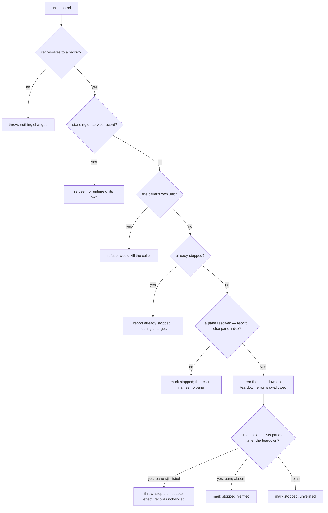
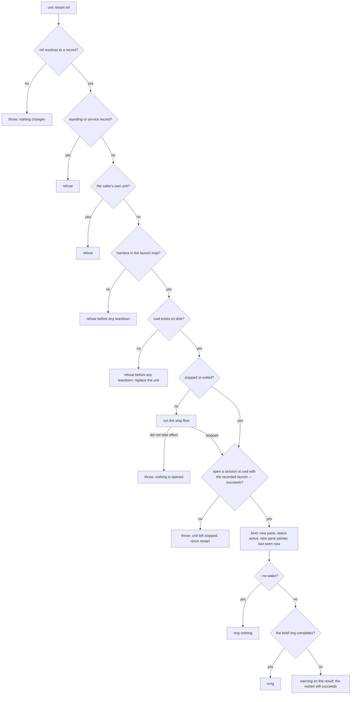
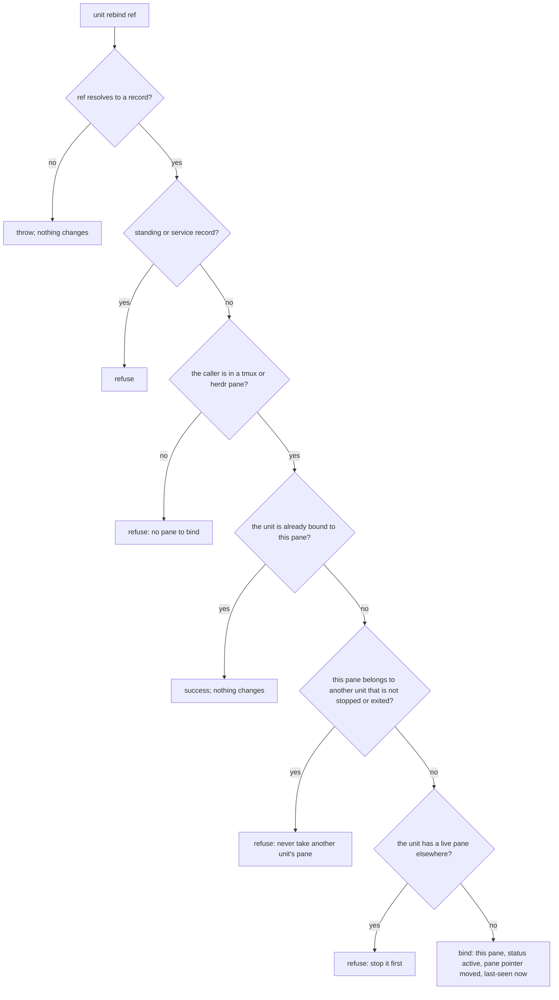
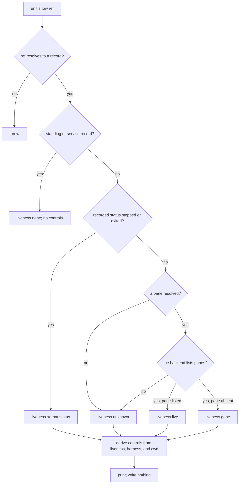

# unit runtime — stop, restart, and rebind a unit's session without losing the unit

## What

A **unit** is durable work: an id, a handle, an inbox, a brief, and usually a git worktree. Its
**runtime** is the live harness session running in a multiplexer pane. Before this node the only
way to end a runtime was `unit close`, which also deletes the worktree, the record, and the stored
brief. A controller that only wanted to replace a crashed or wedged session had to destroy the work
the session represented.

This node splits the two. `unit stop` ends the runtime and keeps the unit. `unit restart` gives the
unit a fresh runtime. `unit rebind` attaches a session a person started by hand. `unit show` reports
where the runtime is, whether it is alive right now, and which controls work on it — read-only, so
any number of clients (a dashboard, a controller, a person) can look without owning anything.
`unit close` stays the one destructive operation (`unit/lifecycle`).

**Why pending mail survives a stop.** A mailbox is keyed by the unit's id, never by its pane.
`stop` changes the pane, not the id, so it makes **no** mail-side change at all: retention follows
from where the mailbox is addressed, not from a special case in `stop`. The one registry rule this
needs is that a stopped unit is never pruned to `exited` (`unit/registry`), because a handle never
resolves to an exited unit.

**Key terms**

- **runtime** — the harness process in a pane, reached through a pane locator (`mux` + pane id).
- **stopped** — the record status meaning "no runtime, on purpose". The record has no pane, keeps
  everything else, stays addressable by handle, and is exempt from pruning.
- **liveness** — what the multiplexer says *now*: `live` (the backend lists the pane), `gone` (the
  backend answered and the pane is not in the list), `unknown` (no pane is recorded, or the backend
  gave no answer), `stopped`, or `exited` (from the recorded status). A standing or service record
  has no runtime and reports `none`.
- **rebrief** — a restarted session starts with an empty context. It is told to read its brief again,
  and its pending mail is still in its inbox.

**Non-goals.**

- **Resuming a harness conversation.** Restart always starts a fresh session and rebriefs it. Claude
  Code, Codex, and Cursor each have their own resume flags with different scopes; wiring them is a
  separate change. See *Backend recovery* below.
- **Supervising runtimes.** Nothing here watches a runtime or restarts it on its own. A controller
  decides; these verbs act.
- **A client owner.** No verb records which client is watching. Closing a dashboard therefore
  changes nothing about any runtime.
- **Service ownership.** A service's lease (`service` commands, ADR-0033) is a separate record. A
  stopped unit reads as not live, so a service it owned reads unhealthy; the lease is not changed
  by a stop.

### Backend recovery

| Backend | stop | restart | rebind |
|---|---|---|---|
| tmux | yes — kill the pane, verified by listing panes | yes — fresh window at the unit's cwd | yes — from inside a tmux pane |
| herdr | yes — close the pane, verified by listing panes | yes — fresh workspace or tab at the unit's cwd | yes — from inside a herdr pane |
| no multiplexer | no pane to stop; the record is marked stopped | refused — no backend can open a session | refused — the caller has no pane to bind |

Every harness restarts as a fresh session plus a rebrief. None resumes its prior conversation
through these verbs. A unit whose worktree or cwd is gone cannot be restarted: it needs a new unit
(`unit spawn`) and a new brief.

## Use Cases

**Actors**

- **A controller** (a project coordinator agent, a Command Center action) — wants a wedged or
  crashed runtime replaced while the work continues.
- **A person at the terminal** — wants to stop an agent for now and come back to it, or start the
  harness by hand (for example with its own resume flag) and have it be the same unit.
- **An observing client** (a dashboard, a status view) — wants to show where each unit's runtime is
  and what can be done with it, and to reconnect after it restarts without disturbing anything.
- **Stakeholder: a peer sending mail** — never invokes these verbs, but its mail must not be lost or
  misdelivered because the recipient's runtime changed.
- **Stakeholder: whoever holds an old pane reference** — a stale locator must not reach a different
  session after a restart.

| Actor | Goal | Entry point |
|---|---|---|
| controller, person | end the session, keep the unit | `unit stop` |
| controller | replace the session, keep the unit | `unit restart` |
| person | make a hand-started session be this unit | `unit rebind` |
| observing client | see location, liveness, and controls | `unit show` |
| peer sending mail | mail reaches the unit across a stop | (no verb — `stop` makes no mail change) |
| stale-reference holder | an old pane never reaches the unit | (no verb — `stop`/`restart`/`rebind` drop the old pane pointer) |

### unit stop — end the runtime, keep the unit

- **Actor / goal:** a controller or a person wants the session gone and the work kept.
- **Entry point:** `unit stop <ref>` (id, handle, or worktree branch). It tears down the unit's pane,
  checks the backend no longer lists it, then marks the record `stopped`: no pane, pane pointer
  removed, and the id, handle, inbox, brief, worktree, and last-seen time unchanged. Reports the pane
  it tore down and whether the teardown was verified.
- **Extensions:**
  - the ref resolves to no unit → error; nothing changes.
  - the record is a standing or service record → refused; it has no runtime of its own.
  - the unit is the caller's own session → refused; the teardown would kill the command before it
    recorded anything.
  - the unit is already stopped → reports it as already stopped; nothing changes (safe to repeat).
  - no pane can be resolved for the unit → marked stopped; the result names no pane.
  - the backend still lists the pane after the teardown → error "stop did not take effect"; the
    record keeps its status and pane, so nothing claims a stop that did not happen.
  - the backend gives no pane list after the teardown → marked stopped, reported as **unverified**.
  - the teardown call itself fails but the pane is gone → treated as stopped (already gone).

### unit restart — a fresh runtime for the same unit

- **Actor / goal:** a controller wants a working session for this unit again, after a crash, a
  wedge, or a stop.
- **Entry point:** `unit restart <ref> [--no-wake]`. It stops a still-running session first (the
  same verified stop as above), opens a new session at the unit's cwd with the launch command the
  unit was spawned with (its harness's default when the record has none), binds the record to the
  new pane (status `active`, a new pane pointer, last-seen now), and rings the new session to read its
  brief. The placement follows spawn's rule: its own workspace for a unit with a worktree, a tab for
  a `--cwd` unit. Reports the previous pane, the new pane, and whether the ring landed.
- **Surface trace:** `--no-wake` — a controller that will brief the unit by mail itself; skips the
  ring. No other flag.
- **Extensions:**
  - the ref resolves to no unit → error; nothing changes.
  - a standing or service record → refused.
  - the caller's own session → refused.
  - the record's harness is not in the launch map → refused before anything is torn down.
  - the unit's cwd no longer exists → refused before anything is torn down; the unit needs replacing.
  - the running session's stop does not take effect → error; nothing is opened.
  - opening the new session fails → error naming the unit as stopped and asking for a rerun; the
    unit keeps its inbox, brief, and worktree. This is how an **interrupted restart is recovered**: a
    second `unit restart` starts from the stopped unit.
  - the ring never completes → a warning on the result; the restart still succeeds (same rule as
    spawn's first-turn ring).
  - the unit was `exited` (pruned after a crash) → restarted like a stopped unit.

### unit rebind — make a hand-started session be this unit

- **Actor / goal:** a person who started the harness in a pane by hand wants that session to be the
  existing unit, with its inbox and brief, instead of a new one.
- **Entry point:** `unit rebind <ref>`, run inside the new pane. It binds the record to the calling
  pane (status `active`, a pane pointer to this pane, last-seen now) and drops the old pane pointer.
- **Extensions:**
  - the ref resolves to no unit → error; nothing changes.
  - a standing or service record → refused.
  - the caller is in no tmux or herdr pane → refused; there is no pane to bind.
  - the calling pane's pointer names a different unit that is neither stopped nor exited → refused;
    rebind never takes a pane from another unit. A pointer left behind by an exited unit is taken over.
  - the unit still has a live pane elsewhere → refused; stop it first, so two sessions never answer
    as one unit.
  - the unit is already bound to the calling pane → success; nothing changes (safe to repeat).

### unit show — where the runtime is, and what works on it

- **Actor / goal:** an observing client wants the runtime's location, current liveness, and the
  controls it supports, and to see the same answer after reconnecting.
- **Entry point:** `unit show <ref>`. Prints the unit's id, handle, harness, recorded status, liveness
  probed now, pane locator, cwd, worktree, recorded last-seen, and its supported controls. Writes
  nothing: the target's record is unchanged, and no client is recorded.
- **Controls are derived from the record and the backend, never from a pane's display name:**
  - `focus`, `nudge`, `read` — only when liveness is `live`;
  - `clear` — when `live` and the harness has an honest reset command;
  - `stop` — when a pane is recorded (`live`, `gone`, or `unknown` with a pane);
  - `restart` — when the harness is in the launch map and the cwd exists;
  - `rebind` — when liveness is `stopped`, `exited`, or `gone`;
  - `close` — for any session record. A standing or service record reports no controls.
- **Extensions:**
  - the ref resolves to no unit → error.
  - the pane is gone but the recorded status says `active` → liveness `gone`; the status stays as
    recorded. Show observes; it never rewrites status or last-seen (no invented progress).
  - the backend gives no pane list → liveness `unknown`.

### No verb: mail across a stop

`stop` and `restart` touch nothing mail-side. A peer's pending mail stays unread in the unit's
inbox, a message sent to the unit's handle while it is stopped lands in that same inbox, and a
restarted session reads the same inbox.

## Control Flow

### stop

"Mark stopped" is one write: status `stopped`, pane `null`, the pane pointer removed; the id,
handle, harness, cwd, worktree, brief, and last-seen are kept. Nothing mail-side is written.

### restart

The launch is the record's own `launch` when present, else the harness's default command (RS8).

### rebind

### show

## Scenario map

Grouped by use case, 1:1 with [`runtime.feature`](./runtime.feature). `any` in **Path** is a
convergence claim.

### unit stop

| Edge | Path (Given) | Scenario |
|---|---|---|
| `ST8` | a unit with a worktree, a live pane, a stored brief | `stop tears down the session and keeps the unit's record, brief, and worktree` |
| `ST8` pane pointer | a unit whose pane pointer names its pane | `stop removes the unit's pane pointer` |
| `ST8` mail | a unit with unread mail and a live pane | `stop leaves the unit's pending mail unread in its inbox` |
| `ST8` addressability | a stopped unit addressed by handle | `mail sent to a stopped unit's handle lands in its inbox` |
| `ST7 -- pane still listed` | a live pane the backend keeps listing after teardown | `stop fails loud when the backend still lists the pane, leaving the record unchanged` |
| `ST8U` | a live pane, then a backend that gives no pane list | `stop reports an unverified stop when the backend gives no pane list` |
| `ST6` error → `ST8` | a pane whose teardown call fails, absent from the backend's pane list | `stop treats a teardown that fails on an already-gone pane as a verified stop` |
| `ST9` | a unit with no pane locator and no pane pointer | `stop marks a unit with no resolvable pane stopped and names no pane` |
| `ST4Y` | a stopped unit | `stop on an already-stopped unit changes nothing` |
| `ST3X` | the caller's own registered unit | `stop refuses the caller's own session` |
| `ST2X` standing | a standing record | `stop refuses a standing record` |
| `ST2X` service | a service endpoint record | `stop refuses a service endpoint` |
| `ST1X` | a registered unit and an unknown ref | `stop on an unresolvable ref errors and tears nothing down` |

### unit restart

| Edge | Path (Given) | Scenario |
|---|---|---|
| `RS9` from live | a live unit with a worktree | `restart replaces a live session and keeps the unit's id, handle, brief, and worktree` |
| `RS9` from stopped | a stopped unit | `restart opens a session for a stopped unit and binds it to the new pane` |
| `RS9` from exited | an exited unit whose cwd exists | `restart revives an exited unit` |
| `RS8` recorded launch | a unit whose record carries a launch command | `restart launches with the command the unit was spawned with` |
| `RS8` no launch | a unit whose record carries no launch command | `restart falls back to the harness's default command when none was recorded` |
| `RS9` placement, worktree | a stopped unit with a worktree | `restart opens a unit with a worktree in its own workspace` |
| `RS9` placement, --cwd | a stopped unit spawned with --cwd | `restart opens a --cwd unit in a tab` |
| `RS9` stale reference | a live unit restarted | `after a restart the previous pane no longer resolves to the unit` |
| `RS11Y` | a stopped unit, no --no-wake | `restart rings the new session to read its brief` |
| `RS10Y` | a stopped unit, --no-wake | `restart --no-wake rings nothing` |
| `RS11N` | a stopped unit whose ring never completes | `a restart whose ring never completes still succeeds with a warning` |
| `RS8X` | a stopped unit, the backend's open fails | `a restart whose open fails leaves the unit stopped` |
| `RS8X` then `RS9` | a unit left stopped by a failed open | `a second restart recovers a unit left stopped by a failed restart` |
| `RS7X` | a live pane the backend keeps listing after teardown | `restart opens nothing when the running session's stop does not take effect` |
| `RS5X` | a live unit whose cwd was deleted | `restart refuses a unit whose cwd no longer exists and tears nothing down` |
| `RS4X` | a live unit whose record names an unmapped harness | `restart refuses a harness outside the launch map and tears nothing down` |
| `RS3X` | the caller's own registered unit | `restart refuses the caller's own session` |
| `RS2X` standing | a standing record | `restart refuses a standing record` |
| `RS2X` service | a service endpoint record | `restart refuses a service endpoint` |
| `RS1X` | a registered unit and an unknown ref | `restart on an unresolvable ref errors and opens nothing` |

### unit rebind

| Edge | Path (Given) | Scenario |
|---|---|---|
| `RB7` | a stopped unit, a caller in an unbound herdr pane | `rebind binds a stopped unit to the calling pane` |
| `RB7` old pointer | an exited unit whose old pane pointer remains | `rebind drops the unit's old pane pointer` |
| `RB4Y` | a unit already bound to the calling pane | `rebind to the pane the unit already holds changes nothing` |
| `RB5X` | a caller pane bound to another active unit | `rebind refuses a pane that belongs to another unit` |
| `RB5 -- no` | a caller pane whose pointer names an exited unit | `rebind takes over a pane whose previous unit has exited` |
| `RB6X` | a unit whose own pane is still live, a different caller pane | `rebind refuses a unit that still has a live pane` |
| `RB3X` | a stopped unit, a caller in no multiplexer pane | `rebind outside any pane refuses` |
| `RB2X` standing | a standing record, a caller in a pane | `rebind refuses a standing record` |
| `RB2X` service | a service endpoint record, a caller in a pane | `rebind refuses a service endpoint` |
| `RB1X` | a caller in a pane, an unknown ref | `rebind on an unresolvable ref errors and binds nothing` |

### unit show

| Edge | Path (Given) | Scenario |
|---|---|---|
| `SH5L` | a unit whose pane the backend lists, harness claude | `show reports a live unit with its pane-driving controls` |
| `SH5G` | a unit recorded active whose pane the backend no longer lists | `show reports a gone pane without rewriting the recorded status` |
| `SH4U` no pane | an active unit with no pane locator and no pointer | `show reports unknown liveness for a unit with no pane` |
| `SH4U` no list | a unit with a pane, a backend giving no pane list | `show reports unknown liveness when the backend gives no pane list` |
| `SH3Y` stopped | a stopped unit | `show reports a stopped unit with restart and rebind but no pane controls` |
| `SH3Y` exited | an exited unit whose old pane the backend still lists | `show reports an exited unit with rebind but no pane controls` |
| `SHC` clear | a live unit whose harness has no honest reset | `show omits clear for a harness with no honest reset command` |
| `SHC` restart | a stopped unit whose cwd was deleted | `show omits restart when the unit's cwd no longer exists` |
| `SH2Y` standing | a standing record | `show reports no runtime and no controls for a standing record` |
| `SH2Y` service | a service endpoint record | `show reports no runtime and no controls for a service endpoint` |
| `SHW` | any unit | `show leaves the target's record unchanged` |
| `SH1X` | a registered unit and an unknown ref | `show on an unresolvable ref errors` |
